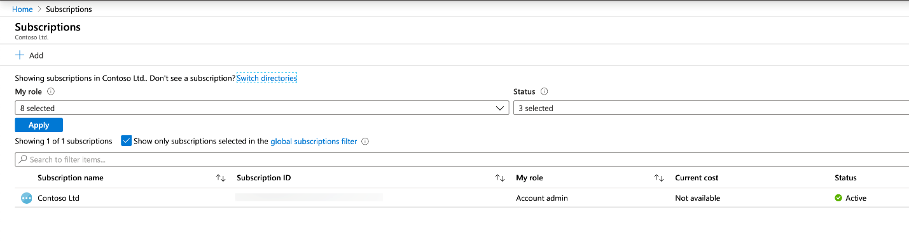
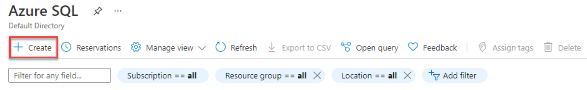
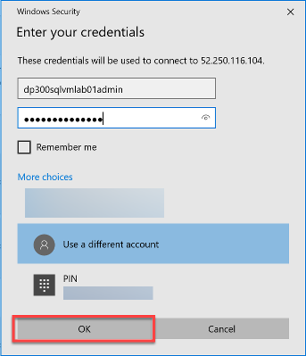
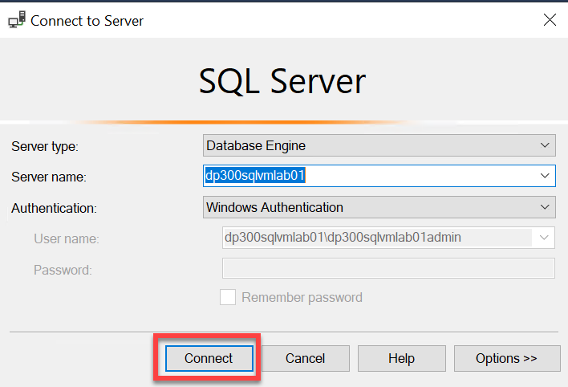
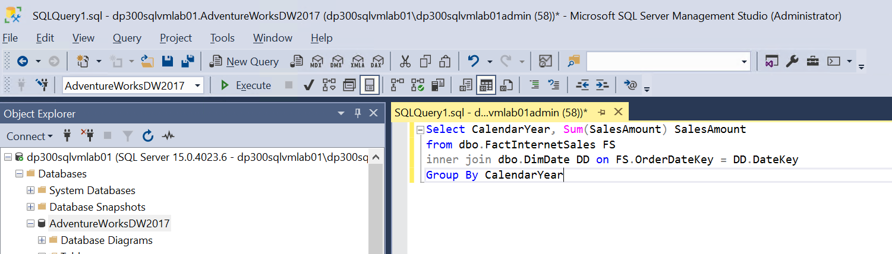
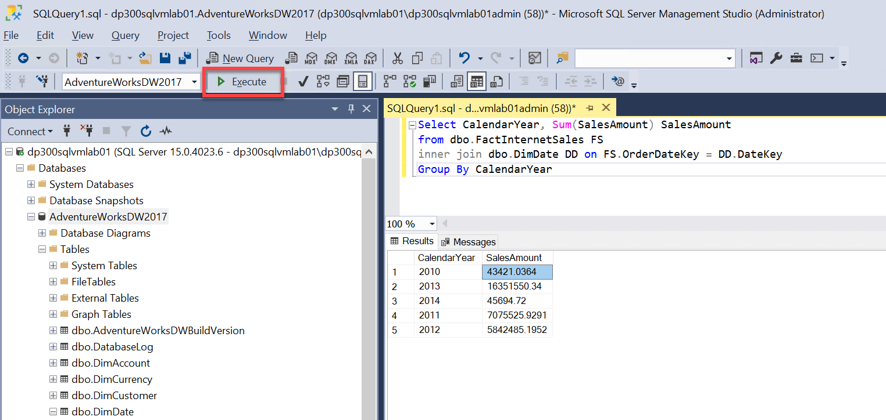

---
lab:
  title: 랩 1 - Azure Portal 및 SQL Server Management Studio 사용
  module: The Role of the Azure Database Administrator
---


# <a name="lab-1---using-the-azure-portal-and-sql-server-management-studio"></a>랩 1 - Azure Portal 및 SQL Server Management Studio 사용

**예상 소요 시간: 30분**

**사전 요구 사항: 없음** 

**랩 파일: 없음**

 

# <a name="lab-overview"></a>랩 개요 

학생은 Azure Portal을 탐색하고 이를 사용하여 설치된 SQL Server 2019에서 Azure VM을 만듭니다. 그런 다음, 원격 데스크톱 프로토콜을 통해 가상 머신에 연결하고 SQL Server Management Studio를 사용하여 데이터베이스를 복원합니다. 

# <a name="lab-goal"></a>랩 목표

학생은 Azure Portal과 상호 작용하여 SQL Server 가상 머신을 만들 수 있습니다. 그런 다음, 가상 머신에 연결하고 SQL Server Management Studio를 사용하여 데이터베이스를 복원할 수 있어야 합니다. 

# <a name="lab-objectives"></a>랩 목표

학생들은 다음을 수행합니다:

- Azure Portal과 상호 작용

- SQL Server Virtual Machine 만들기

- SQL Server Management Studio를 사용하여 데이터베이스 복원

# <a name="scenario"></a>시나리오

AdventureWorks의 데이터베이스 관리자입니다. 개념 증명에서 사용할 테스트 환경을 만들어야 합니다. 개념 증명은 Azure Virtual Machine의 SQL Server 및 AdventureWorksDW 데이터베이스의 백업을 사용합니다. Virtual Machine을 설정하고 데이터베이스를 복원하고 쿼리하여 사용할 수 있는지 확인해야 합니다. 

# <a name="exercise-1-provision-a-sql-server-on-an-azure-virtual-machine"></a>연습 1: Azure 가상 머신에서 SQL Server 프로비저닝

**예상 소요 시간: 20분**

이 연습의 주요 태스크는 다음과 같습니다. 

1. Azure Portal을 살펴보고 중요한 기능을 찾습니다.

2. Azure Portal을 사용하여 Azure Virtual Machine에서 SQL Server를 만듭니다.

 

## <a name="task-1-explore-the-azure-portal"></a>작업 1: Azure Portal 살펴보기

1. 아직 포털에 액세스하지 않았으면 랩 가상 머신에서 브라우저 세션을 시작하여 [https://portal.azure.com](https://portal.azure.com/)으로 이동합니다. 

    

 

2. Azure Portal에서 화면 위쪽의 검색 창에 구독을 입력합니다. 구독 아이콘을 클릭합니다. 먼저 로그인해야 할 수도 있습니다.

    

 

3. 구독 블레이드에 하나 이상의 구독이 있습니다. 구독 이름, 구독 ID 및 역할을 검토합니다. 

    

4. 포털 왼쪽 상단에 있는 Microsoft Azure 옆의 가로 선을 클릭하여 왼쪽 탐색 창을 시작합니다. 그런 다음, 모든 리소스를 선택합니다. 

    

    

 

5. 모든 리소스 페이지에는 선택한 구독 내에 모든 Azure 리소스가 나열됩니다. 

 

6. 왼쪽 탐색에서 리소스 그룹을 선택합니다.

    

    

    리소스 그룹 블레이드에는 선택한 구독 내에 모든 Azure 리소스 그룹이 나열됩니다. 


7. 리소스 그룹 블레이드에서 만들기 단추를 선택합니다. 

    

 
8. 랩에 적합한 구독을 선택했는지 확인합니다. 리소스 그룹 DP-300-Lab01의 이름을 지정합니다. 현재 위치에서 가장 가까운 Azure 지역을 선택합니다. 검토 + 만들기 단추를 선택합니다. 검토가 완료되면 만들기 단추를 선택합니다. 

    

9. 페이지 맨 위에 있는 검색 창을 찾습니다. Azure SQL을 검색합니다. 결과에서 서비스 아래에 표시되는 Azure SQL 검색 결과를 선택합니다.

    

 

## <a name="task-2-provision-a-sql-server-on-an-azure-virtual-machine"></a>작업 2: Azure 가상 머신에서 SQL Server 프로비저닝

1. Azure SQL 블레이드에서 만들기 단추를 선택합니다. 

    


2. SQL 배포 옵션 선택 블레이드에서 SQL 가상 머신 아래에 있는 드롭다운 상자를 엽니다. SQL Server 무료 라이선스 레이블이 지정된 옵션을 선택합니다. Windows Server 2019의 SQL 2019 Developer 그런 다음, 만들기 단추를 선택합니다.
    
    

3. 가상 머신 만들기 블레이드에 다음 정보를 입력합니다. 

    - 구독: **&lt;본인의 구독&gt;**

    - 리소스 그룹: **DP-300-Lab01**

    - 가상 머신 이름: **dp300sqlvmlab01**

    - 지역: **&lt;사용자 리소스 그룹에 대해 선택한 것과 동일한 사용자 지역&gt;**

    - 가용성 옵션: **인프라 중복 필요 없음**
    
    - 이미지: **무료 SQL Server 라이선스: Windows Server 2019의 SQL 2019 Developer - 1세대**

    - Azure Spot 인스턴스: **아니요**

    - 크기: 표준 **D2s_v3**(vCPU 2개, 옵션은 메모리 8GiB, "모든 크기 보기" 링크를 선택해야 표시될 수 있음)

    - 관리자 계정 사용자 이름: **dp300sqlvmlab01admin**

    - 관리자 계정 암호: **pwd!DP300lab01**(또는 기준을 충족하는 사용자 고유 암호)

    - 인바운드 포트 선택: **RDP(3389)**

    - 기존 Windows Server 라이선스를 사용하시겠습니까? ‘아니요’****

 

    나중에 사용할 수 있도록 사용자 이름 및 암호를 적어 둡니다.

    


4. 디스크 탭으로 이동하여 구성을 검토합니다. 

    

 
5. 네트워킹 탭으로 이동하여 구성을 검토합니다. 

    
 

6. 관리 탭으로 이동하여 구성을 검토합니다. 

    

    **부팅 진단**에서 **관리되는 스토리지 계정으로 활성화(권장)** 단추가 선택되어 있는지 확인합니다. 
    **auto_shutdown 사용**이 꺼져 있는지 확인합니다. 


7. 고급 탭으로 이동하여 구성을 검토합니다. 

    


8. SQL Server 설정 탭으로 이동하여 구성을 검토합니다. 

    

 

    참고—이 화면에서 SQL Server VM용 스토리지를 구성할 수도 있습니다. 기본적으로 SQL Server Azure VM 템플릿은 데이터에 대한 읽기 캐싱이 있는 프리미엄 디스크 1개와 트랜잭션 로그에 대한 캐싱이 없는 프리미엄 디스크 1개를 만들고 tempdb에 대한 로컬 SSD(Windows의 D:\)를 사용합니다.


9. 검토 + 만들기 단추를 선택합니다. 그런 다음, 만들기 단추를 선택합니다.  
‎ 


10. 배포 블레이드에서 배포가 완료될 때까지 기다립니다. VM을 배포하는 데 약 5~10분이 소요됩니다. 그런 다음, 리소스로 이동 단추를 선택합니다. 

    

 
11. 가상 머신 개요 페이지에서 리소스에 대한 메뉴 옵션을 스크롤하여 사용할 수 있는 옵션을 검토합니다.

    


# <a name="exercise-2-connect-to-sql-server-and-restore-a-backup"></a>연습 2: SQL Server에 연결 및 백업 복원

**예상 소요 시간: 10분**

이 연습의 주요 태스크는 다음과 같습니다. 

1. Azure Virtual Machine에서 SQL Server에 대한 RDP(원격 데스크톱 프로토콜) 연결을 만듭니다.

2. 데이터베이스 백업 파일을 다운로드합니다.

3. SQL Server Management Studio를 사용하여 SQL Server에서 데이터베이스를 복원합니다.

4. 데이터베이스를 쿼리하여 가용성을 확인합니다.

 
## <a name="task-1-connect-to-the-virtual-machine-and-download-the-backup-file"></a>작업 1: Virtual Machine에 연결하고 백업 파일을 다운로드합니다.

1. 가상 머신의 개요 페이지에서 연결 단추를 선택하고 RDP를 선택합니다. 

    

 
2. RDP 탭에서 RDP 파일 다운로드 단추를 선택합니다. 

    

3. 방금 다운로드한 RDP 파일을 엽니다. 연결할지 묻는 대화 상자가 나타나면 연결 단추를 선택합니다.   
‎   

 
4. Windows 보안 대화 상자에서 PIN 대화 상자가 표시되면 추가 선택 사항을 선택합니다. 그런 다음, 다른 계정 사용을 선택합니다. PIN 대화 상자가 표시되지 않으면 5단계로 진행할 수 있습니다.

    

 
5. 가상 머신 프로비전 프로세스 중에 선택한 사용자 이름과 암호를 입력합니다. 그런 다음, 확인 단추를 선택합니다.

    

 
6. 연결할지 묻는 원격 데스크톱 연결 대화 상자가 나타나는 경우 예 단추를 선택합니다. 

    


7. 원격 데스크톱 창이 열립니다. 오른쪽에서 아니요 단추를 선택하여 네트워크의 다른 디바이스에서 컴퓨터를 검색하기를 원치 않음을 표시합니다. 작게 표시된 서버 관리자 팝업 대화 상자 오른쪽 위의 X를 클릭하여 대화 상자를 닫습니다. 큰 서버 관리자 창은 열어 두세요.

    

 
8. 서버 관리자 창에서 왼쪽의 로컬 서버를 선택한 다음, IE 강화된 보안 구성 옆에 있는 켜기를 선택합니다. 

    

 
9. Internet Explorer 강화된 보안 구성 대화 상자가 나타나면 관리자를 끄기로 설정합니다. 그런 다음, 확인 단추를 선택합니다.

    

 
10. 작업 표시줄에서 아이콘을 선택하여 Internet Explorer를 엽니다. 

    


11. Internet Explorer에서 다음 URL로 이동합니다. 

    [https://github.com/Microsoft/sql-server-samples/releases/download/adventureworks/AdventureWorksDW2017.bak](https://github.com/Microsoft/sql-server-samples/releases/download/adventureworks/AdventureWorksDW2017.bak)

    

    파일을 실행하거나 저장할지 묻는 대화 상자가 나타납니다.   
    ‎

 

12. 대화 상자에서 저장 옆에 있는 드롭다운을 선택하고 다른 이름으로 저장을 선택합니다. 

    

 

13. 다른 이름으로 저장 대화 상자에서 다음 폴더 위치로 이동합니다:   
C:\Program Files\Microsoft SQL Server\MSSQL15.MSSQLSERVER\MSSQL\Backup.  
파일 이름은 AdventureWorksDW2017로, 유형은 BAK 파일로 유지합니다. 저장 단추를 선택합니다. 

    
 
## <a name="task-2-restore-the-database-and-verify-its-availability"></a>작업 2: 데이터베이스 복원 및 가용성 확인

 

1. Windows 시작 단추를 선택하고 SSMS를 입력합니다. 목록에서 Microsoft SQL Server Management Studio 18을 선택합니다.  
‎ 


2. Management Studio가 열리면 서버에 연결 대화 상자가 로컬 컴퓨터에 미리 채워집니다. 연결 단추를 선택합니다. 


    

 

3. 개체 탐색기에서 데이터베이스 노드를 마우스 오른쪽 단추로 클릭하고 데이터베이스 복원을 선택합니다.

    

 

4. 데이터베이스 복원 대화 상자의 소스 아래에서 디바이스를 선택하고 타원으로 레이블이 지정된 디바이스 오른쪽에 있는 단추를 선택합니다. 

    

 

5. 백업 디바이스 선택 대화 상자에서 추가를 선택합니다. 

    


6. 로컬 백업 파일 대화 상자에서 AdventureWorksDW2017.bak를 선택한 다음, 확인 단추를 선택합니다. 

    

 
7. 이제 백업 디바이스 선택 대화 상자에서 백업 미디어 아래에 나열된 항목이 하나 있는지 확인합니다. 그런 다음, 확인 단추를 선택합니다.

    


8. 데이터베이스 복원 대화 상자에서 복원할 백업 집합 아래에 나열된 항목이 하나 있는지 확인합니다. 그런 다음, 확인 단추를 선택합니다. 

    

 
9. 데이터베이스 복원이 완료되면 "'AdventureWorksDW2017' 데이터베이스가 성공적으로 복원되었습니다"라는 메시지와 함께 대화 상자가 표시됩니다. 확인 단추를 선택합니다.

    

 

10. 개체 탐색기에서 데이터베이스 노드, AdventureWorksDW2017 노드, 테이블 노드를 순서대로 확장합니다. 데이터베이스에 dbo.DimAccount를 포함한 여러 테이블이 포함되어 있는지 확인합니다.

    

 
11. Management Studio의 개체 탐색기에서 AdventureWorksDW2017 노드를 선택합니다. 그런 다음, [새 쿼리] 단추를 선택합니다. 

    


12. 다음 문을 복사하여 새 쿼리 창에 붙여넣습니다. 

    ```SQL
    SELECT CalendarYear, Sum(SalesAmount) SalesAmount 

    FROM dbo.FactInternetSales FS

    INNER JOIN dbo.DimDate DD ON FS.OrderDateKey = DD.DateKey

    GROUP BY CalendarYear
    ```

    


13. 실행 단추를 선택하여 쿼리를 실행합니다. 2010년 매출액이 **43421.0364**인지 확인합니다. 

    

 

 

## <a name="task-3-clean-up"></a>작업 3: 정리

1. 원격 데스크톱을 종료합니다. 

2. 이 랩에서 만든 VM을 삭제하여 비용을 절감합니다. 이후 랩에는 사용하지 않습니다. 

3. **dp300sqlvmlab01** 가상 머신의 기본(개요) 블레이드로 이동하여 메뉴에서 삭제 단추를 클릭합니다. 

    
 
4. **확인**을 클릭합니다.
