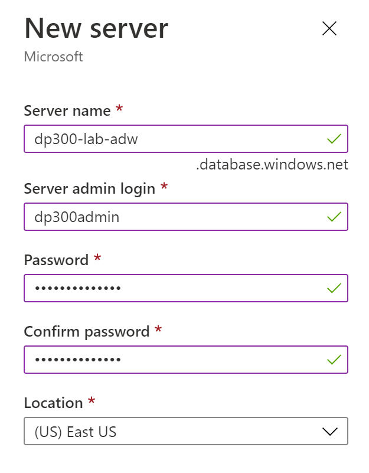
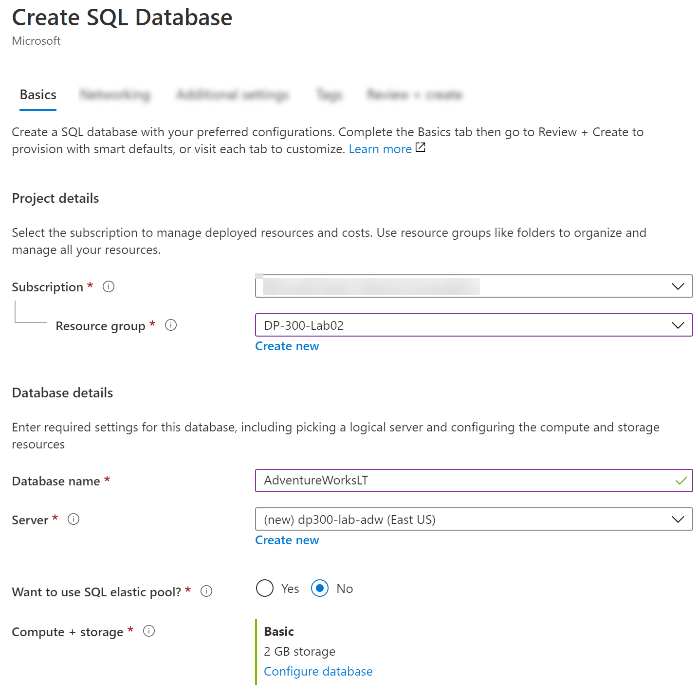
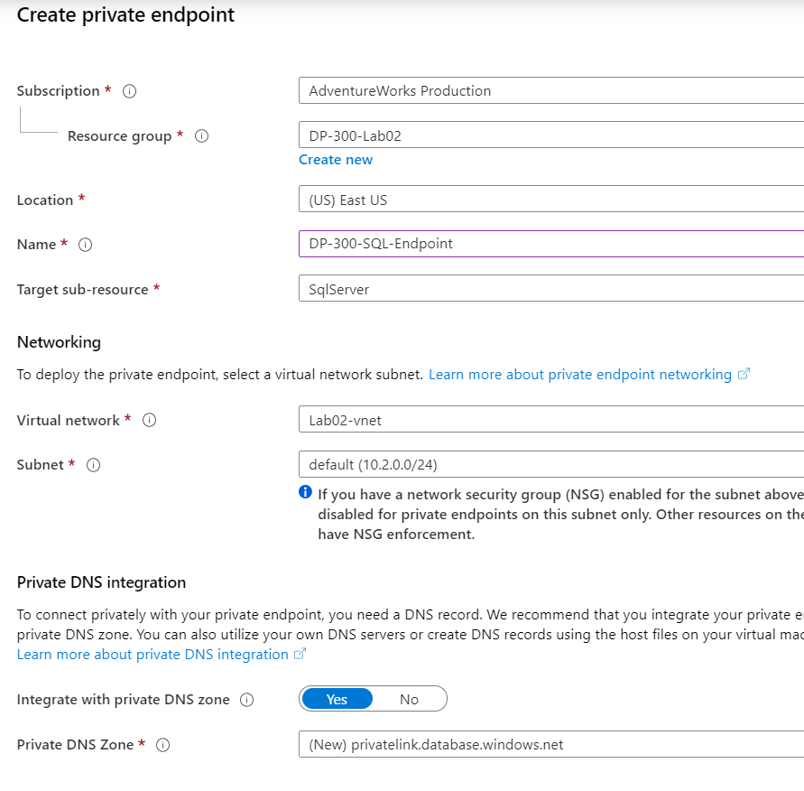
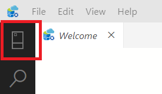
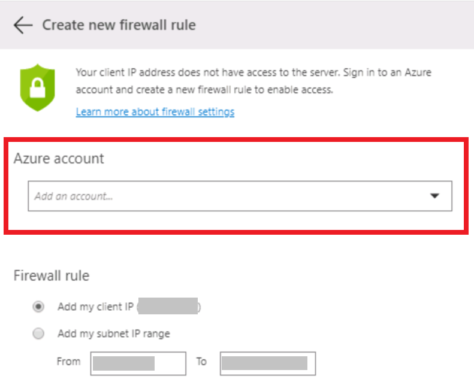
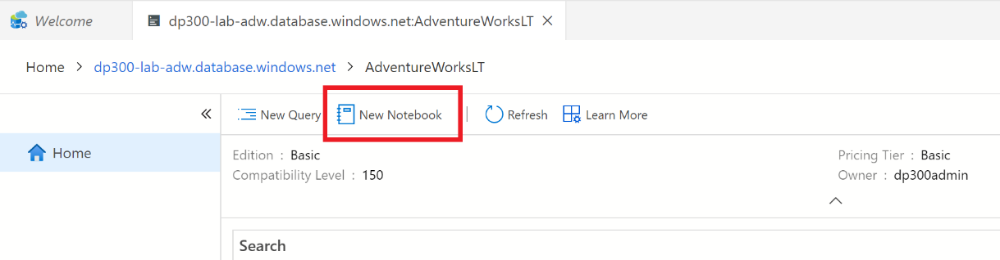
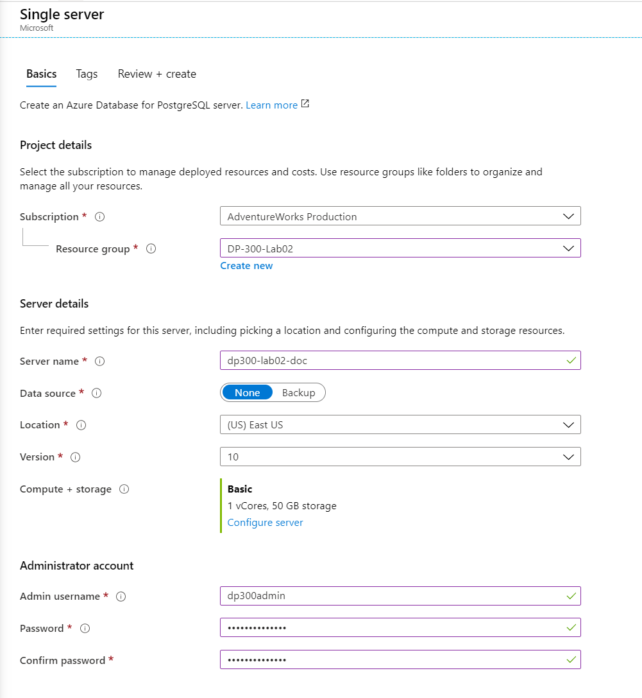
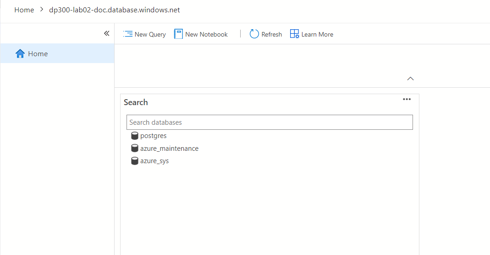

---
lab:
  title: 랩 2 – PaaS 데이터베이스 배포
  module: Plan and Implement Data Platform Resources
---

# <a name="lab-2--deploying-paas-databases"></a>랩 2 – PaaS 데이터베이스 배포

**예상 완료 시간:** 35-40분

**필수 조건:** 없음

**랩 파일:** 없음

# <a name="lab-overview"></a>랩 개요

The student will configure basic resources needed to deploy an Azure SQL Database with a Virtual Network Endpoint. Connectivity to the SQL Database will be validated using Azure Data Studio from the lab VM. Finally, an Azure Database for PostgreSQL will be created.

# <a name="lab-objectives"></a>랩 목표

학생들은 다음을 수행합니다:

1. 기본 리소스 구성

2. Azure SQL Database 배포

3. Azure Data Studio를 사용하여 Azure SQL Database에 연결

4. Azure Database for PostgreSQL 배포

# <a name="scenario"></a>시나리오

As a database administrator for AdventureWorks, you will set up a new SQL Database, including a Virtual Network Endpoint to increase and simplify the security of the deployment. Azure Data Studio will be used to evaluate the use of a SQL Notebook for data querying and results retention.

마지막으로 Azure Database for PostgreSQL가 배포되어 추가 데이터 시스템 요구 사항을 지원합니다.

# <a name="exercise-1-configure-basic-resources"></a>연습 1: 기본 리소스 구성

## <a name="task-1-create-a-resource-group"></a>작업 1: 리소스 그룹 만들기

1. 브라우저를 시작하고 [https://portal.azure.com](https://portal.azure.com/)에서 Azure Portal을 연 후 적절한 자격 증명으로 로그인합니다.

2. 홈 화면에서 **리소스 그룹** 단추를 클릭합니다.  

    

3. 기존 리소스 그룹을 검토한 다음 **만들기** 단추를 클릭하여 새 리소스 그룹을 만듭니다.  

    

4. RG를 만드는 데 필요한 정보로 리소스 그룹 만들기 마법사를 완료합니다.

    - 구독이 원하는 구독으로 설정되어 있는지 확인합니다.

    - 리소스 그룹 이름으로 **DP-300-Lab02**를 입력합니다.

    - 이 랩의 목적을 위해, 실제 위치와 가장 가까운 지역을 선택합니다.

    - **검토 + 만들기** 단추를 클릭합니다.  

    

    - **만들기** 단추를 클릭합니다.

## <a name="task-2-create-a-virtual-network"></a>작업 2: 가상 네트워크 만들기

1. 탐색 창에서 **가상 네트워크**를 클릭합니다.  

    

2. Click <bpt id="p1">**</bpt>+ Create<ept id="p1">**</ept> to open the <bpt id="p2">**</bpt>Create Virtual Network<ept id="p2">**</ept> page. On the <bpt id="p1">**</bpt>Basics<ept id="p1">**</ept> tab, complete the following information:

    - 구독: **랩 구독 선택**

    - 리소스 그룹: 
          **DP-300-Lab02** 리소스 그룹을 선택합니다.

    - 이름: **Lab02-vnet**

    - 지역: 리소스 그룹을 만든 것과 같은 지역(사용자 위치와 가장 가까운 지역)을 선택합니다.  

    

    - **다음: IP 주소** 단추를 클릭합니다.  

    

3. Azure SQL 데이터베이스 엔드포인트에 대한 가상 네트워크의 IP 범위를 구성합니다.

    - IP 주소 페이지에서 IPv4 주소 공간의 기본값을 그대로 둡니다.

    - Click on the <bpt id="p1">**</bpt>default<ept id="p1">**</ept> subnet. (Note that the Subnet address range you see might be different.)  

    

    - 오른쪽의 서브넷 플라이아웃 편집에서 서비스 드롭다운을 펼치고 **Microsoft.Sql**에 체크 표시를 합니다.  

    

    - 페이지 맨 아래에 있는 **저장**

    - **검토 + 만들기** 단추를 클릭하고, 새 가상 네트워크에 대한 설정을 검토한 다음, **만들기**를 클릭합니다.

# <a name="exercise-2-deploy-an-azure-sql-database"></a>연습 2: Azure SQL Database 배포

## <a name="task-1-deploy-an-azure-sql-database"></a>작업 1: Azure SQL Database 배포

1. Azure Portal에서 왼쪽 탐색 모음 상단에 있는 **+ 리소스 만들기**를 클릭합니다.  

    

2. 상단의 검색 상자에서 “SQL 데이터베이스”를 검색한 다음, 옵션 목록에서 **SQL Databases**를 클릭합니다.  

    

3. **만들기** 단추를 클릭합니다.

4. 다음 입력으로 SQL Database 기본 화면 만들기를 완료한 후 **다음: 네트워킹**을 클릭합니다.

    - 구독: 랩 구독을 선택합니다.

    - 리소스 그룹: **DP-300-Lab02**(연습 1에서 생성된 RG)

    - 데이터베이스 이름: **AdventureWorksLT**
    
    - Server: click <bpt id="p1">**</bpt>Create new.<ept id="p1">**</ept> In the New Server sidebar, complete the form as follows:

        - 서버 이름: **dp300-lab-&lt;사용자 이니셜(소문자)&gt;** (서버 이름은 전역적으로 고유해야 함)
        
        - 위치: 가장 가까운 지역을 선택합니다(연습 1과 동일).

        - 서버 관리자 로그인: **dp300admin**

        - 암호: **dp300P@ssword!**

        - 암호 확인: **dp300P@ssword!**

        - Your New server sidebar should look similar to the one below. Click <bpt id="p1">**</bpt>OK<ept id="p1">**</ept>

        

    -  SQL Database 만들기 페이지에서 **탄력적 풀 사용**이 **아니요**로 설정되어 있는지 확인합니다.

    -  컴퓨팅 + 스토리지: 
          **데이터베이스 구성**을 클릭합니다.

        - 구성 화면에서 서비스 계층 드롭다운에 대해 **기본**을 선택합니다.

        

        - **기본**을 클릭합니다.

        - **적용** 단추를 클릭합니다.

**참고: 이 서버 이름과 로그인 정보를 기록합니다. 이는 다음 랩에서 사용합니다.**

5. **백업 스토리지 중복** 옵션이 표시되면 다음 기본값 **지역 중복 백업 스토리지**를 유지합니다. 

6. 설정을 검토하고 **다음: 네트워킹**을 클릭합니다.  

    

7. 네트워킹 화면의 연결 방법에서 **프라이빗 엔드포인트** 라디오 단추를 클릭합니다.  

    

8. 그런 다음 프라이빗 엔드포인트 아래에서 **프라이빗 엔드포인트 추가** 링크를 클릭합니다.  

    

9. 다음과 같이 프라이빗 엔드포인트 플라이아웃 만들기를 완료합니다.

    - 구독: 랩 구독이 선택되어 있는지 확인합니다.

    - 리소스 그룹: **DP-300-Lab02**

    - 위치: 이 랩의 이전 파트에서 선택한 지역과 동일

    - 이름: **DP-300-SQL-Endpoint**

    - 대상 하위 리소스: **SqlServer**

    - 가상 네트워크: **Lab02-vnet**

    - 서브넷: **default (10.x.0.0/24)**

    - 프라이빗 DNS 통합 옵션은 기본값 그대로 둘 수 있습니다.

    - 설정을 검토한 후 **확인**을 클릭합니다.  

    

10. 네트워킹 페이지에 나타나는 엔드포인트를 확인합니다. 

    

11. **다음: 보안** 단추를 클릭하고, **다음: 추가 설정** 단추를 클릭합니다.  

12. 추가 설정 페이지에서 다음 옵션을 선택합니다.

    - 기존 데이터 사용을 **샘플**로 설정

    

13. **검토 + 만들기** 클릭

14. 설정을 검토하고 **만들기**를 클릭합니다.

15. 배포가 완료되면 **리소스로 이동** 단추를 클릭합니다.  


## <a name="task-2-enable-all-azure-services-access-to-new-sql-server"></a>작업 2: 모든 Azure 서비스에서 새 SQL Server에 액세스하도록 설정

1. SQL Database 블레이드 위쪽 섹션에서 서버 이름 링크를 클릭합니다.  

    

2. SQL Server 개체의 탐색 블레이드의 **보안**에서 **방화벽 및 가상 네트워크**를 클릭합니다.

    

3. **Azure 서비스 및 리소스가 이 서버에 액세스할 수 있도록 허용**을 **예**로 설정합니다.  

    

4. **저장**을 클릭한 다음, 성공 메시지 창에서 **확인**을 클릭합니다.

# <a name="exercise-3-connect-to-azure-sql-database"></a>연습 3: Azure SQL Database에 연결

## <a name="task-1-register-azure-sql-database-instance-in-azure-data-studio"></a>작업 1: Azure Data Studio에서 Azure SQL Database 인스턴스 등록

1. 랩 VM에서 ADS(Azure Data Studio)를 실행합니다.

    - You may see this pop-up at initial launch of Azure Data Studio. If you receive it, click <bpt id="p1">**</bpt>Yes<ept id="p1">**</ept>  


2. Azure Data Studio가 열리면 Azure Data Studio 왼쪽 사이드바에서 **연결** 단추를 클릭한 다음, **연결 추가** 단추를 클릭합니다.
    
    

3. **연결** 사이드바에서 연결 정보로 연결 세부 정보 섹션을 작성하여 이전 연습에서 만든 SQL 데이터베이스에 연결합니다.

    - 연결 형식: **Microsoft SQL Server**

    - 학생들은 가상 네트워크 엔드포인트를 사용하여 Azure SQL Database를 배포하는 데 필요한 기본 리소스를 구성합니다.  
    [‘xx’ 대신 이니셜이 있는 서버 이름을 만들어 달라는 요청을 받았습니다.]

    - 인증 유형: **SQL 로그인**

    - 사용자 이름: **dp300admin**

    - 암호: **dp300P@ssword!**

    - 데이터베이스 드롭다운을 펼쳐 **AdventureWorksLT**를 선택합니다. 
        - SQL Database에 대한 연결은 랩 VM의 Azure Data Studio를 사용하여 유효성을 검사합니다.
        
        
        
    다시 연결 사이드바에서 다음 연결 세부 정보를 계속 작성합니다.  
    
    - 서버 그룹은 **&lt;기본값&gt;** 으로 남아 있습니다.

    - 원하는 경우 이름(선택 사항)을 데이터베이스의 식별 이름으로 채울 수 있습니다.

    - 설정을 검토하고 **연결**을 클릭합니다.  

    

4. Azure Data Studio는 데이터베이스에 연결하고 데이터베이스에 대한 몇 가지 기본 정보와 개체의 일부 목록을 표시합니다.  

    

## <a name="task-2-query-azure-sql-database-with-a-sql-notebook"></a>작업 2: SQL Notebook을 사용하여 Azure SQL Database 쿼리

1. 이 랩의 AdventureWorksLT 데이터베이스에 연결된 Azure Data Studio에서 **새 Notebook** 단추를 클릭합니다.  

    

2. **+텍스트** 단추를 클릭하여 Notebook에 새 텍스트 상자를 추가합니다.  

    


**참고:** Notebook에서 쿼리 또는 결과 세트를 설명하는 일반 텍스트를 포함할 수 있습니다.

3. **주문 소계별 상위 10위 고객** 텍스트를 입력하고 원하는 경우 굵게 표시합니다.  

    

4. **+ 코드** 단추를 클릭하여 Notebook 마지막에 새 셀을 추가하고 쿼리를 넣습니다.  

    

5. 다음 SQL 문을 새 셀에 붙여 넣습니다.

```sql
select top 10 cust.[CustomerID], cust.[CompanyName], sum(sohead.[SubTotal]) as OverallOrderSubTotal

  from [SalesLT].[Customer] cust

    inner join [SalesLT].[SalesOrderHeader] sohead

        on sohead.[CustomerID] = cust.[CustomerID]

   group by cust.[CustomerID], cust.[CompanyName]

   order by [OverallOrderSubTotal] desc
   ```

6. 마지막으로 Azure Database for PostgreSQL이 만들어집니다.

7. **+ 텍스트** 단추를 클릭하여 새 텍스트 셀을 추가합니다.

8. **상위 10개의 주문 제품 카테고리** 텍스트를 입력하고 원하는 경우 굵게 표시합니다.

9. **+ 코드** 단추를 다시 클릭하여 새 셀을 추가하고 다음 SQL 문을 셀에 붙여넣습니다.

```sql
select top 10 cat.[Name] as ProductCategory, sum(detail.[OrderQty]) as OrderedQuantity

    from salesLT.[ProductCategory] cat

       inner join saleslt.[Product] prod
      
          on prod.[ProductCategoryID] = cat.[ProductCategoryID]

       inner join salesLT.[SalesOrderDetail] detail

          on detail.[ProductID] = prod.[ProductID]

    group by cat.[name]

    order by [OrderedQuantity] desc
```
10.  화살표가 있는 파란색 원을 클릭하여 쿼리를 실행합니다. 

11. Notebook의 모든 셀을 실행하고 결과를 표시하려면 도구 모음에서 **셀 실행** 단추를 클릭합니다.  

    

12. Within Azure Data Studio save the notebook from File menu (either Save or Save As) to the D:\Labfiles\Deploy Azure SQL Database (this folder already exists on the VM) directory. Close the tab for the Notebook from inside of Azure Data Studio. From the File Menu, select Open File, and open the notebook you just saved. Observe that query results were saved along with the queries in the notebook.

# <a name="exercise-4-deploy-an-azure-database-for-postgresql-database"></a>연습 4: Azure Database for PostgreSQL 데이터베이스 배포

## <a name="task-1-deploy-a-postgresql-database"></a>작업 1: PostgreSQL Database 배포

1. Azure Portal에서 왼쪽 탐색 모음 상단에 있는 **+ 리소스 만들기**를 클릭합니다.

    

2. 상단의 검색 상자에서 “Azure Database for PostgreSQL”을 검색한 다음, 결과에서 **Azure Database for PostgreSQL**을 클릭합니다.  

    

3. **만들기** 단추를 클릭합니다.

4. 단일 서버 옵션에 대해 **만들기**를 클릭합니다.  

    

5. 다음 입력으로 단일 서버 기본 화면을 완료합니다.

    - 구독: 랩 구독을 선택합니다.

    - 리소스 그룹: **DP-300-Lab02**(연습 1에서 생성된 RG)

    - 서버 이름: **dp300-lab02-****&lt;사용자 이니셜&gt;** (서버 이름은 고유해야 함)

    - 데이터 원본: **없음**

    - 위치: 이 랩에서 사용했던 가장 가까운 지역을 선택합니다.

    - 버전: **10** 또는 **11**

    - 컴퓨팅 + 스토리지 아래에서 **서버 구성** 링크를 클릭합니다.

        - **기본** 탭을 클릭합니다.

        - vCore 슬라이더를 왼쪽 끝까지 밀고 **1 vCore**를 선택합니다.  

    

        - Click **OK**

    - 관리자 사용자 이름: **dp300admin**

    - 암호: **dp300P@ssword!**

    - 암호 확인: **dp300P@ssword!**  
    

6. **검토 + 만들기** 클릭

7. 설정을 검토하고 **만들기**를 클릭합니다.

8. 배포가 완료되면 **리소스로 이동**을 클릭합니다.

## <a name="task-2-enable-all-azure-services-access-to-postgresql-database"></a>작업 2: PostgreSQL 데이터베이스에 대한 모든 Azure 서비스 액세스 사용

1. 데이터베이스의 사이드바에서 설정 아래의 **연결 보안** 단추를 클릭합니다.  

    

2. Slide the Allow access to Azure services setting to <bpt id="p1">**</bpt>Yes<ept id="p1">**</ept>.  Click <bpt id="p1">**</bpt>+ Add current client IP address<ept id="p1">**</ept>, then <bpt id="p2">**</bpt>Save<ept id="p2">**</ept>.  

    


## <a name="task-3-connect-to-the-postgresql-database-with-azure-data-studio"></a>작업 3: Azure Data Studio를 사용하여 PostgreSQL 데이터베이스에 연결

<bpt id="p1">**</bpt>Note:<ept id="p1">**</ept> With the PostgreSQL extension installed to Azure Data Studio, PostgreSQL can be queried. This extension is pre-installed on the lab VM.


1. 랩 VM의 Azure Data Studio에서 연결 사이드바가 확장되었는지 확인하고, 그렇지 않은 경우 왼쪽 탐색 모음의 **연결** 단추를 클릭합니다.

2. **새 연결** 단추를 클릭합니다.  

    

3. 연결 세부 정보 사이드바에서 다음 정보를 입력하여 이전 작업의 PostgreSQL 데이터베이스에 연결합니다.

    - 연결 형식: **PostgreSQL**

    - Server: Enter the name of the PostgreSQL Server you created in Task 1. For example: <bpt id="p1">**</bpt>dp300-lab02-xx.postgres.database.azure.com<ept id="p1">**</ept> (You can find the full name of the server in the Overview pane in the portal. You'll probably need to replace xx with the specific letters you added. )

    - 인증 유형: **암호**

    - User name: <bpt id="p1">**</bpt><ph id="ph1">dp300admin@dp300-lab02-xx</ph><ept id="p1">**</ept> (note that the user name must include the first part of the hostname that you specified above; use your suffix instead of 'xx'. The admin username can also be found on the Overview pane in the portal.) 

    - 암호: **dp300P@ssword!**

    - 데이터베이스 이름은 **&lt;기본값&gt;** 으로 유지합니다.

    - 서버 그룹은 **&lt;기본값&gt;** 으로 남아 있습니다.

    - 원하는 경우 이름(선택 사항)을 데이터베이스의 식별 이름으로 채울 수 있습니다.

4. 설정 검토  

    

5. **연결**

6. Azure Data Studio가 PostgreSQL 데이터베이스에 연결됩니다.  

    
