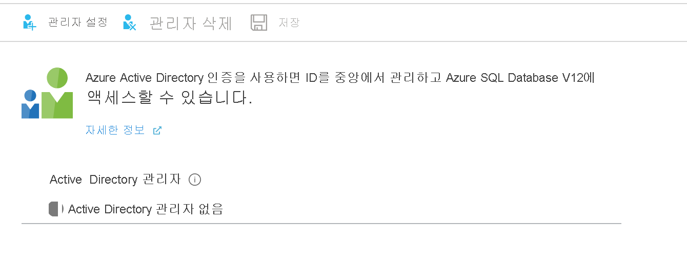
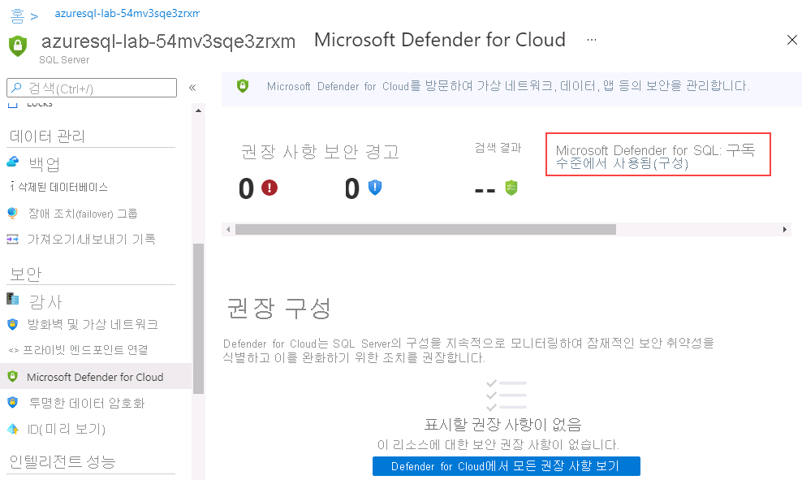
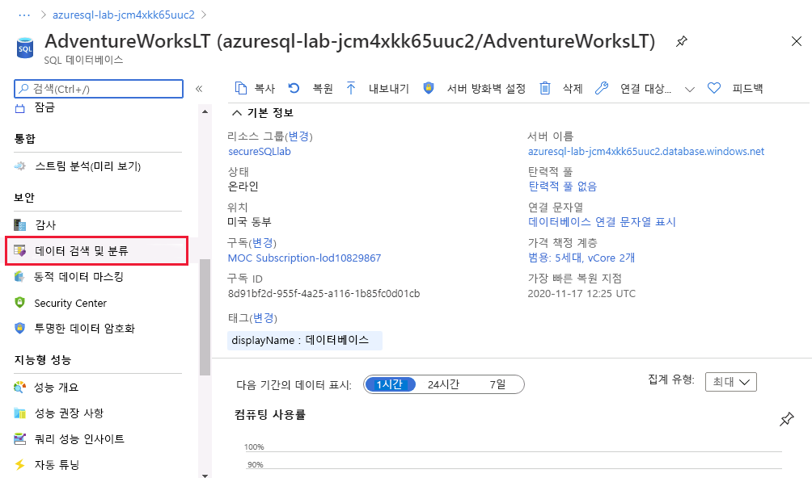

---
lab:
  title: 랩 3 – 안전한 환경 구현
  module: Implement a Secure Environment
---

# <a name="lab-3--implement-a-secure-environment"></a>랩 3 – 안전한 환경 구현
 

**예상 소요 시간:** 60분

**필수 조건**: 모듈 2 랩에서 만든 Azure SQL server입니다. 구독에서 Azure Active Directory 액세스.  

**랩 파일**: 이 랩용 파일은 D:\Labfiles\Secure Environment 폴더에 있습니다.

# <a name="lab-overview"></a>랩 개요

학생들은 단원에서 파악한 정보를 사용하여 Azure Portal 및 AdventureWorks 내에서 보안 기능을 구성한 후 구현합니다. 

# <a name="lab-objectives"></a>랩 목표

이 랩을 완료하면 다음을 수행할 수 있습니다.

1. Azure SQL 데이터베이스 방화벽 구성

2. Azure Active Directory를 사용하여 Azure SQL Database에 대한 액세스 권한 부여

3. Azure SQL Database에서 Microsoft Defender for SQL 사용

4. Azure SQL Database에서 데이터 분류 구성

5. 데이터베이스 개체에 대한 액세스 관리

# <a name="scenario"></a>시나리오

선임 데이터베이스 관리자로 고용되어 데이터베이스 환경의 보안을 보장합니다. 작업은 Azure SQL Database에 중점을 둡니다. 

**참고:** 이 연습을 진행할 때는 T-SQL 코드를 복사하여 붙여 넣어야 합니다. 코드를 실행하기 전에 코드를 올바르게 복사했으며 줄 바꿈이 적절한지 확인하세요. 

## <a name="exercise-1-configure-an-azure-sql-database-firewall-and-connect-to-a-new-database"></a>연습 1: Azure SQL Database 방화벽을 구성한 다음 새 데이터베이스에 연결

1. 랩 가상 머신에서 브라우저 세션을 시작하고 [https://portal.azure.com](https://portal.azure.com/)으로 이동합니다. 적절한 자격 증명을 제공합니다. 

    

2. Azure Portal 상단의 검색 창에 SQL을 입력합니다. SQL Server 아이콘이 표시됩니다. SQL 서버를 클릭합니다. 랩 2에서 만든 서버의 세부 정보 페이지로 이동하려면 서버 이름을 클릭합니다.

    

3. SQL Server 세부 정보 화면에서 마우스를 서버 이름 오른쪽으로 이동한 후 아래와 같이 클립보드에 복사 단추를 클릭합니다.

    

4. 방금 복사한 서버 이름 바로 위에 있는 방화벽 설정 표시를 클릭합니다. 아래에 강조 표시된 것처럼 **+ 클라이언트 IP 추가**를 클릭한 다음 저장을 클릭합니다.

    

    이렇게 하면 SQL Server Management Studio 또는 다른 클라이언트 도구를 사용하여 Azure SQL Database 서버에 연결할 수 있습니다. **중요:** 클라이언트 IP 주소를 기록해두세요. 이 작업의 후반에 사용할 것입니다.

5. 랩 VM에서 SQL Server Management Studio를 엽니다. Azure SQL 데이터베이스 서버의 이름을 붙여넣고 랩 2에서 만든 자격 증명으로 로그인합니다.

    - 서버 이름: **&lt;여기에 Azure SQL 데이터베이스 서버 이름 붙여넣기&gt;**  
         
     - 인증: **SQL Server 인증**  
    
    - 서버 관리자 로그인: **dp300admin**

    - 암호: **dp300P@ssword!**

    

    **연결**을 클릭합니다.

6. 개체 탐색기에서 서버 노드를 확장하고 데이터베이스를 마우스 오른쪽 단추로 클릭합니다. 데이터 계층 애플리케이션 가져오기를 클릭합니다.

    

7. 데이터 계층 애플리케이션 가져오기 대화 상자의 첫 번째 화면에서 다음을 클릭합니다. 

    

8. 가져오기 설정 화면에서 찾아보기를 클릭하고 D:\Labfiles\Secure Environment로 이동하여 AdventureWorks.bacpac 파일을 클릭하고 열기를 클릭합니다. 그런 다음 데이터 계층 애플리케이션 가져오기 화면에서 **다음**을 클릭합니다.

    

    

9. 데이터베이스 설정 화면에서 Azure SQL 데이터베이스 버전을 범용으로 변경합니다. 서비스 개체를 **GP_Gen5_2**로 변경하고 **다음**을 클릭합니다. 

    

10.  요약 화면에서 **마침**을 클릭합니다. 가져오기가 완료되면 아래 결과가 표시됩니다. 그런 다음, 
    **닫기**를 클릭합니다.

11. 개체 탐색기에서 데이터베이스 폴더를 확장합니다. 그런 다음 AdventureWorks를 마우스 오른쪽 단추로 클릭하고 새 쿼리를 클릭합니다. 

    

12. 텍스트를 쿼리 창에 붙여넣어 다음 T-SQL 쿼리를 실행합니다. **중요:** 4단계부터 192.168.1.1을 클라이언트 IP 주소로 바꿉니다. 실행을 클릭하거나 F5 키를 누릅니다.

    ```sql
    EXECUTE sp_set_database_firewall_rule @name = N'ContosoFirewallRule',

    @start_ip_address = '192.168.1.1', @end_ip_address = '192.168.1.1'
    ```

13. 다음으로 AdventureWorks 데이터베이스에 포함된 사용자를 만듭니다. 새 쿼리를 클릭하고 다음 T-SQL을 실행합니다. AdventureWorks 데이터베이스를 여전히 사용하고 있는지 확인합니다. 아래의 데이터베이스 이름 상자에 마스터가 표시되면 아래로 당겨서 AdventureWorks로 전환할 수 있습니다.

    ```sql
    CREATE USER containeddemo WITH PASSWORD = 'P@ssw0rd!'
    ```
    
    
    **실행**을 클릭하여 이 명령을 실행합니다. 이 명령은 AdventureWorks 데이터베이스 내에 포함된 사용자를 만듭니다. 다음 단계에서 사용자 이름과 암호를 사용하여 로그인합니다.
    
14. 개체 탐색기로 이동합니다. **연결**을 클릭한 다음 **데이터베이스 엔진**을 클릭합니다.

    

15. 13단계에서 만든 자격 증명으로 연결을 시도합니다. 
    다음 정보를 사용해야 합니다.  
    -  **로그인:** containeddemo   
    -  **암호:**  P@ssw0rd! 
     
     **연결**을 클릭합니다.
     
     다음 오류가 표시됩니다.

    

    연결 과정에서 사용자가 생성된 AdventureWorks가 아닌 마스터 데이터베이스에 로그인을 시도했기 때문에 이 오류가 생성되었습니다. **확인**을 클릭하고 연결 컨텍스트를 변경하여 오류 메시지를 종료한 다음 아래와 같이 서버에 연결 대화 상자에서 **옵션 >>** 을 클릭합니다.

    

16. 연결 옵션 탭에서 데이터베이스 이름 AdventureWorks를 입력합니다. **연결**을 클릭합니다.

    

17. 개체 탐색기에 다른 데이터베이스가 표시됩니다. 

    

    새로 추가한 데이터베이스에 선택 항목이 그대로 유지되었는지 확인합니다. 그런 다음 개체 탐색기 및 **데이터베이스 엔진**에서 **연결**을 클릭합니다. 
    다음을 다시 입력합니다. 
    - **로그인:** containeddemo   
    - **암호:**  P@ssw0rd! 

    **연결**을 클릭합니다.

    이번에는 연결이 마스터 데이터베이스를 건너뛰고 AdventureWorks(새로 만들어진 사용자가 액세스할 수 있는 유일한 데이터베이스)로 바로 이동합니다.

## <a name="exercise-2-authorize-access-to-azure-sql-database-with-azure-active-directory"></a>연습 2: Azure Active Directory로 Azure SQL 데이터베이스에 대한 액세스 권한 부여

1. Azure Portal로 이동하여 화면 오른쪽 상단 모서리에 있는 사용자 이름을 클릭합니다.

    

    사용자 이름을 기록합니다. 
    
    **중요:** Azure SQL Database의 Azure Active Directory 관리자인 경우 Microsoft 계정(예: Outlook, Gmail, Hotmail 또는 Yahoo 사용자 계정)은 **지원되지 않습니다**. 이에 대한 해결책으로, DBA라는 Azure Active Directory 그룹을 만들고 이 그룹에 사용자 계정을 추가하면 됩니다. 연습 2는 건너뛰어도 됩니다.

2. Azure Portal에서 Azure SQL Database 서버(**dp300-lab-xx**)로 이동하여 Active Directory 관리자 옆에 있는 **구성되지 않음**을 클릭합니다.

    

    다음 화면에서 **관리자 설정**을 클릭합니다.

    

3. 관리자 설정 화면에서 사용자 이름을 검색합니다. 사용자 이름을 찾았으면 클릭하여 강조 표시한 다음 **선택**을 클릭합니다. 위의 Active Directory 관리자 화면으로 돌아갑니다. **저장**을 클릭하여 프로세스를 완료합니다. 이는 아래와 같이 서버의 Azure Active Directory 관리자 사용자 이름을 지정합니다.

    

4. SQL Server Management Studio를 열고 **연결**, **데이터베이스 엔진**을 차례로 클릭합니다. 서버 이름에 해당 서버의 이름을 입력합니다. 인증 형식을 Azure Active Directory 유니버설(MFA 포함)로 변경합니다.

    

    Azure Active Directory 암호를 입력하라는 메시지가 표시되어 **연결**을 클릭하면 데이터베이스에 로그인됩니다. 

## <a name="exercise-3-enable-microsoft-defender-for-sql-and-data-classification"></a>연습 3: Microsoft Defender for SQL 및 데이터 분류 사용

1. Azure SQL Server의 기본 블레이드에서 **보안** 섹션으로 이동하여 **Microsoft Defender for Cloud**를 선택합니다.

    

    이 옵션을 사용하도록 설정하지 않은 경우 **클라우드용 Microsoft Defender** 페이지에서 **Microsoft Defender for SQL 사용**을 선택합니다.

2. Azure Defender for SQL을 사용하도록 설정한 후 **구성** 옵션을 선택합니다. 이 옵션을 표시하려면 페이지를 새로 고쳐야 할 수도 있습니다.

    

3. **서버 설정** 페이지에서 **MICROSOFT DEFENDER FOR SQL**의 설정/해제 스위치가 **켜기**로 설정되어 있고 **스토리지 계정** 이름이 제공되어 있는지 확인합니다. **검사 보고서 전송 대상**에 Azure 계정 이메일을 입력하고 **저장**을 선택합니다.

    

4. Azure SQL Server의 개요 화면 아래로 스크롤하여 Azure Portal의 **AdventureWorksLT** 데이터베이스로 이동하고 데이터베이스 이름을 선택합니다.

    

5. Azure SQL Database용 기본 블레이드의 보안 섹션으로 이동하고 **데이터 검색 및 분류**를 선택합니다.

    

6. **데이터 검색 및 분류** 화면에서 **분류 권장 사항이 포함된 15개의 열을 발견했습니다**라는 정보 메시지가 표시됩니다. 해당 링크를 선택합니다.

    

7. 다음 **데이터 검색 및 분류** 화면에서 **모두 선택** 옆의 확인란을 선택하고, **선택한 권장 사항 적용**을 선택한 다음 **저장**을 선택하여 분류를 데이터베이스에 저장합니다.

    

## <a name="exercise-4-manage-access-to-database-objects"></a>연습 4: 데이터베이스 개체에 대한 액세스 관리

1. 이 연습에서는 데이터베이스에 대한 액세스와 해당 개체를 관리합니다. SQL Server Management Studio로 다시 이동합니다. 먼저 AdventureWorks 데이터베이스에서 두 명의 사용자를 생성합니다. 

    개체 탐색기에서 AdventureWorks 데이터베이스를 마우스 오른쪽 단추로 클릭하고 **새 쿼리**를 선택합니다. 새 쿼리 창에서 다음 T-SQL을 복사하여 붙여넣습니다. 코드가 올바르게 복사되었는지 확인합니다. 

```sql
CREATE USER [DP300User1] WITH PASSWORD = 'Azur3Pa$$'

GO

CREATE USER [DP300User2] WITH PASSWORD = 'Azur3Pa$$'

GO
```

이러한 사용자는 데이터베이스의 범위에서 만들어집니다. 따라서 이러한 사용자 중 한 명으로 로그인하려고 하면 연결 문자열에 AdventureWorks 데이터베이스를 지정해야 합니다.

2. 사용자 지정 역할을 만들고 사용자를 역할에 추가합니다. 1단계에서처럼 다음 T-SQL을 동일한 쿼리 창에 추가합니다. **실행**을 클릭하여 실행합니다. 

```sql
CREATE ROLE [SalesReader]

GO

ALTER ROLE [SalesReader] ADD MEMBER [DP300User1]

GO

ALTER ROLE [SalesReader] ADD MEMBER [DP300User2]

GO
```

3. 다음으로 역할에 권한을 부여합니다. 이 경우 Sales 스키마에서 SELECT 및 EXECUTE을 할당합니다. 이전 쿼리 창을 지웁니다. 그런 다음 동일한 창에서 **실행**을 클릭하여 아래 T-SQL을 실행한 후 역할에 권한을 부여합니다.

```sql
GRANT SELECT, EXECUTE ON SCHEMA::Sales TO [SalesReader]

GO
```
 

4. 다음으로 Sales 스키마에 새 저장 프로시저를 만듭니다. 이 절차는 Product 스키마의 테이블에 액세스합니다. 이전 쿼리 창을 지웁니다. 쿼리 창에서 아래 T-SQL을 실행합니다.

```sql
CREATE OR ALTER PROCEDURE Sales.DemoProc

AS

SELECT P.Name, Sum(SOD.LineTotal) as TotalSales ,SOH.OrderDate 

FROM Production.Product P

INNER JOIN Sales.SalesOrderDetail SOD on SOD.ProductID = P.ProductID

INNER JOIN Sales.SalesOrderHeader SOH on SOH.SalesOrderID = SOD.SalesOrderID

GROUP BY P.Name, SOH.OrderDate

ORDER BY TotalSales DESC

GO
```
 

5. 다음으로는 EXECUTE AS USER 명령을 사용하여 방금 만든 보안 기능을 테스트합니다. 이렇게 하면 데이터베이스 엔진이 사용자 컨텍스트에서 쿼리를 실행할 수 있습니다. 이전 쿼리 창을 지웁니다. 쿼리 창에서 아래 쿼리를 실행합니다.

```sql
EXECUTE AS USER = 'DP300User1'


SELECT P.Name, Sum(SOD.LineTotal) as TotalSales ,SOH.OrderDate 

FROM Production.Product P

INNER JOIN Sales.SalesOrderDetail SOD on SOD.ProductID = P.ProductID

INNER JOIN Sales.SalesOrderHeader SOH on SOH.SalesOrderID = SOD.SalesOrderID

GROUP BY P.Name, SOH.OrderDate

ORDER BY TotalSales DESC
```
 

이 쿼리는 Production.Product 테이블에서 SELECT 권한이 거부되었다는 오류 메시지와 함께 실패합니다. 사용자 DP300User1이 구성원인 역할은 Sales 스키마에서는 SELECT 권한이 있지만 Production 스키마에는 없습니다. 

그러나 동일한 컨텍스트에서 저장 프로시저를 실행하면 쿼리가 완료됩니다. 오류 메시지가 표시된 쿼리를 지웁니다. 다음 T-SQL을 실행합니다.

```sql
EXECUTE AS USER = 'DP300User1'

EXECUTE Sales.DemoProc
```

이는 저장 프로시저가 소유권 체인이라는 기능을 활용하여 데이터베이스 개체에 액세스할 수 있는 직접 권한이 없는 사용자에게 데이터 액세스를 제공하기 때문에 발생합니다. 소유자가 동일한 모든 개체의 경우 데이터베이스 엔진은 내부 개체가 아닌 프로시저에 대한 EXECUTE 권한만 검사합니다. 

**다음 랩 실습에서 사용할 예정이기 때문에 이 랩에서 만든 리소스를 제거하지 마세요.**
