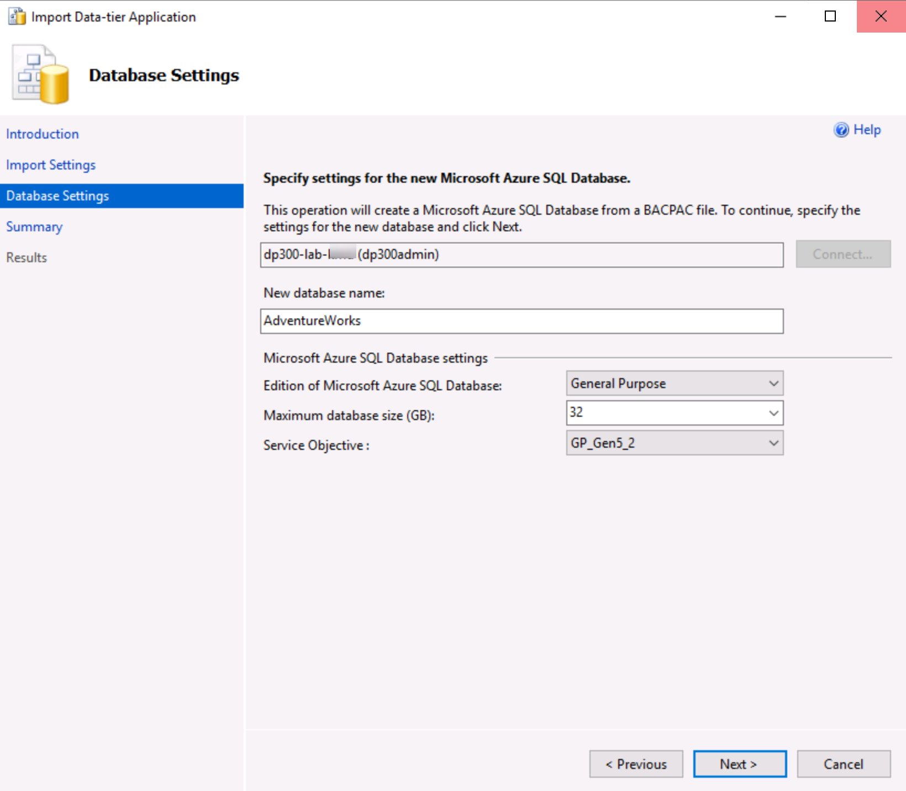
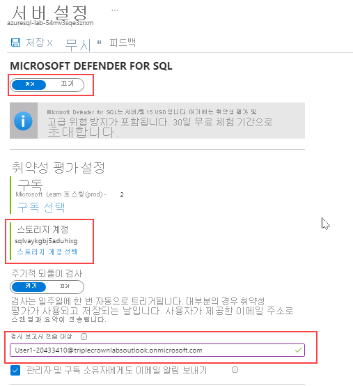

---
lab:
  title: 랩 3 – 안전한 환경 구현
  module: Implement a Secure Environment
---

# <a name="lab-3--implement-a-secure-environment"></a>랩 3 – 안전한 환경 구현
 

**예상 소요 시간:** 60분

<bpt id="p1">**</bpt>Prerequisites<ept id="p1">**</ept>: An Azure SQL server you created in the lab for Module 2. Azure Active Directory access in the subscription.  

**랩 파일**: 이 랩용 파일은 D:\Labfiles\Secure Environment 폴더에 있습니다.

# <a name="lab-overview"></a>랩 개요

학생들은 단원에서 파악한 정보를 사용하여 Azure Portal 및 AdventureWorks 내에서 보안 기능을 구성한 후 구현합니다. 

# <a name="lab-objectives"></a>랩 목표

이 랩을 완료하면 다음을 수행할 수 있습니다.

1. Azure SQL 데이터베이스 방화벽 구성

2. Azure Active Directory를 사용하여 Azure SQL Database에 대한 액세스 권한 부여

3. Azure SQL Database에서 Microsoft Defender for SQL 사용

4. Azure SQL Database에서 데이터 분류 구성

5. 데이터베이스 개체에 대한 액세스 관리

# <a name="scenario"></a>시나리오

You have been hired as a Senior Database Administrator help ensure the security of the database environment. These tasks will focus on Azure SQL Database. 

<bpt id="p1">**</bpt>Note:<ept id="p1">**</ept> The exercises ask you to copy and paste T-SQL code. Please verify that the code has been copied correctly, with the proper line breaks, before executing the code. 

## <a name="exercise-1-configure-an-azure-sql-database-firewall-and-connect-to-a-new-database"></a>연습 1: Azure SQL Database 방화벽을 구성한 다음 새 데이터베이스에 연결

1. From the lab virtual machine, start a browser session and navigate to <bpt id="p1">[</bpt><ph id="ph1">https://portal.azure.com</ph><ept id="p1">](https://portal.azure.com/)</ept>. Provide appropriate credentials. 

    

2. **필수 조건**: 모듈 2 랩에서 만든 Azure SQL server입니다.

    

3. SQL Server 세부 정보 화면에서 마우스를 서버 이름 오른쪽으로 이동한 후 아래와 같이 클립보드에 복사 단추를 클릭합니다.

    

4. 구독에서 Azure Active Directory 액세스.

    

    This will allow you to connect to your Azure SQL Database server using SQL Server Management Studio or any other client tools. <bpt id="p1">**</bpt>Important:<ept id="p1">**</ept> Make note of your client IP address, you will use it later in this task.

5. Open SQL Server Management Studio on the lab VM. Paste in the name of your Azure SQL database server and login with the credentials you created in Lab 2:

    - 서버 이름: **&lt;여기에 Azure SQL 데이터베이스 서버 이름 붙여넣기&gt;**  
         
     - 인증: **SQL Server 인증**  
    
    - 서버 관리자 로그인: **dp300admin**

    - 암호: **dp300P@ssword!**

    

    **연결**을 클릭합니다.

6. In Object Explorer expand the server node, and right click on databases. Click Import a Data-tier Application.

    

7. 데이터 계층 애플리케이션 가져오기 대화 상자의 첫 번째 화면에서 다음을 클릭합니다. 

    

8. In the Import Settings screen, click Browse and navigate to D:\Labfiles\Secure Environment folder and click on the AdventureWorks.bacpac file and click open. Then in the Import Data-tier application screen click <bpt id="p1">**</bpt>Next<ept id="p1">**</ept>.

    

    

9. On the database settings screen, change the edition of Azure SQL Database to General Purpose. Change the Service Objective to <bpt id="p1">**</bpt>GP_Gen5_2<ept id="p1">**</ept> and click <bpt id="p2">**</bpt>Next<ept id="p2">**</ept>. 

    

10.  On the Summary screen click <bpt id="p1">**</bpt>Finish<ept id="p1">**</ept>. When your import completes you will see the results below. Then click <bpt id="p1">**</bpt>Close<ept id="p1">**</ept><ph id="ph1">
    </ph><ph id="ph2"></ph>

11. In Object Explorer, expand the Databases folder. Then right-click on AdventureWorks and click on new query. 

    

12. Execute the following T-SQL query by pasting the text into your query window. <bpt id="p1">**</bpt>Important:<ept id="p1">**</ept> Replace 192.168.1.1. with your client IP address from Step 4. Click execute or press F5.

    ```sql
    EXECUTE sp_set_database_firewall_rule @name = N'ContosoFirewallRule',

    @start_ip_address = '192.168.1.1', @end_ip_address = '192.168.1.1'
    ```

13. Next you will create a contained user in the AdventureWorks database. Click New Query and execute the following T-SQL. Ensure that you are still using the AdventureWorks database. If you see master in the database name box below, you can pull down and switch to AdventureWorks.

    ```sql
    CREATE USER containeddemo WITH PASSWORD = 'P@ssw0rd!'
    ```
    
    
    Click <bpt id="p1">**</bpt>Execute<ept id="p1">**</ept> to run this command. This command creates a contained user within the AdventureWorks database. You will login using the username and password in the next step.
    
14. Navigate to the Object Explorer. Click on <bpt id="p1">**</bpt>Connect<ept id="p1">**</ept> and then <bpt id="p2">**</bpt>Database Engine<ept id="p2">**</ept>.

    

15. Attempt to connect with the credentials you created in step 13. 
    You will need to use the following information:  
    -  **로그인:** containeddemo   
    -  **암호:**  P@ssw0rd! 
     
     **연결**을 클릭합니다.
     
     다음 오류가 표시됩니다.

    

    선임 데이터베이스 관리자로 고용되어 데이터베이스 환경의 보안을 보장합니다.

    

16. 작업은 Azure SQL Database에 중점을 둡니다.

    

17. 개체 탐색기에 다른 데이터베이스가 표시됩니다. 

    

    Make sure the selection stays on the newly added database. Then click <bpt id="p1">**</bpt>Connect<ept id="p1">**</ept> from the Object Explorer and <bpt id="p2">**</bpt>Database Engine<ept id="p2">**</ept>. 
    Enter the following again: 
    - **로그인:** containeddemo   
    - **암호:**  P@ssw0rd! 

    **연결**을 클릭합니다.

    이번에는 연결이 마스터 데이터베이스를 건너뛰고 AdventureWorks(새로 만들어진 사용자가 액세스할 수 있는 유일한 데이터베이스)로 바로 이동합니다.

## <a name="exercise-2-authorize-access-to-azure-sql-database-with-azure-active-directory"></a>연습 2: Azure Active Directory로 Azure SQL 데이터베이스에 대한 액세스 권한 부여

1. Azure Portal로 이동하여 화면 오른쪽 상단 모서리에 있는 사용자 이름을 클릭합니다.

    

    사용자 이름을 기록합니다. 
    
    **참고:** 이 연습을 진행할 때는 T-SQL 코드를 복사하여 붙여 넣어야 합니다.

2. Azure Portal에서 Azure SQL Database 서버(**dp300-lab-xx**)로 이동하여 Active Directory 관리자 옆에 있는 **구성되지 않음**을 클릭합니다.

    

    다음 화면에서 **관리자 설정**을 클릭합니다.

    

3. 코드를 실행하기 전에 코드를 올바르게 복사했으며 줄 바꿈이 적절한지 확인하세요.

    

4. Open SQL Server Management Studio and click <bpt id="p1">**</bpt>Connect<ept id="p1">**</ept>, then <bpt id="p2">**</bpt>Database Engine<ept id="p2">**</ept>. In the server name enter the name of your server. Change the authentication type to Azure Active Directory Universal with MFA.

    

    Azure Active Directory 암호를 입력하라는 메시지가 표시되어 **연결**을 클릭하면 데이터베이스에 로그인됩니다. 

## <a name="exercise-3-enable-microsoft-defender-for-sql-and-data-classification"></a>연습 3: Microsoft Defender for SQL 및 데이터 분류 사용

1. Azure SQL Server의 기본 블레이드에서 **보안** 섹션으로 이동하여 **Microsoft Defender for Cloud**를 선택합니다.

    

    이 옵션을 사용하도록 설정하지 않은 경우 **클라우드용 Microsoft Defender** 페이지에서 **Microsoft Defender for SQL 사용**을 선택합니다.

2. After Azure Defender for SQL is successfully enabled, select <bpt id="p1">**</bpt>Configure<ept id="p1">**</ept> option. You may need to refresh the page to see this option.

    

3. 랩 가상 머신에서 브라우저 세션을 시작하고 [https://portal.azure.com](https://portal.azure.com/)으로 이동합니다.

    

4. Azure SQL Server의 개요 화면 아래로 스크롤하여 Azure Portal의 **AdventureWorksLT** 데이터베이스로 이동하고 데이터베이스 이름을 선택합니다.

    

5. Azure SQL Database용 기본 블레이드의 보안 섹션으로 이동하고 **데이터 검색 및 분류**를 선택합니다.

    

6. 적절한 자격 증명을 제공합니다.

    

7. 다음 **데이터 검색 및 분류** 화면에서 **모두 선택** 옆의 확인란을 선택하고, **선택한 권장 사항 적용**을 선택한 다음 **저장**을 선택하여 분류를 데이터베이스에 저장합니다.

    

## <a name="exercise-4-manage-access-to-database-objects"></a>연습 4: 데이터베이스 개체에 대한 액세스 관리

1. In this exercise, you will manage access to the database and its objects. Navigate back to SQL Server Management Studio. The first thing you will do is create two users in the AdventureWorks database. 

    In the Object Explorer, right click on the AdventureWorks database and select <bpt id="p1">**</bpt>New Query<ept id="p1">**</ept>. In the new query window, copy and paste the following T-SQL into it. Verify that the code has been copied correctly. 

```sql
CREATE USER [DP300User1] WITH PASSWORD = 'Azur3Pa$$'

GO

CREATE USER [DP300User2] WITH PASSWORD = 'Azur3Pa$$'

GO
```

Azure Portal 상단의 검색 창에 SQL을 입력합니다.

2. SQL Server 아이콘이 표시됩니다. 

```sql
CREATE ROLE [SalesReader]

GO

ALTER ROLE [SalesReader] ADD MEMBER [DP300User1]

GO

ALTER ROLE [SalesReader] ADD MEMBER [DP300User2]

GO
```

3. SQL 서버를 클릭합니다.

```sql
GRANT SELECT, EXECUTE ON SCHEMA::Sales TO [SalesReader]

GO
```
 

4. 랩 2에서 만든 서버의 세부 정보 페이지로 이동하려면 서버 이름을 클릭합니다.

```sql
CREATE OR ALTER PROCEDURE Sales.DemoProc

AS

SELECT P.Name, Sum(SOD.LineTotal) as TotalSales ,SOH.OrderDate 

FROM Production.Product P

INNER JOIN Sales.SalesOrderDetail SOD on SOD.ProductID = P.ProductID

INNER JOIN Sales.SalesOrderHeader SOH on SOH.SalesOrderID = SOD.SalesOrderID

GROUP BY P.Name, SOH.OrderDate

ORDER BY TotalSales DESC

GO
```
 

5. Next you will use the EXECUTE AS USER command to test out the security you just created. This allows the database engine to execute a query in the context of your user. Clear the window of the previous query. Execute the below query in your query window.

```sql
EXECUTE AS USER = 'DP300User1'


SELECT P.Name, Sum(SOD.LineTotal) as TotalSales ,SOH.OrderDate 

FROM Production.Product P

INNER JOIN Sales.SalesOrderDetail SOD on SOD.ProductID = P.ProductID

INNER JOIN Sales.SalesOrderHeader SOH on SOH.SalesOrderID = SOD.SalesOrderID

GROUP BY P.Name, SOH.OrderDate

ORDER BY TotalSales DESC
```
 

This query will fail, with an error message saying the SELECT permission was denied on the Production.Product table. The role that user DP300User1 is a member of has SELECT permission in the Sales schema, but not in the Production schema. 

However, if you execute the stored procedure in that same context, the query will complete. Clear the query that gave an error message. Then execute the following T-SQL.

```sql
EXECUTE AS USER = 'DP300User1'

EXECUTE Sales.DemoProc
```

This happens because stored procedures take advantage a feature called ownership chaining to provide data access to users who do not have direct permissions to access database objects. For all objects that have the same owner, the database engine only checks the EXECUTE permission on the procedure and not the underlying objects. 

**다음 랩 실습에서 사용할 예정이기 때문에 이 랩에서 만든 리소스를 제거하지 마세요.**
