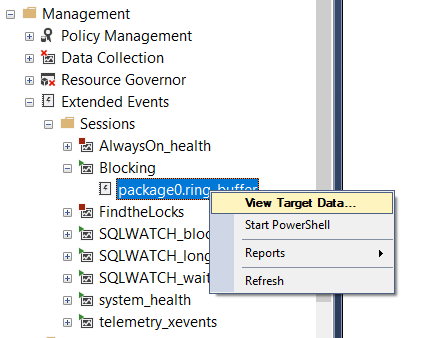
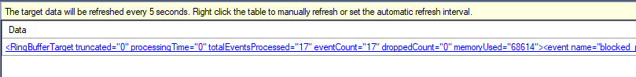

---
lab:
    title: '랩 4 – 리소스 모니터링 및 최적화'
    module: '운영 리소스 모니터링 및 최적화'
---

# 랩 4 – 리소스 모니터링 및 최적화


**예상 소요 시간**: 60분

**사전 요구 사항**: 랩 2 및 3에서 만든 랩 VM 및 Azure SQL 데이터베이스


# 랩 개요


학생들은 단원에서 파악한 정보를 사용하여 AdventureWorks 내에서 진행되는 디지털 혁신 프로젝트의 결과물을 확인합니다. Azure Portal과 다른 도구를 살펴보며, 학생은 기본 도구를 활용하여 성능 관련 문제를 식별하고 해결하는 방법을 결정합니다. 마지막으로 학생은 데이터베이스 내 조각을 식별하고 문제를 적절하게 해결하는 단계를 배울 수 있습니다. 


# 랩 목표


이 랩을 완료하면 다음과 같은 작업을 수행할 수 있습니다.

1. 모니터링을 통해 성능 문제를 격리합니다. 

2. 쿼리 저장소를 활용하여 새 인덱스를 만들어 차단 문제를 찾고 해결합니다.

3. 조각화 문제를 검색하고 수정합니다. 


# 시나리오


성능 관련 문제를 식별하고 발견된 문제를 해결하기 위한 실행 가능한 솔루션을 제공하기 위해 데이터베이스 관리자로 고용되었습니다. AdventureWorks는 10년 이상 소비자 및 유통업체에 자전거와 자전거 부품을 직접 판매해 왔습니다. 이 회사는 Azure SQL 데이터베이스와 더불어 Azure 가상 머신의 SQL Server를 혼합하여 활용합니다. 최근 이 회사는 고객의 요청을 서비스하는 데 사용되는 두 제품 모두에서 성능 저하를 발견했습니다. Azure Portal과 온-프레미스 도구를 사용하여 성능 문제를 식별하고 이를 해결하는 방법을 제안해야 합니다. 
 
        

**참고:** 이 연습을 진행할 때는 T-SQL 코드를 복사하여 붙여 넣어야 합니다. 코드를 실행하기 전에 코드를 올바르게 복사했으며 줄 바꿈이 적절한지 확인하세요. 

        

# 연습 1: 모니터링을 통해 문제 파악


예상 소요 시간: 30분

이 연습의 주요 작업은 다음과 같습니다.

1. Azure SQL 데이터베이스의 성능 관련 문제를 식별하기 위한 모니터링 솔루션 검토

2. 쿼리 저장소를 사용하여 진행 중인 차단 문제를 식별하고 차단을 해결하기 위해 구현할 적절한 인덱스를 식별합니다. 

3. 쿼리 도구를 사용하여 인덱스 조각화을 식별하고 조각화를 해결하는 방법을 제공합니다. 

 

## 작업 1: Azure Portal에서 CPU 사용률 검토

1. 아직 Azure Portal에 액세스하지 않았다면 portal.azure.com으로 다시 이동합니다. 다시 로그인해야 할 수도 있습니다. Azure Portal 상단의 검색 창에서 SQL을 입력하고 SQL 데이터베이스를 클릭합니다. 이 작업은 랩 3에서 만든 AdventureWorks 데이터베이스를 사용합니다. 데이터베이스 이름을 클릭합니다.


    


2. AdventureWorks 데이터베이스 블레이드의 모니터링 섹션에서 메트릭을 찾아서 선택합니다. 


3.  CPU 백분율이 반영되도록 메트릭 메뉴 옵션을 변경합니다.

 
    

4. "평균"의 집계를 선택합니다. 이렇게 하면 지정된 시간 프레임 동안의 평균 CPU 백분율이 표시됩니다. 

5. 이제 집계를 Max로 조정하여 지정된 시간 프레임 동안 사용되는 최대 CPU 백분율을 식별합니다. 이것이 평균과 다른 점은 무엇입니까?

## 작업 2: 높은 CPU 소모 쿼리 식별

1. 첫 번째 작업과 같은 보기를 표시한 다음 지능형 성능 아래의 같은 메뉴에서 Query Performance Insight를 선택합니다.

    

2.  그래프 아래 표에서 첫 번째 쿼리를 클릭합니다. 


    

3. 다음 이미지에서 보여지는 것과 같이 쿼리와 리소스 사용량을 기록합니다. Azure는 각 쿼리에 대해 CPU, 데이터 IO 및 로그 IO를 추적합니다.

 
    


# 연습 2: 차단 문제 식별 및 해결


예상 소요 시간: 15분

개인 연습

이 연습의 주요 작업은 다음과 같습니다.

1. 확장된 이벤트와 함께 차단 보고서를 활용하여 차단을 일으키는 쿼리를 결정합니다.

2. 차단을 해결하기 위해 구현할 수 있는 인덱스 식별

## 작업 1: 차단된 쿼리 보고서 실행

이 연습에서는 랩 VM의 SQL Server Management Studio를 사용하여 온-프레미스 SQL Server에 연결합니다. 

1.  랩 VM에서 SQL Server Management Studio를 엽니다. 이렇게 하려면 시작 메뉴를 열고   
    Microsoft SQL Server Tools 18> Microsoft SQL Server Management Studio로 이동합니다. 작업 표시줄에서 Management Studio 아이콘을 선택해도 됩니다. 

2. Management Studio에서 새 쿼리 단추를 클릭하여 새 쿼리를 시작합니다.

    

    SQL Server에 연결하라는 메시지가 표시됩니다.


    

    로컬 서버 이름으로 LON-SQL1을 입력하고 Windows 인증을 선택되었는지 확인한 다음 연결을 클릭합니다.


3. 아래 코드를 복사하여 쿼리 창에 붙여넣습니다. 

 
    ```sql
    USE MASTER

    GO

    CREATE EVENT SESSION [Blocking] ON SERVER 

    ADD EVENT sqlserver.blocked_process_report(

    ACTION(sqlserver.client_app_name,sqlserver.client_hostname,sqlserver.database_id,sqlserver.database_name,sqlserver.nt_username,sqlserver.session_id,sqlserver.sql_text,sqlserver.username))

    ADD TARGET package0.ring_buffer

    WITH (MAX_MEMORY=4096 KB, EVENT_RETENTION_MODE=ALLOW_SINGLE_EVENT_LOSS, MAX_DISPATCH_LATENCY=30 SECONDS, MAX_EVENT_SIZE=0 KB,MEMORY_PARTITION_MODE=NONE, TRACK_CAUSALITY=OFF,STARTUP_STATE=ON)

    GO

    -- Start the event session 

    ALTER EVENT SESSION [Blocking] ON SERVER 

    STATE = start; 

    GO
    ```

    실행 단추를 클릭하여 쿼리를 실행합니다. 

    위의 T-SQL 코드는 차단 이벤트를 캡처하는 확장 이벤트 세션을 만듭니다. 데이터에는 다음 요소가 포함됩니다.

    - 클라이언트 애플리케이션 이름

    - 클라이언트 호스트 이름

    - 데이터베이스 ID

    - 데이터베이스 이름

    - NT 사용자 이름

    - 세션 ID

    - T-SQL 텍스트

    - 사용자 이름


4. SQL Server Management Studio에서 새 쿼리를 클릭합니다. 다음 T-SQL 코드를 복사하여 쿼리 창에 붙여 넣습니다. 실행 단추를 클릭하여 쿼리를 실행합니다. 

    ```sql
    USE AdventureWorks2017

    GO

    BEGIN TRANSACTION

    UPDATE Person.Person SET LastName = LastName;

    GO
    ```
 

5. 새 쿼리 단추를 클릭하여 또 다른 쿼리 창을 엽니다. 다음 T-SQL 코드를 복사하여 쿼리 창에 붙여 넣습니다. 실행 단추를 클릭하여 쿼리를 실행합니다. 

    ```sql
    USE AdventureWorks2017

    GO

    SELECT TOP (1000) [LastName]

    ,[FirstName]

    ,[Title]

    FROM Person.Person

    WHERE FirstName = 'David'
    ```
    

    이 쿼리는 결과를 즉시 반환하지 않으며 여전히 실행 중인 것으로 나타난다는 점에 주목해야 합니다.


6. 개체 탐색기에서 **관리**로 이동한 후 더하기 기호를 클릭하여 하이브를 확장합니다. **확장 이벤트**를 확장한 다음 **세션**을 확장합니다. 3단계에서 만든 세션이 포함된 **Blocking**을 확장합니다. **package0.ring_buffer**를 마우스 오른쪽 단추로 클릭하고 **대상 데이터 보기**를 선택합니다. 

    

7. 하이퍼링크 클릭합니다. 

    

8. XML은 차단 중인 프로세스와 차단을 유발하는 프로세스를 표시합니다. 

    
 
9.  **Blocking**이라고 하는 확장 이벤트 세션을 마우스 오른쪽 단추로 클릭하고 **세션 중지**를 선택합니다. 
    
    

10.  4단계에서 열어놓은 쿼리 탭으로 다시 이동하여 쿼리 아래 줄에 ROLLBACK TRANSACTION을 입력합니다. ROLLBACK TRANSACTION을 강조 표시하 명령을 실행합니다.

  
 
11. 5단계에서 열어놓은 쿼리 탭으로 다시 이동합니다. 이제 쿼리가 완료되었음을 알 수 있습니다.

12. 쿼리 창을 모두 닫습니다.

## 작업 2: 읽기 커밋 스냅샷 격리 사용

1. 새 쿼리 창을 엽니다. 다음 T-SQL 코드를 복사하여 쿼리 창에 붙여 넣습니다. 실행 단추를 클릭하여 쿼리를 실행합니다. 

```sql
USE master

GO

ALTER DATABASE AdventureWorks2017 SET READ_COMMITTED_SNAPSHOT ON WITH ROLLBACK IMMEDIATE;

GO
```
2. 다음 T-SQL 코드를 복사하여 새 쿼리 창에 붙여 넣습니다. 실행 단추를 클릭하여 쿼리를 실행합니다. 
```sql
USE AdventureWorks2017

GO

BEGIN TRANSACTION

UPDATE Person.Person SET LastName = LastName;

GO
```
 

3. 다음 T-SQL 코드를 복사하여 새 쿼리 창에 붙여 넣습니다. 실행 단추를 클릭하여 쿼리를 실행합니다. 

```sql
USE AdventureWorks2017

GO

SELECT TOP (1000) [LastName]

 ,[FirstName]

 ,[Title]

 FROM Person.Person

 WHERE firstname = 'David';
 
 GO
```

4. 왜 쿼리가 이전 연습에서는 UPDATE에 의해 차단된 반면에 3단계에서는 이제 완료되었는지에 대해 강사와 논의합니다. SQL Server Management Studio는 다음 연습에서도 사용할 것이므로 열어 두되 쿼리 창은 모두 닫습니다. 


# 연습 3: 조각화 문제 감지/수정


예상 소요 시간: 15분

개인 연습

이 연습의 주요 작업은 다음과 같습니다.

1. 조각 식별 

2. 조각화 제거

2. 강사는 그룹과 결과에 대해 논의합니다.

## 작업 1: 조각 식별

1. SQL Server Management Studio에서 새 쿼리 단추를 클릭합니다. 다음 T-SQL 코드를 복사하여 쿼리 창에 붙여 넣습니다. 실행 단추를 클릭하여 쿼리를 실행합니다. 

```sql
USE AdventureWorks2017
GO

INSERT INTO [Person].[Address]

 ([AddressLine1]

 ,[AddressLine2]

 ,[City]

 ,[StateProvinceID]

 ,[PostalCode]

 ,[SpatialLocation]

 ,[rowguid]

 ,[ModifiedDate])

SELECT AddressLine1,

 AddressLine2, 

 'Amsterdam',

 StateProvinceID, 

 PostalCode, 

 SpatialLocation, 

 newid(), 

 getdate()

FROM Person.Address;


GO
```
이 쿼리는 Person.Address 테이블 및 인덱스의 조각화 수준을 증가시킵니다.


2. 다음 T-SQL 코드를 복사하여 새 쿼리 창에 붙여 넣습니다. 실행 단추를 클릭하여 쿼리를 실행합니다. 

```sql
USE AdventureWorks2017

GO

SELECT i.name Index_Name

 , avg_fragmentation_in_percent

 , db_name(database_id)

 , i.object_id

 , i.index_id

 , index_type_desc

FROM sys.dm_db_index_physical_stats(db_id('AdventureWorks2017'),object_id('person.address'),NULL,NULL,'DETAILED') ps

 INNER JOIN sys.indexes i ON ps.object_id = i.object_id 

 AND ps.index_id = i.index_id

WHERE avg_fragmentation_in_percent > 50 -- find indexes where fragmentation is greater than 50%
```
 
이 쿼리는 50% 이상의 조각이 있는 인덱스를 보고합니다. 조각이 있는 네 개의 인덱스가 표시됩니다.


3. 다음 T-SQL 코드를 복사하여 새 쿼리 창에 붙여 넣습니다. 실행 단추를 클릭하여 이 쿼리를 실행합니다. 

```sql
SET STATISTICS IO,TIME ON

GO

USE AdventureWorks2017

GO

SELECT DISTINCT (StateProvinceID)

 ,count(StateProvinceID) AS CustomerCount

FROM person.Address

GROUP BY StateProvinceID

ORDER BY count(StateProvinceID) DESC;

GO
```
 

SQL Server Management Studio의 결과 창에서 메시지 탭을 클릭합니다. 쿼리에서 수행하는 논리적 읽기 횟수를 기록합니다. 
    
   

## 작업 2: 인덱스 다시 빌드

1. 새 쿼리 단추를 클릭합니다. 


2. 다음 T-SQL 코드를 복사하여 쿼리 창에 붙여 넣습니다. 실행 단추를 클릭하여 쿼리를 실행합니다. 

```sql
USE AdventureWorks2017

GO

ALTER INDEX [IX_Address_StateProvinceID] ON [Person].[Address] REBUILD PARTITION = ALL WITH (PAD_INDEX = OFF, STATISTICS_NORECOMPUTE = OFF, SORT_IN_TEMPDB = OFF, IGNORE_DUP_KEY = OFF, ONLINE = OFF, ALLOW_ROW_LOCKS = ON, ALLOW_PAGE_LOCKS = ON)
```
 

3. 작업 1의 2단계에서 쿼리를 다시 실행합니다. AK_Address_StateProvinceID 인덱스에 50%를 초과하는 조각이 더이상 없는지 확인합니다. 

4. 작업 1의 3단계에서 쿼리를 다시 실행합니다. Management Studio 결과 창의 메시지 탭에서 논리적 읽기를 기록합니다. 인덱스를 다시 빌드하기 전에 마주쳤던 논리적 읽기 횟수에 변경이 있었나요? 
