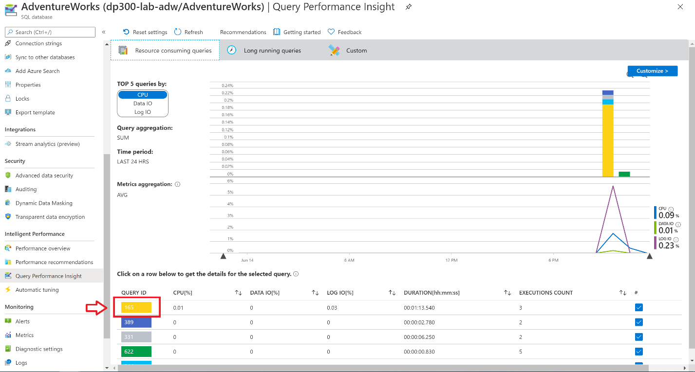
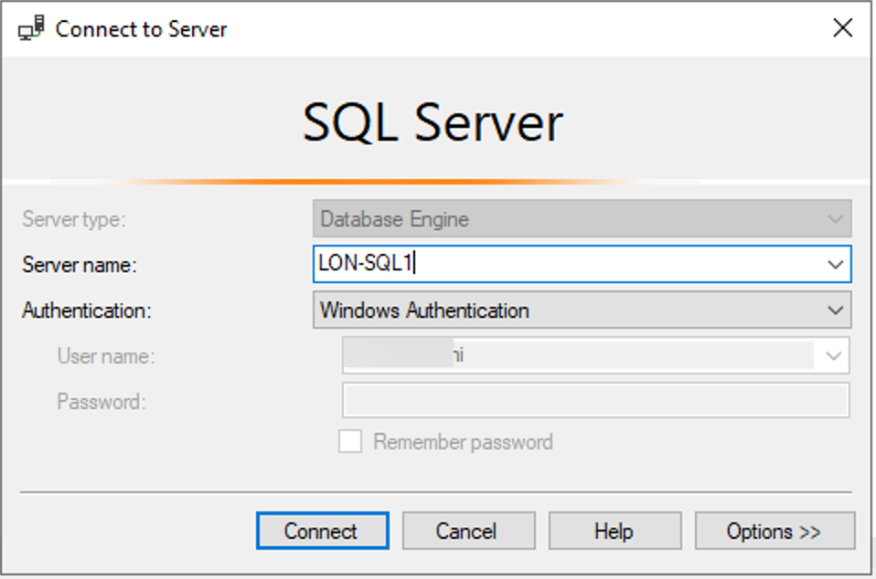

---
lab:
  title: 랩 4 – 리소스 모니터링 및 최적화
  module: Monitor and Optimize Operational Resources
---

# <a name="lab-4--monitor-and-optimize-resources"></a>랩 4 – 리소스 모니터링 및 최적화


**예상 소요 시간:** 60분

**사전 요구 사항**: 랩 2 및 3에서 만든 랩 VM 및 Azure SQL 데이터베이스


# <a name="lab-overview"></a>랩 개요


The students will take the information gained in the lessons to scope out the deliverables for a digital transformation project within AdventureWorks. Examining the Azure portal as well as other tools, students will determine how to utilize native tools to identify and resolve performance related issues. Finally, students will be able to identify fragmentation within the database as well as learn steps to resolve the issue appropriately. 


# <a name="lab-objectives"></a>랩 목표


이 랩을 완료하면 다음을 수행할 수 있습니다.

1. 모니터링을 통해 성능 문제를 격리합니다. 

2. 쿼리 저장소를 활용하여 새 인덱스를 만들어 차단 문제를 찾고 해결합니다.

3. 조각화 문제를 검색하고 수정합니다. 


# <a name="scenario"></a>시나리오


You have been hired as a database administrator to identify performance related issues and provide viable solutions to resolve any issues found. AdventureWorks has been selling bicycles and bicycle parts directly to consumers and distributors for over a decade. The company utilizes a mixture of both Azure SQL Databases as well as a SQL Server in an Azure Virtual Machine. Recently the company has noticed performance degradation within both products that are used to service customer requests. You need to use the Azure portal as well as on-premises tools to identify the performance issues and suggest methods to resolve them. 
 
        

<bpt id="p1">**</bpt>Note:<ept id="p1">**</ept> The exercises ask you to copy and paste T-SQL code. Please verify that the code has been copied correctly, with the proper line breaks, before executing the code. 

        

# <a name="exercise-1-isolate-problems-by-monitoring"></a>연습 1: 모니터링을 통해 문제 파악


예상 소요 시간: 30분

이 연습의 주요 태스크는 다음과 같습니다.

1. Azure SQL 데이터베이스의 성능 관련 문제를 식별하기 위한 모니터링 솔루션 검토

2. 쿼리 저장소를 사용하여 진행 중인 차단 문제를 식별하고 차단을 해결하기 위해 구현할 적절한 인덱스를 식별합니다. 

3. 쿼리 도구를 사용하여 인덱스 조각화을 식별하고 조각화를 해결하는 방법을 제공합니다. 

 

## <a name="task-1-review-cpu-utilization-in-azure-portal"></a>작업 1: Azure Portal에서 CPU 사용률 검토

1. If you're not already in the Azure portal, navigate back to portal.azure.com. You may need to login again. In the search bar at the top of the Azure Portal, type SQL, and click on SQL databases. This task will use the AdventureWorks database you created in Lab 3. Click on the database name.


    


2. AdventureWorks 데이터베이스 블레이드의 모니터링 섹션에서 메트릭을 찾아서 선택합니다. 


3.  CPU 백분율이 반영되도록 메트릭 메뉴 옵션을 변경합니다.

 
    

4. Select an Aggregation of “Avg”. This will display the average CPU Percentage for the given time frame. 

5. Now adjust the aggregation to Max to identify the maximum CPU Percentage used for the give time frame. How is it different from the average?

## <a name="task-2-identify-high-cpu-consuming-queries"></a>작업 2: 높은 CPU 소모 쿼리 식별

1. 첫 번째 작업과 같은 보기를 표시한 다음 지능형 성능 아래의 같은 메뉴에서 Query Performance Insight를 선택합니다.

    

2.  그래프 아래 표에서 첫 번째 쿼리를 클릭합니다. 


    

3. 학생들은 단원에서 파악한 정보를 사용하여 AdventureWorks 내에서 진행되는 디지털 혁신 프로젝트의 결과물을 확인합니다.

 
    


# <a name="exercise-2-identify-and-resolve-blocking-issues"></a>연습 2: 차단 문제 식별 및 해결


예상 소요 시간: 15분

개인 연습

이 연습의 주요 태스크는 다음과 같습니다.

1. 확장된 이벤트와 함께 차단 보고서를 활용하여 차단을 일으키는 쿼리를 결정합니다.

2. 차단을 해결하기 위해 구현할 수 있는 인덱스 식별

## <a name="task-1-run-blocked-queries-report"></a>작업 1: 차단된 쿼리 실행 보고서

이 연습에서는 랩 VM의 SQL Server Management Studio를 사용하여 온-프레미스 SQL Server에 연결합니다. 

1.  랩 VM에서 SQL Server Management Studio를 엽니다. 이렇게 하려면 시작 메뉴를 열고   
    Azure Portal과 다른 도구를 살펴보며, 학생은 기본 도구를 활용하여 성능 관련 문제를 식별하고 해결하는 방법을 결정합니다. 

2. Management Studio에서 새 쿼리 단추를 클릭하여 새 쿼리를 시작합니다.

    

    SQL Server에 연결하라는 메시지가 표시됩니다.


    

    로컬 서버 이름으로 LON-SQL1을 입력하고 Windows 인증을 선택되었는지 확인한 다음 연결을 클릭합니다.


3. 아래 코드를 복사하여 쿼리 창에 붙여넣습니다. 

 
    ```sql
    USE MASTER

    GO

    CREATE EVENT SESSION [Blocking] ON SERVER 

    ADD EVENT sqlserver.blocked_process_report(

    ACTION(sqlserver.client_app_name,sqlserver.client_hostname,sqlserver.database_id,sqlserver.database_name,sqlserver.nt_username,sqlserver.session_id,sqlserver.sql_text,sqlserver.username))

    ADD TARGET package0.ring_buffer

    WITH (MAX_MEMORY=4096 KB, EVENT_RETENTION_MODE=ALLOW_SINGLE_EVENT_LOSS, MAX_DISPATCH_LATENCY=30 SECONDS, MAX_EVENT_SIZE=0 KB,MEMORY_PARTITION_MODE=NONE, TRACK_CAUSALITY=OFF,STARTUP_STATE=ON)

    GO

    -- Start the event session 

    ALTER EVENT SESSION [Blocking] ON SERVER 

    STATE = start; 

    GO
    ```

    실행 단추를 클릭하여 이 쿼리를 실행합니다. 

    마지막으로 학생은 데이터베이스 내 조각을 식별하고 문제를 적절하게 해결하는 단계를 배울 수 있습니다.

    - 클라이언트 애플리케이션 이름

    - 클라이언트 호스트 이름

    - 데이터베이스 ID

    - 데이터베이스 이름

    - NT 사용자 이름

    - 세션 ID

    - T-SQL 텍스트

    - 사용자 이름


4. Click New Query from SQL Server Management Studio. Copy and paste the following T-SQL code into the query window. Click the execute button to execute this query. 

    ```sql
    USE AdventureWorks2017

    GO

    BEGIN TRANSACTION

    UPDATE Person.Person SET LastName = LastName;

    GO
    ```
 

5. Open another query window by clicking the New Query button. Copy and paste the following T-SQL code into the query window. Click the execute button to execute this query. 

    ```sql
    USE AdventureWorks2017

    GO

    SELECT TOP (1000) [LastName]

    ,[FirstName]

    ,[Title]

    FROM Person.Person

    WHERE FirstName = 'David'
    ```
    

    이 쿼리는 결과를 즉시 반환하지 않으며 여전히 실행 중인 것으로 표시됩니다.


6. In Object Explorer, navigate to <bpt id="p1">**</bpt>Management<ept id="p1">**</ept>, and expand the hive by clicking the plus sign. Expand <bpt id="p1">**</bpt>Extended Events<ept id="p1">**</ept> and then expand <bpt id="p2">**</bpt>Sessions<ept id="p2">**</ept>. Expand <bpt id="p1">**</bpt>Blocking<ept id="p1">**</ept>, which contains the session created in step 3. Right click on <bpt id="p1">**</bpt>package0.ring_buffer<ept id="p1">**</ept> and select <bpt id="p2">**</bpt>View Target Data<ept id="p2">**</ept>. 

    

7. 하이퍼링크 클릭합니다. 

    

8. XML은 차단 중인 프로세스와 차단을 초래하는 프로세스를 표시합니다. 

    
 
9.  **Blocking**이라고 하는 확장 이벤트 세션을 마우스 오른쪽 단추로 클릭하고 **세션 중지**를 선택합니다. 
    
    

10.  Navigate back to the query tab you opened in step 4, and type ROLLBACK TRANSACTION on the line below the query. Highlight ROLLBACK TRANSACTION and execute the command.

  
 
11. Navigate back to the query tab you opened in Step 5. You will notice that the query has now completed.

12. 쿼리 창을 모두 닫습니다.

## <a name="task-2-enabling-read-committed-snapshot-isolation"></a>작업 2: 읽기 커밋 스냅샷 격리 사용

1. Open a new query window. Copy and paste the following T-SQL code into the query window. Click the execute button to execute this query. 

```sql
USE master

GO

ALTER DATABASE AdventureWorks2017 SET READ_COMMITTED_SNAPSHOT ON WITH ROLLBACK IMMEDIATE;

GO
```
2. Copy and paste the following T-SQL code into a new query window. Click the execute button to execute this query. 
```sql
USE AdventureWorks2017

GO

BEGIN TRANSACTION

UPDATE Person.Person SET LastName = LastName;

GO
```
 

3. 데이터베이스 관리자는 성능 관련 문제를 식별하고 발견된 문제를 해결하는 실행 가능한 솔루션을 제공하도록 고용됩니다. 

```sql
USE AdventureWorks2017

GO

SELECT TOP (1000) [LastName]

 ,[FirstName]

 ,[Title]

 FROM Person.Person

 WHERE firstname = 'David';
 
 GO
```

4. AdventureWorks는 10년 이상 소비자 및 유통업체에 자전거와 자전거 부품을 직접 판매해 왔습니다. 


# <a name="exercise-3-detectcorrect-fragmentation-issues"></a>연습 3: 조각화 문제 감지/수정


예상 소요 시간: 15분

개인 연습

이 연습의 주요 태스크는 다음과 같습니다.

1. 조각화 확인 

2. 조각화 제거

2. 강사는 그룹과 결과에 대해 논의합니다.

## <a name="task-1-identify-fragmentation"></a>작업 1: 조각화 확인

1. 이 회사는 Azure SQL 데이터베이스와 더불어 Azure 가상 머신의 SQL Server를 혼합하여 활용합니다. 

```sql
USE AdventureWorks2017
GO

INSERT INTO [Person].[Address]

 ([AddressLine1]

 ,[AddressLine2]

 ,[City]

 ,[StateProvinceID]

 ,[PostalCode]

 ,[SpatialLocation]

 ,[rowguid]

 ,[ModifiedDate])

SELECT AddressLine1,

 AddressLine2, 

 'Amsterdam',

 StateProvinceID, 

 PostalCode, 

 SpatialLocation, 

 newid(), 

 getdate()

FROM Person.Address;


GO
```
이 쿼리는 Person.Address 테이블 및 인덱스의 조각화 수준을 증가시킵니다.


2. 최근 이 회사는 고객의 요청을 서비스하는 데 사용되는 두 제품 모두에서 성능 저하를 발견했습니다. 

```sql
USE AdventureWorks2017

GO

SELECT i.name Index_Name

 , avg_fragmentation_in_percent

 , db_name(database_id)

 , i.object_id

 , i.index_id

 , index_type_desc

FROM sys.dm_db_index_physical_stats(db_id('AdventureWorks2017'),object_id('person.address'),NULL,NULL,'DETAILED') ps

 INNER JOIN sys.indexes i ON ps.object_id = i.object_id 

 AND ps.index_id = i.index_id

WHERE avg_fragmentation_in_percent > 50 -- find indexes where fragmentation is greater than 50%
```
 
Azure Portal과 온-프레미스 도구를 사용하여 성능 문제를 식별하고 이를 해결하는 방법을 제안해야 합니다.


3. Copy and paste the following T-SQL code into a new query window. Click the execute button to to execute this query. 

```sql
SET STATISTICS IO,TIME ON

GO

USE AdventureWorks2017

GO

SELECT DISTINCT (StateProvinceID)

 ,count(StateProvinceID) AS CustomerCount

FROM person.Address

GROUP BY StateProvinceID

ORDER BY count(StateProvinceID) DESC;

GO
```
 

**참고:** 이 연습을 진행할 때는 T-SQL 코드를 복사하여 붙여 넣어야 합니다. 
    
   

## <a name="task-2-rebuild-indexes"></a>작업 2: 인덱스 다시 빌드

1. 새 쿼리 단추를 클릭합니다. 


2. 코드를 실행하기 전에 코드를 올바르게 복사했으며 줄 바꿈이 적절한지 확인하세요. 

```sql
USE AdventureWorks2017

GO

ALTER INDEX [IX_Address_StateProvinceID] ON [Person].[Address] REBUILD PARTITION = ALL WITH (PAD_INDEX = OFF, STATISTICS_NORECOMPUTE = OFF, SORT_IN_TEMPDB = OFF, IGNORE_DUP_KEY = OFF, ONLINE = OFF, ALLOW_ROW_LOCKS = ON, ALLOW_PAGE_LOCKS = ON)
```
 

3. Re-execute the query from step 2 in Task 1. Confirm that the AK_Address_StateProvinceID index no longer has fragmentation greater than 50%. 

4. Re-execute the query from step 3 in Task 1. Make note of the logical reads in the Messages tab of the Results pane in Management Studio. Was there a change from the number of logical reads encountered before you rebuilt the index? 
