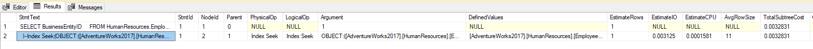
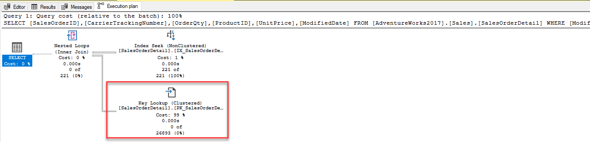

---
lab:
  title: 랩 5 - 쿼리 성능 문제 해결
  module: Optimize Query Performance
---


# <a name="lab-5--query-performance-troubleshooting"></a>랩 5 - 쿼리 성능 문제 해결

**예상 소요 시간:** 75분

**랩 파일**: 이 랩의 파일은 D:\Labfiles\Query 성능 폴더에 있습니다.


# <a name="lab-overview"></a>랩 개요

The students will evaluate a database design for problems with normalization, data type selection and index design. They will run queries with suboptimal performance, examine the query plans, and attempt to make improvements within the AdventureWorks2017 database.

# <a name="lab-objectives"></a>랩 목표

이 랩을 완료하면 다음을 수행할 수 있습니다.

1. 데이터베이스 디자인과 관련된 문제를 식별합니다.

    - 데이터베이스 디자인에 대한 쿼리를 평가합니다.

    - 초과/미달 정규화 또는 잘못된 데이터 형식과 같은 잠재적인 잘못된 패턴에 대한 기존 설계를 검토합니다. 

2. 성능이 저하된 쿼리에서 문제 영역을 격리합니다. 

    - GUI를 사용하지 않는 실제 실행 계획을 생성하기 위해 쿼리를 실행합니다.

    - 지정된 실행 계획(예: 키 조회)을 평가합니다. 

3. 쿼리 저장소를 사용하여 회귀를 감지하고 처리합니다. 

    - 쿼리 저장소에 대한 쿼리 통계를 생성하기 위해 워크로드를 실행합니다. 

    - 리소스를 가장 많이 사용하는 쿼리를 검사하여 성능 저하 파악 

    - 더 나은 실행 계획 강제 적용 

4. 쿼리 힌트를 사용하여 성능에 영향을 미칩니다. 

    - 워크로드를 실행합니다. 

    - 매개 변수 값을 사용하도록 쿼리를 변경합니다.

    - 값을 최적화하기 위해 쿼리 힌트를 쿼리에 적용합니다. 

# <a name="scenario"></a>시나리오

You have been hired as a Senior Database Administrator to help with performance issues currently happening when users query the AdventureWorks2017 database. Your job is to identify issues in query performance and remedy them using techniques learned in this module.

첫 번째 단계는 사용자가 문제가 있는 쿼리를 검토하고 권장 사항을 만드는 것입니다.

1. AdventureWorks2017 내에서 데이터베이스 디자인 문제를 식별합니다.

2. AdventureWorks2017의 성능이 저하된 쿼리에서 문제 영역을 격리합니다.

3. 쿼리 저장소를 사용하여 AdventureWorks2017에서 회귀를 감지하고 처리합니다.

4. 쿼리 힌트를 사용하여 AdventureWorks2017의 성능에 영향을 미칩니다.
 
        

<bpt id="p1">**</bpt>Note:<ept id="p1">**</ept> The exercises ask you to copy and paste T-SQL code. Please verify that the code has been copied correctly, with the proper line breaks, before executing the code. 

       


# <a name="exercise-1-identify-issues-with-database-design-in-adventureworks2017"></a>연습 1: AdventureWorks2017에서 데이터베이스 디자인 문제를 식별합니다.

예상 소요 시간: 15분

이 연습의 주요 작업은 다음과 같습니다.

1. 쿼리를 검사하고 경고가 표시되는 이유와 경고의 내용을 확인합니다.

2. 문제를 해결하는 두 가지 방법을 생각해 보세요.

    - 문제를 해결하기 위해 쿼리를 변경합니다.

    - 문제를 해결하기 위해 데이터베이스 설계 변경을 제안합니다.

## <a name="task-1-examine-the-query-and-identify-the-problem"></a>작업 1: 쿼리를 검사하고 문제를 식별합니다.

1. 랩 가상 머신에서 **SSMS(SQL Server Management Studio)** 를 시작합니다. 

    

2. SQL Server에 연결하라는 메시지가 표시됩니다.  
‎서버 이름으로 LON-SQL1을 입력하고 Windows 인증이 선택되었는지 확인한 후 연결을 클릭합니다.

    

‎   
3. Open a new query window. Copy and paste the code below into your query window.

```sql
USE AdventureWorks2017;

SELECT BusinessEntityID, NationalIDNumber, LoginID, HireDate, JobTitle 

FROM HumanResources.Employee 

WHERE NationalIDNumber = 14417807;
```

4. Click on Include Actual Execution Plan icon as shown below before running the query or type CTRL+M. This will cause the execution plan to be displayed when you execute the query.
    <ph id="ph1"></ph>  
‎

5. 실행 단추를 클릭하여 이 쿼리를 실행합니다. 

6. Navigate to the execution plan, by clicking on Execution plan tab in the results panel in SSMS. In the execution plan, move your mouse over the SELECT operator. You will note a warning message identified by an exclamation point in a yellow triangle as shown below. Identify what the Warning Message tells you. 
    <ph id="ph1"></ph>

    암시적 변환으로 인해 성능 문제가 발생합니다.


## <a name="task-2-identify-two-ways-to-fix-the-warning-issue"></a>작업 2: 두 개의 경고 문제 해결 방법 파악

테이블 구조는 다음 DDL(데이터 정의 언어) 문에 표시됩니다.

```sql
CREATE TABLE [HumanResources].[Employee](

 [BusinessEntityID] [int] NOT NULL,

 [NationalIDNumber] [nvarchar](15) NOT NULL,

 [LoginID] [nvarchar](256) NOT NULL,

 [OrganizationNode] [hierarchyid] NULL,

 [OrganizationLevel] AS ([OrganizationNode].[GetLevel]()),

 [JobTitle] [nvarchar](50) NOT NULL,

 [BirthDate] [date] NOT NULL,

 [MaritalStatus] [nchar](1) NOT NULL,

 [Gender] [nchar](1) NOT NULL,

 [HireDate] [date] NOT NULL,

 [SalariedFlag] [dbo].[Flag] NOT NULL,

 [VacationHours] [smallint] NOT NULL,

 [SickLeaveHours] [smallint] NOT NULL,

 [CurrentFlag] [dbo].[Flag] NOT NULL,

 [rowguid] [uniqueidentifier] ROWGUIDCOL NOT NULL,

 [ModifiedDate] [datetime] NOT NULL

) ON [PRIMARY]
```


1. 코드를 솔루션으로 사용하여 쿼리를 수정합니다.

암시적 변환의 원인이 되는 열과 그 이유를 식별합니다. 

학생들은 정규화, 데이터 유형 선택 및 인덱스 디자인 문제에 대한 데이터베이스 설계를 평가합니다.

2. 최적이 아닌 성능으로 쿼리를 실행하고 쿼리 계획을 검토하고 AdventureWorks2017 데이터베이스 내에서 개선하려고 시도합니다.

By changing the WHERE clause so that the value compared to the NationalIDNumber column matches the column’s data type in the table, you can get rid of the implicit conversion. In this scenario just adding a single quote on each side of the value changes it from a number to a character string. Keep the query window open for this query.

```sql
SELECT BusinessEntityID, NationalIDNumber, LoginID, HireDate, JobTitle 

FROM HumanResources.Employee 

WHERE NationalIDNumber = '14417807'
```


3. 데이터베이스 디자인 변경 내용을 사용하여 쿼리를 수정합니다. 

To attempt to fix the index, open a new query window, and copy the query below to change the column’s data type. Attempt to execute the query by clicking Execute.

```sql
ALTER TABLE [HumanResources].[Employee] ALTER COLUMN [NationalIDNumber] INT NOT NULL;
```

The changes to the table would solve the conversion issue. However this change introduces another issue that as a database administrator you need to resolve. Since this column is part of an already existing nonclustered index, the index has to be rebuilt/recreated in order to execute the data type change. This could lead to extended downtime in production, which highlights the importance of choosing the right data types in your design. 

Msg 5074, 레벨 16, 상태 1, 1줄 'AK_Employee_NationalIDNumber' 인덱스는 'NationalIDNumber' 열에 따라 달라집니다.

Msg 4922, 레벨 16, 상태 9, 1줄

ALTER TABLE ALTER COLUMN NationalIDNumber는 하나 이상의 개체가 이 열에 액세스하기 때문에 실패했습니다.

 

4. 이 문제를 해결하기 위해 아래 코드를 쿼리 창에 복사하여 붙여넣고 실행을 클릭하여 실행합니다.

```sql
USE AdventureWorks2017
GO

DROP INDEX [AK_Employee_NationalIDNumber] ON [HumanResources].[Employee]
GO

ALTER TABLE [HumanResources].[Employee] ALTER COLUMN [NationalIDNumber] INT NOT NULL;
GO

CREATE UNIQUE NONCLUSTERED INDEX [AK_Employee_NationalIDNumber] ON [HumanResources].[Employee]

( [NationalIDNumber] ASC

);
GO
```

5. 따옴표 없이 원래 쿼리를 다시 실행합니다.

```sql
USE AdventureWorks2017;

SELECT BusinessEntityID, NationalIDNumber, LoginID, HireDate, JobTitle 

FROM HumanResources.Employee 

WHERE NationalIDNumber = 14417807;
```

실행 계획에 경고 메시지가 더 이상 표시되지 않습니다. 

# <a name="exercise-2-isolate-problem-areas-in-poorly-performing-queries-in-adventureworks2017"></a>연습 2: AdventureWorks2017에서 성능이 저하된 쿼리에서 문제 영역을 격리합니다.

예상 소요 시간: 30분

이 연습에 대한 작업은 다음과 같습니다.

1. 쿼리를 실행하여 실제 실행 계획을 생성합니다. 

2. 지정된 실행 계획(예: 키 조회)을 평가합니다. 

## <a name="task-1-run-a-query-to-generate-the-actual-execution-plan"></a>작업 1: 쿼리를 실행하여 실제 실행 계획을 생성합니다.

There are several ways to generate an execution plan in SQL Server Management Studio. You will use the same query from Exercise 1. Copy and paste the code below into a new query window and execute it by clicking Execute.

SHOWPLAN_ALL 설정을 사용하면 지난 연습에서와 동일한 정보를 그래픽 결과 대신 결과 창에서 얻을 수 있습니다.

```sql
USE AdventureWorks2017; 

GO 

SET SHOWPLAN_ALL ON; 

GO 

SELECT BusinessEntityID 

FROM HumanResources.Employee 

WHERE NationalIDNumber = '14417807'; 

GO 

SET SHOWPLAN_ALL OFF; 

GO 
```

여기에서는 실행 계획의 텍스트 버전을 보여줍니다.

  
‎

## <a name="task-2-resolve-a-performance-problem-from-an-execution-plan"></a>작업 2: 실행 계획에서 성능 문제 해결

1. Copy and paste the code below into a new query window. Click on Include Actual Execution Plan icon before running the query, or type CTRL+M. Execute the query by clicking Execute. Make note of the execution plan and the logical reads in the messages tab.

```sql
SET STATISTICS IO, TIME ON;

SELECT SalesOrderID, CarrierTrackingNumber, OrderQty, ProductID, UnitPrice, ModifiedDate

FROM AdventureWorks2017.Sales.SalesOrderDetail WHERE ModifiedDate > '2012/05/01' AND ProductID = 772;
```

When reviewing the execution plan you will note there is a key lookup. If you move your mouse over the icon, you will see that the properties indicate it is performed for each row retrieved by the query. You can see the execution plan is performing a Key Lookup operation. 

To identify what index needs to be altered in order to remove the key lookup, you need to examine the index seek above it. Hover over the index seek operator with your mouse and the properties of the operator will appear. Make note of the output list as shown below. 





2. Fix the Key Lookup and rerun the query to see the new plan. Key Lookups are fixed by adding a COVERING index that INCLUDES all columns being returned or searched in the query. In this example the index only had <bpt id="p1">**</bpt>ProductID<ept id="p1">**</ept>. If we add the output list columns to the index as included columns, and add the other search column (<bpt id="p1">**</bpt>ModifiedDate<ept id="p1">**</ept>) as a key column, then the Key Lookup will be removed. Since the index already exists you either have to DROP the index and recreate it or set DROP_EXISTING=ON in order to add the columns. Note <bpt id="p1">**</bpt>ProductID<ept id="p1">**</ept> is already part of the index and does not need to be added as an included column.

```sql
CREATE NONCLUSTERED INDEX IX_SalesOrderDetail_ProductID

ON [Sales].[SalesOrderDetail] (ProductID, ModifiedDate)

INCLUDE (CarrierTrackingNumber,OrderQty, UnitPrice)

WITH (DROP_EXISTING = ON);

GO
```

3. Rerun the query from Step 1. Make note of the changes to the logical reads and execution plan changes

# <a name="exercise-3-use-query-store-to-detect-and-handle-regression-in-adventureworks2017"></a>연습 3: 쿼리 저장소를 사용하여 AdventureWorks2017에서 회귀를 감지하고 처리합니다.

예상 소요 시간: 15분

이 연습의 주요 작업은 다음과 같습니다.

1. 워크로드를 실행하여 QS에 대한 쿼리 통계를 생성합니다. 

2. 리소스를 가장 많이 사용하는 쿼리를 검사하여 성능 저하 파악 

3. 더 나은 실행 계획을 강제 적용합니다. 

## <a name="task-1-run-a-workload-to-generate-query-stats-for-query-store"></a>작업 1: 워크로드를 실행하여 쿼리 저장소의 쿼리 통계 생성

1. Copy and paste the code below into a new query window and execute it by clicking Execute. Make note of the execution plan and the logical reads in the messages tab. This script will enable the Query Store for AdventureWorks2017 and sets the database to Compatibility Level 100

```sql
USE master;
GO

ALTER DATABASE AdventureWorks2017 SET QUERY_STORE = ON;
GO

ALTER DATABASE AdventureWorks2017 SET QUERY_STORE (OPERATION_MODE = READ_WRITE);
GO

ALTER DATABASE AdventureWorks2017 SET COMPATIBILITY_LEVEL = 100;
GO
```


2. From the menu in SQL Server Management Studio, select File &gt; Open &gt; File. Navigate to the D:\Labfiles\Query Performance\CreateRandomWorkloadGenerator.sql file. Click on the file to load it into Management Studio and then click Execute to execute the query.


 
3. Run a workload to generate statistics for Query Store. Navigate to the D:\Labfiles\Query Performance\ExecuteRandomWorkload.sql script to execute a workload. Click execute to run the script. After execution completes, run the script a second time to generate more data. Leave the query tab open for this query.

4. Copy and paste the code below into a new query window and execute it by clicking Execute. This script changes the database compatibility mode using the below script to SQL Server 2019 (150).

```sql
USE master;
GO

ALTER DATABASE AdventureWorks2017 SET COMPATIBILITY_LEVEL = 150;
GO
```

5. 3단계(ExecuteRandomWorkload.sql)에서 쿼리 탭으로 다시 이동하여 다시 실행합니다.

## <a name="task-2-examine-top-resource-consuming-queries-to-identify-poor-performance"></a>작업 2: 리소스를 가장 많이 사용하는 쿼리를 검사하여 성능 저하 파악

1. In order to view the Query Store you will need to refresh the AdventureWorks2017 database in Management Studio. Make sure that Management Studio is connected to the local SQL Server instance. Right click on database name and choose click refresh. You will then see the Query Store option under the database.  
‎   
   ‎

2. Expand Query Store node to view all available reports. Click on plus sign to expand Query Store reports. Select the Top Resource Consuming Queries Report by double-clicking on it.

    

    아래 표시된 대로 보고서가 열립니다.  
    ‎ 
    
    Make sure that SQL Server Management Studio is maximized in size. Click configure in the top right. 

    

    In the configuration screen, change the filter for the minimum number of query plans to 2. Click Apply and close the configuration window.

    

 

3. 보고서의 왼쪽 상단 부분에 있는 막대형 차트에서 가장 왼쪽 막대를 클릭하여 가장 긴 기간의 쿼리를 선택합니다.

      
‎


    이렇게 하면 쿼리 저장소에서 가장 기간이 긴 쿼리에 대한 쿼리 및 계획 요약이 표시됩니다. 

    

## <a name="task-3-force-a-better-execution-plan"></a>작업 3: 더 나은 실행 계획 강제 적용

1. Navigate to the plan summary portion of the report as shown below. You will note there are two execution plans with widely different durations.

      
‎

2. 사용자가 AdventureWorks2017 데이터베이스를 쿼리하는 경우 발생하고 있는 성능 문제를 해결할 선임 데이터베이스 관리자로 고용되었습니다.

3. 쿼리 성능 문제를 식별하고 이 모듈에서 배운 기술을 사용하여 문제를 해결하는 작업을 수행해야 합니다.

       
‎

    강제 적용되면 강제 적용된 계획이 이제 회색으로 표시되고 계획 요약 창의 계획에는 강제로 적용되었음을 나타내는 체크 표시가 나타납니다.

    
    
    
4. 쿼리 창을 모두 닫고 쿼리 저장소 보고서도 닫습니다.
    

# <a name="exercise-4-use-query-hints-to-impact-performance-in-adventureworks2017"></a>연습 4: 쿼리 힌트를 사용하여 AdventureWorks2017의 성능에 영향 미치기

예상 소요 시간: 15분

이 연습의 주요 작업은 다음과 같습니다.

1. 워크로드를 실행합니다. 

2. 매개 변수를 사용하도록 쿼리를 변경합니다.

3. 쿼리 힌트를 쿼리에 적용하여 값을 최적화하고 다시 실행합니다.

## <a name="task-1-run-a-workload"></a>작업 1: 워크로드 실행

1. Open a New Query window in SQL Server Management Studio. Click on Include Actual Execution Plan icon before running the query or use CTRL+M.
    
      
‎
2. Execute the query below. Note that the execution plan shows an index seek operator.
        
    ```sql
    USE AdventureWorks2017

    GO

    SELECT SalesOrderId, OrderDate

    FROM Sales.SalesOrderHeader 

    WHERE SalesPersonID=288;
    ```
 
    

3. Now run the next query. The only change is that the SalesPersonID value being searched for is 277. Note the Clustered Index Scan operation in the execution plan.

    ```sql
    USE [AdventureWorks2017]

    GO

    SELECT SalesOrderId, OrderDate

    FROM Sales.SalesOrderHeader

    WHERE SalesPersonID=277;
    ```

    

    Based on the column statistics the query optimizer has chosen a different execution plan because of the different value used in the WHERE clause. Because this query uses a constant in its WHERE clause, the optimizer sees each of these queries as unique and generates a different execution plan for each one.

## <a name="task-2-change-the-query-to-use-a-parameterized-stored-procedure-and-use-a-query-hint"></a>작업 2: 매개 변수가 있는 저장 프로시저를 사용하도록 쿼리를 변경하고 쿼리 힌트를 사용합니다.

1. Open a New Query window. Click on Include Actual Execution Plan or use CTRL+M.

2. Create a parameterized stored procedure so that the value to be searched for can be passed as a parameter instead of a hard-coded value in the WHERE clause. You should ensure that the data type of your parameter matches the data type of the column in the target table. Copy and execute the code below. 

    ```sql
    USE AdventureWorks2017  
    GO 
    
    CREATE OR ALTER PROCEDURE getSalesOrder  
    @PersonID INT 
    AS 
    SELECT SalesOrderId, OrderDate 
    FROM Sales.SalesOrderHeader 
    WHERE SalesPersonID = @PersonID 
    GO
    
    ```

3. **참고:** 이 연습을 진행할 때는 T-SQL 코드를 복사하여 붙여 넣어야 합니다. 

    ```sql
    EXEC getSalesOrder 277 
    GO  
    ```

    앞에서 확인한 것처럼 매개 변수가 없는 SELECT 문을 실행하여 값 277을 찾으면 계획에는 클러스터형 인덱스 스캔이 사용됨이 표시됩니다. 
    
4. 코드를 실행하기 전에 코드를 올바르게 복사했으며 줄 바꿈이 적절한지 확인하세요. 

    ```sql
    EXEC getSalesOrder 288 
    GO  
    ``` 

    If you examine the execution plan, you will note it is the same as it was for the value of 277. This is because SQL Server has cached the execution plan and is reusing it for the second execution of the procedure. Note that although the same plan is used for both queries, it is not necessarily the best plan.

5. AdventureWorks2017 데이터베이스의 계획 캐시를 지우려면 다음 명령을 실행합니다.

    ```sql
    USE AdventureWorks2017  
    GO 
    ALTER DATABASE SCOPED CONFIGURATION CLEAR PROCEDURE_CACHE;  
    GO
    ```

6. Run the procedure again with a parameter value of 288. Copy and execute the following code: 

    ```sql
    EXEC getSalesOrder 288 
    GO  
    ``` 

    You should notice the plan is now using the Nonclustered Index Seek operation.  This is because the cached plan was removed and a new plan was created based on the new initial parameter value of 288. 
 
7. Now recreate the stored procedure with a Query Hint. Because of the OPTION hint, the optimizer will create a plan based on a value of 288 and that plan will be used no matter what parameter value is passed to the procedure. 

    Execute the procedure multiple times and note that it now always uses the plan with the Nonclustered Index Seek. Try calling with the procedure with parameter values we haven't seen yet, and you'll notice that no matter how many rows are returned (or no rows are returned!) the plan will always use the Nonclustered Index Seek. 

    ```sql
    USE AdventureWorks2017  
    GO 
    
    CREATE OR ALTER PROCEDURE getSalesOrder  
    @PersonID INT 
    AS 
    SELECT SalesOrderId, OrderDate  
    FROM Sales.SalesOrderHeader   
    WHERE SalesPersonID = @PersonID  
    OPTION (OPTIMIZE FOR (@PersonID = 288));  
    GO    
    
    EXEC getSalesOrder 288; 
    GO  
    
    EXEC getSalesOrder 277; 
    GO 
    
    EXEC getSalesOrder 200;
    GO 
    ``` 

8. 쿼리 창을 모두 닫습니다. 
