---
lab:
  title: 랩 6 – 리소스 자동화
  module: Automation of Tasks
ms.openlocfilehash: 6065a86dec560f4d7909b16b9f492076094b58c8
ms.sourcegitcommit: 94cd035f5afa2196ea593dc6bb1afb84b478c66b
ms.translationtype: HT
ms.contentlocale: ko-KR
ms.lasthandoff: 04/06/2022
ms.locfileid: "141372058"
---
# <a name="lab-6--automate-resources"></a>랩 6 – 리소스 자동화

**예상 소요 시간:** 90분

이 랩은 Azure Portal에 대한 액세스를 통해 웹 브라우저에서 수행할 수 있습니다.

참고: 이 랩을 완료하려면 Microsoft.Insights 모듈을 구독에 추가해야 합니다. 다음 단계를 완료하면 등록할 수 있습니다.

Azure Portal의 오른쪽 위에 있는 Cloud Shell 아이콘을 클릭합니다.


화면 하단에서 셸이 열립니다. 아래와 같이 PowerShell을 클릭합니다.

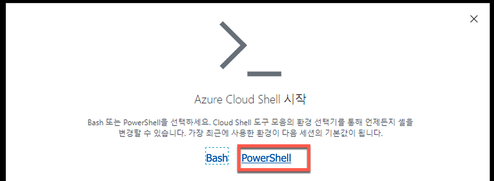

스토리지 계정을 만들라는 메시지가 표시될 수 있습니다. 스토리지 만들기를 클릭합니다.

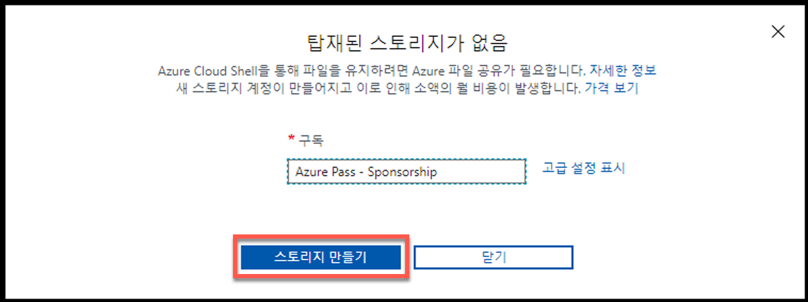

PowerShell 창이 열리면 다음 명령을 붙여넣고 Enter 키를 누릅니다.

```sql
register-AzResourceProvider -ProviderNamespace Microsoft.Insights
```


**랩 파일**: 이 랩용 파일은 D:\LabFiles\Automate Resources 폴더에 있습니다.

# <a name="lab-overview"></a>랩 개요

학생들은 단원에서 파악한 정보를 사용하여 AdventureWorks 내 자동화 프로세스를 구성하고 구현합니다.

# <a name="lab-objectives"></a>랩 목표

이 랩을 완료하면 다음을 수행할 수 있습니다.

- GitHub 빠른 시작 템플릿에서 Azure 리소스 배포

- 성능 메트릭 관련 알림 구성

- Azure SQL Database에서 인덱스 유지 관리를 수행하려면 Azure Automation Runbook 배포하세요.

# <a name="scenario"></a>시나리오

데이터베이스 관리의 일상적인 업무를 자동화하는 데 도움을 주는 선임 데이터 엔지니어로 고용되었습니다. 이 자동화에서는 AdventureWorks용 데이터베이스가 최고 성능으로 계속 작동하고 특정 조건에 따라 경고하는 메서드를 제공하도록 지원합니다. AdventureWorks는 IaaS(Infrastructure as a Service) 및 PaaS(Platform as a Service) 제품 모두에서 SQL Server를 사용합니다.

# <a name="exercise-1-deploy-an-azure-quickstart-template"></a>연습 1: Azure 빠른 시작 템플릿 배포 

예상 소요 시간: 30분

개인 연습

이 연습의 주요 작업은 다음과 같습니다.

- GitHub 빠른 시작 템플릿에서 Azure 리소스 배포

## <a name="task-deploy-an-azure-sql-database-from-a-template"></a>작업: 템플릿에서 Azure SQL Database 배포

1. 웹 브라우저를 사용하여 다음 GitHub로 이동합니다.

    [https://github.com/Azure/azure-quickstart-templates/tree/master/quickstarts/microsoft.sql/sql-database-transparent-encryption-create](https://github.com/Azure/azure-quickstart-templates/tree/master/quickstarts/microsoft.sql/sql-database-transparent-encryption-create)

    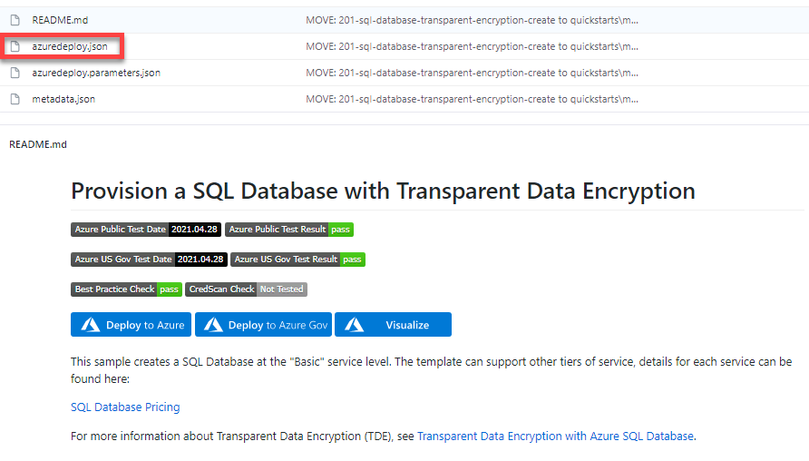

    azuredeploy.json을 클릭하고 파일을 검토합니다.

2. 브라우저 왼쪽 위의 뒤로 화살표를 클릭하여 위의 링크로 돌아간 후 Azure에 배포 단추를 클릭합니다. Azure Portal에 로그인하라는 메시지가 표시될 수 있습니다. 제공된 자격 증명으로 로그인합니다.

3. 아래와 같은 화면이 표시됩니다. 이 템플릿을 배포하려면 빈 필드를 작성해야 합니다.

    리소스 그룹 필드에서 "새로 만들기"를 클릭하고 **DP300-Lab06** 을 입력한 후에 확인을 클릭합니다. 지역을 가까운 지역으로 변경합니다. 나머지 필드에는 다음 값을 사용합니다.

    - SQL 관리자 로그인: **labadmin**
    - SQL 관리자 로그인 암호: **Azur3Pa$$**
    - 투명한 데이터 암호화: **사용**
    - 위치: **[resourceGroup().location]**

    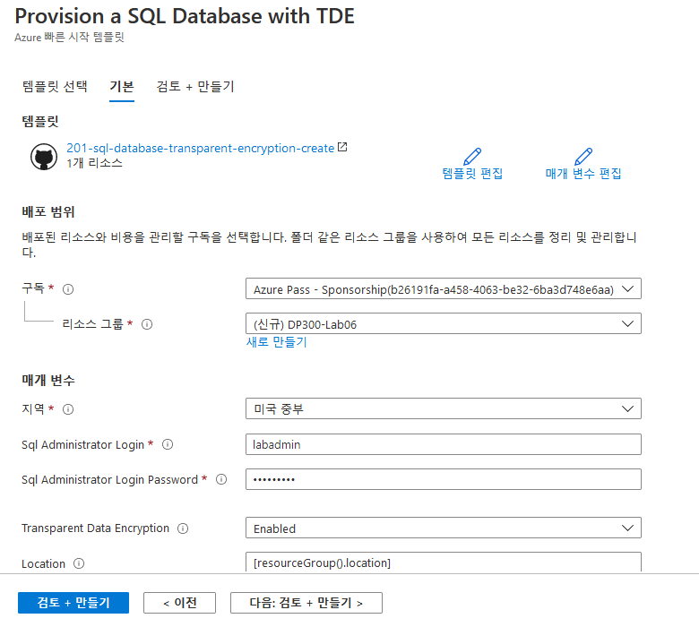

4. 검토 + 만들기, 만들기를 차례로 클릭합니다. 배포가 시작됩니다. 벨(아래 스크린샷에서 강조 표시됨)을 클릭한 다음, 알림 창에서 진행 중인 배포 링크를 클릭하여 배포 상태를 추적할 수 있습니다.

    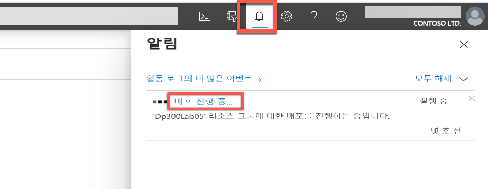

    배포하는 데 약 5~10분이 소요됩니다. 위의 링크를 클릭한 경우 배포를 추적할 수 있습니다.

    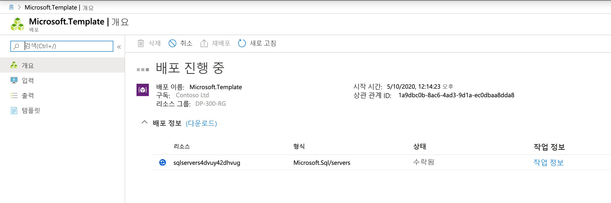

5. 완료되면 화면이 새로 만든 리소스에 대한 링크로 업데이트됩니다.

    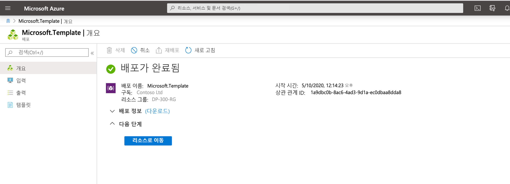

    리소스로 이동 링크를 클릭합니다. 배포를 만들면 Azure 리소스 그룹으로 이동합니다. 리소스 그룹에 SQL 서버와 SQL 데이터베이스가 모두 표시됩니다.  다음 연습에서 사용할 것이므로 SQL 서버 이름을 적어 둡니다.

    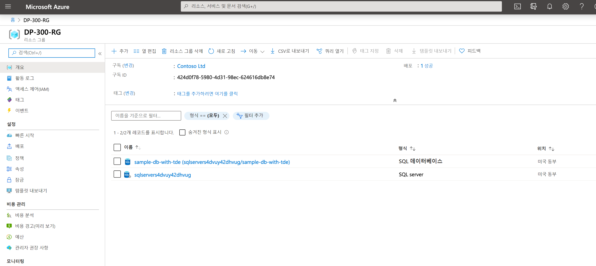

# <a name="exercise-2-configure-performance-metrics-based-alerts"></a>연습 2: 성능 메트릭 기반 경고 구성

예상 소요 시간: 30분

개인 연습

이 연습의 주요 작업은 다음과 같습니다.

- 성능 메트릭 관련 알림 구성

## <a name="task-creating-an-alert-when-cpu-exceeds-an-average-of-80-percent"></a>작업: CPU가 평균 80%를 초과할 때 경고를 생성합니다.

1. 아직 이동하지 않은 경우 portal.azure.com으로 이동합니다. 다시 로그인해야 할 수도 있습니다. Azure Portal 상단의 검색 창에서 SQL을 입력하고 SQL 데이터베이스를 클릭합니다. 데이터베이스 이름 **sample-db-with-tde** 를 클릭합니다.

    

2. sample-db-with-tde 데이터베이스의 기본 블레이드에서 모니터링 섹션으로 아래로 이동합니다.

3. 아래와 같이 **경고** 를 클릭합니다. 그러면 아래 화면이 표시됩니다. **+ 만들기** 를 클릭한 다음 **경고 규칙** 을 클릭합니다. 

    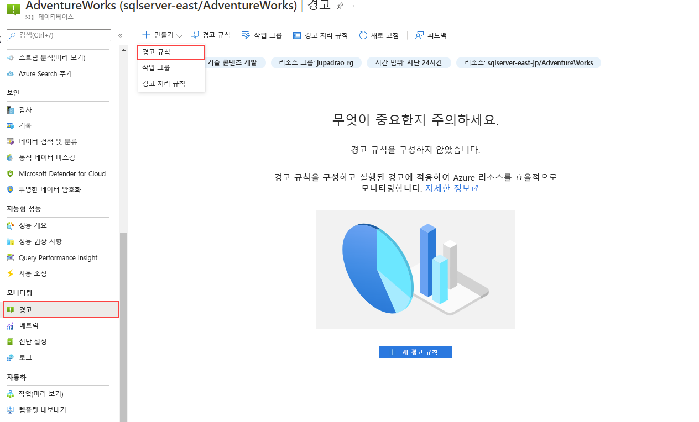

4. 리소스로 방금 만든 SQL Server가 이미 입력되어 있음을 확인할 수 있습니다. **신호 선택** 창이 이미 열려 있는 경우 다음 단계를 진행합니다. 조건 섹션에서 조건 추가를 클릭합니다. 

  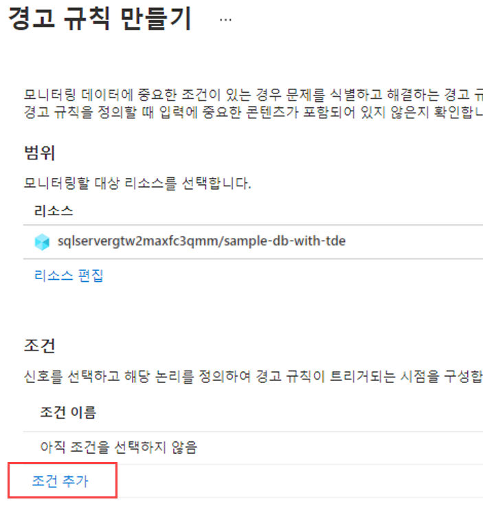

5. 신호 로직 구성 플라이아웃 메뉴에서 CPU 백분율을 선택합니다.

    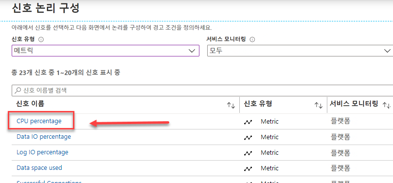

6. 임계값 80을 제공합니다. 완료를 클릭합니다.

    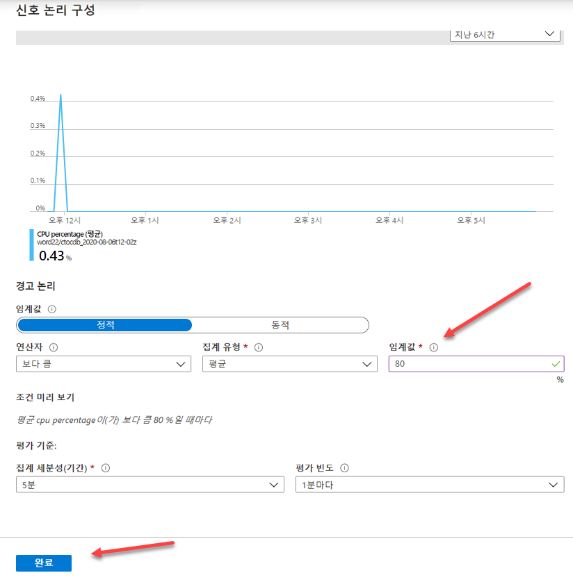

7. **작업** 탭의 작업 그룹 섹션에서 **작업 그룹 만들기** 를 선택합니다.

8. 작업 그룹 만들기 화면에서 다음을 입력합니다.
    - 작업 그룹 이름: **emailgroup**
    - 표시 이름: **emailgroup**

    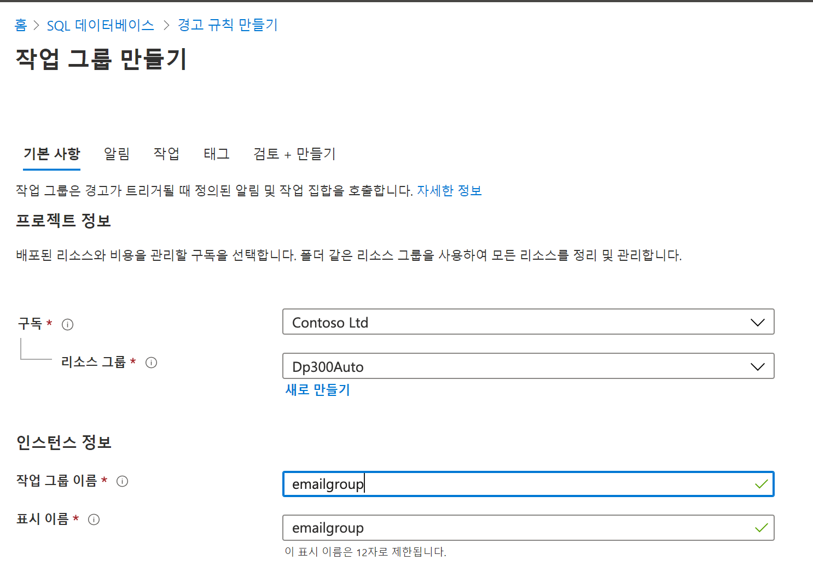

    **다음: 알림 >** 을 선택합니다.

9. 그런 다음 **알림 유형** 드롭다운을 클릭하고 **전자 메일/SMS 메시지/푸시/음성** 을 선택하여 이름 DemoLab을 입력합니다.

    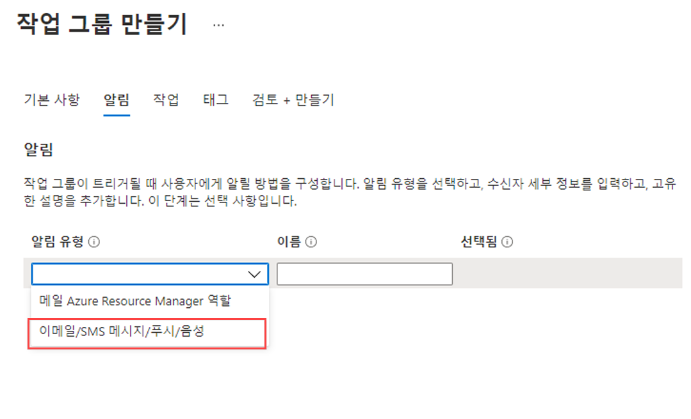

10. 위의 그림에 나와 있는 오른쪽 플라이아웃 화면에서 이메일 옆의 확인란을 클릭하고 이메일 주소를 입력한 후에 확인을 클릭합니다. 검토 및 만들기 단추를 클릭한 다음, 작업 그룹 만들기 화면에서 만들기를 클릭합니다.

    경고 규칙 만들기 화면의 **세부 정보** 메뉴에서 DemoAlert라는 이름의 경고 규칙을 추가한 다음, **검토 + 만들기** 및 **만들기** 를 선택합니다.

# <a name="exercise-3-deploy-an-automation-runbook"></a>연습 3: Automation Runbook 배포

예상 소요 시간: 30분

개인 연습

이 연습의 주요 작업은 다음과 같습니다.

- 유지 관리 작업 스크립트를 배포합니다.

- Azure SQL Database에서 인덱스 유지 관리를 수행하려면 Azure Automation Runbook 배포하세요.

## <a name="task-deploy-an-automation-runbook-to-rebuild-indexes-in-an-azure-sql-database"></a>작업: Automation Runbook을 배포하여 Azure SQL Database에서 인덱스 다시 작성

1. 아직 Azure Portal에 액세스하지 않았으면 랩 가상 머신에서 브라우저 세션을 시작하여 [https://portal.azure.com](https://portal.azure.com/)으로 이동합니다. 적절한 자격 증명을 제공합니다. 

    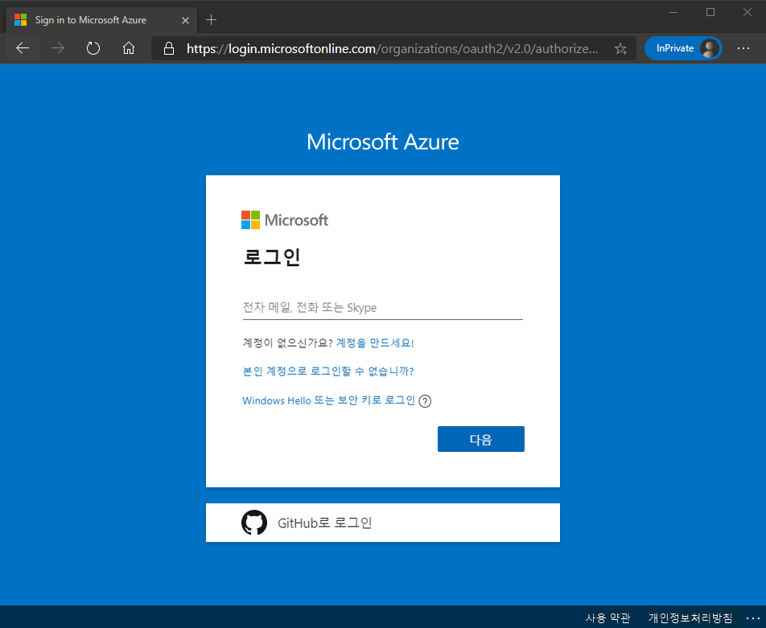

2. 검색 창의 Azure Portal에서 Automation을 입력한 다음, Automation 계정을 클릭합니다.

    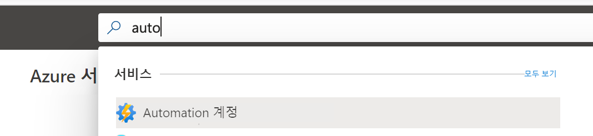

    Portal에서 **+ 만들기** 단추를 클릭합니다.

    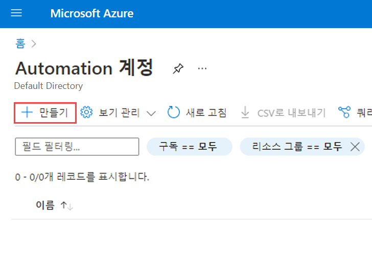

3. Automation 계정 만들기

    리소스 그룹: 이 랩 앞부분에서 만든 리소스 그룹을 사용합니다. **DP300-Lab06**

    이름: **DP300Lab06**

    위치: 랩 2에서 Azure SQL 서버를 만든 지역 사용

    **검토 + 만들기** 및 **만들기** 를 선택합니다. 자동화 계정은 1~3분 안에 배포해야 합니다.


4. AdaptativeIndexDefragmentation의 **github** 페이지로 이동합니다. [https://github.com/microsoft/tigertoolbox/blob/master/AdaptiveIndexDefrag/usp_AdaptiveIndexDefrag.sql](https://github.com/microsoft/tigertoolbox/blob/master/AdaptiveIndexDefrag/usp_AdaptiveIndexDefrag.sql)

    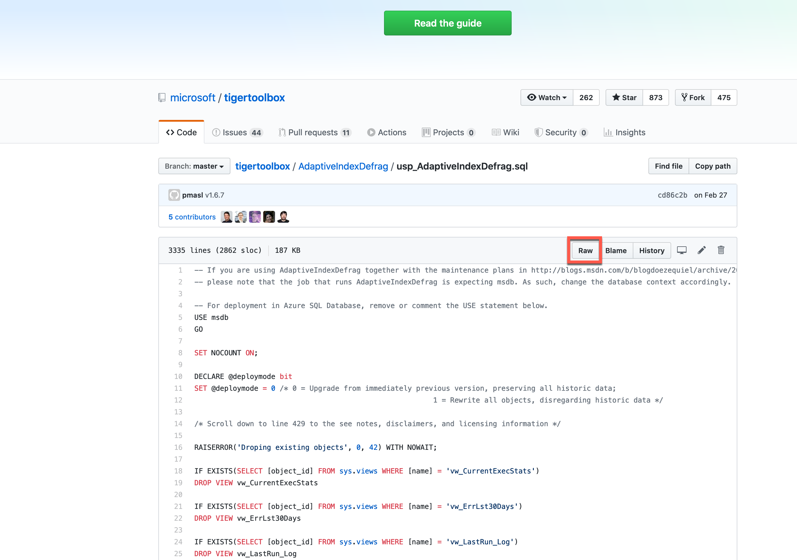

    원시를 클릭합니다. 그러면 복사할 수 있는 형식으로 코드를 제공합니다. Ctrl+A를 눌러 모든 텍스트를 선택한 다음 Ctrl+C를 눌러 클립보드에 복사합니다.

5. Azure Portal에서 데이터베이스로 다시 이동하여 아래와 같이 쿼리 편집기를 클릭합니다.

    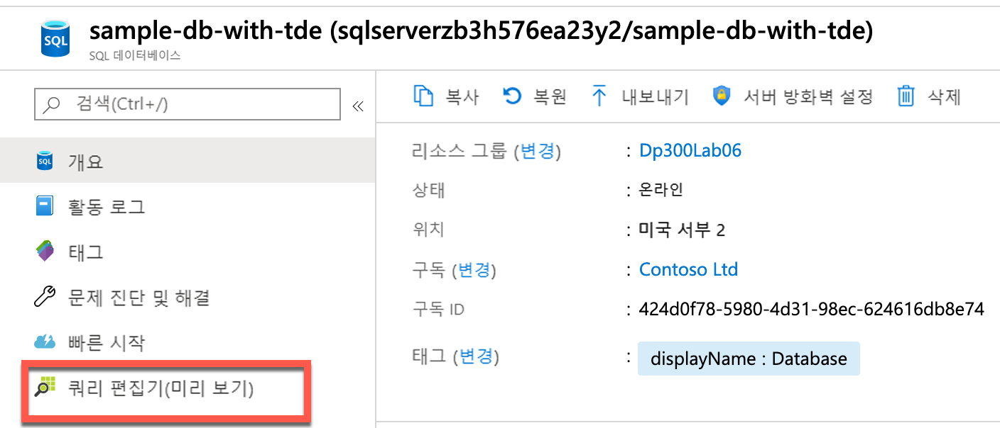

6. 데이터베이스에 로그인하기 위한 자격 증명을 묻는 메시지가 표시됩니다. 연습 1에서 만든 자격 증명을 사용합니다.
   **로그인**: labadmin **암호**: Azur3Pa$$

    로그인을 시도하면 허용 목록 IP에 대한 오류가 표시될 수 있습니다. 오류 메시지 끝에 있는 파란색 **허용 목록 IP** 링크를 클릭합니다. 그러면 서버 방화벽 규칙이 업데이트되어 액세스가 허용됩니다.

    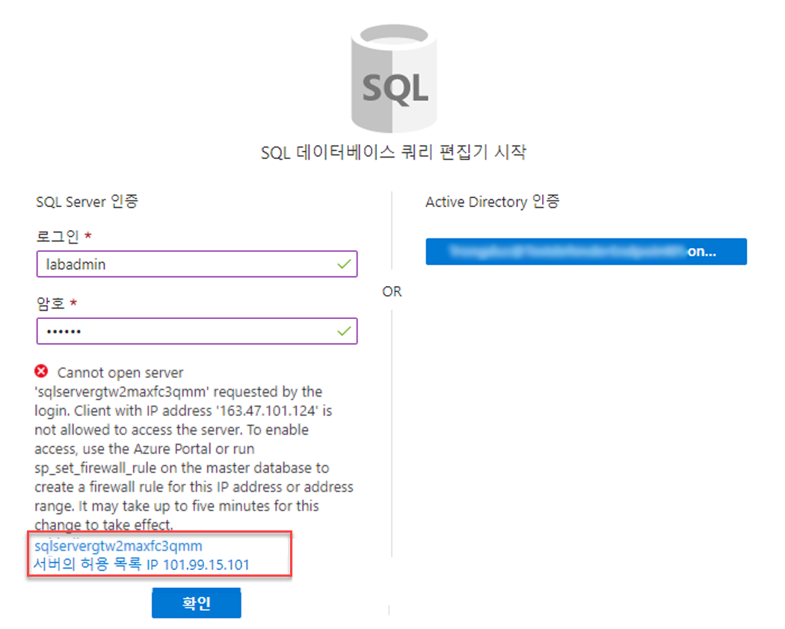

7. 성공 메시지가 표시되면 로그인 화면에서 **확인** 을 다시 클릭합니다. 이번에는 SQL 데이터베이스 쿼리 편집기에 대한 액세스 권한이 부여될 것입니다.

8. 쿼리 편집기에서 이 작업 앞부분에서 복사한 텍스트를 GitHub에서 쿼리 1 창으로 붙여넣습니다. 스크립트의 5번째와 6번째 줄에서 **USE msdb** 및 **GO** 문을 삭제합니다.

    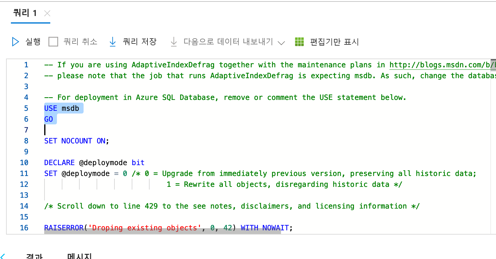

9. **실행** 을 클릭합니다. 쿼리에는 다음 메시지가 표시되어야 합니다.

    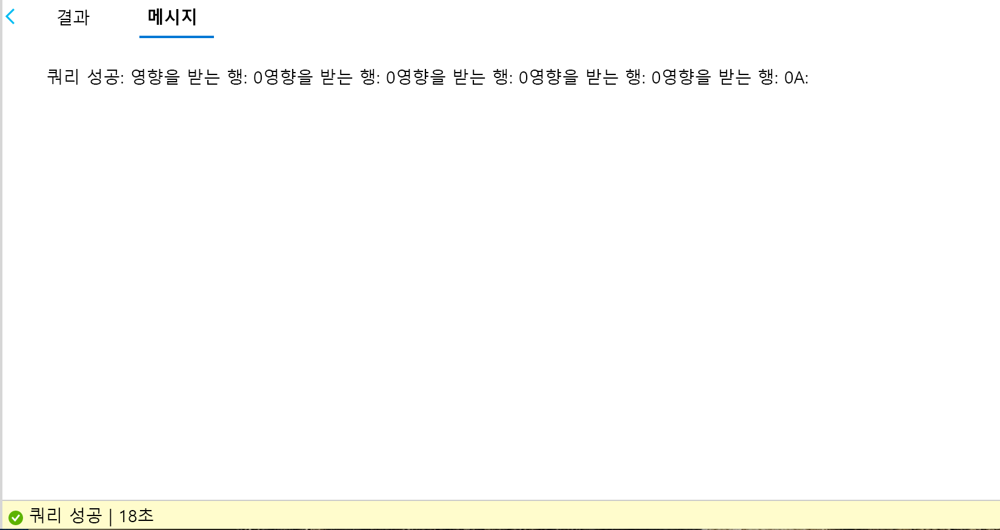

10. Azure Portal의 검색 필드에 자동화를 입력합니다. **자동화 계정** 을 클릭합니다.

    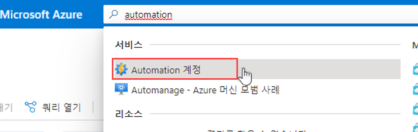

    구독에서 만든 자동화 계정을 식별하고 클릭합니다.

    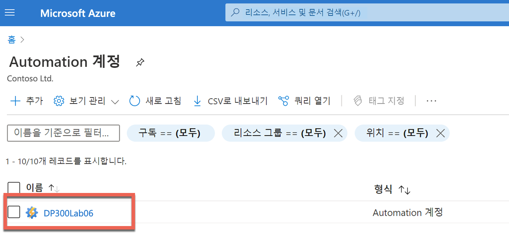

12. Automation 블레이드의 공유 리소스 섹션에서 **모듈** 을 선택합니다.

    

13. **갤러리 찾아보기** 를 클릭합니다.

    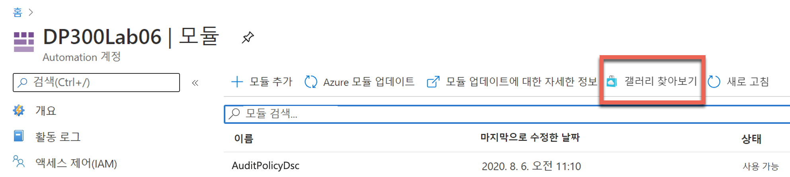

14. 갤러리 내에서 sqlserver 검색

    

15. 다음 화면으로 연결되는 SqlServer 텍스트를 클릭합니다. **선택** 을 클릭합니다.
    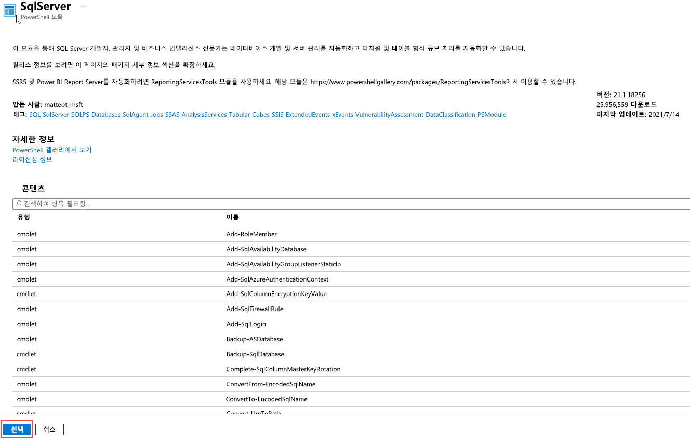

16. **모듈 추가** 페이지에서 사용 가능한 최신 **런타임 버전** 을 선택한 다음 **가져오기** 를 클릭합니다. 그러면 PowerShell 모듈을 Automation 계정으로 가져옵니다.

    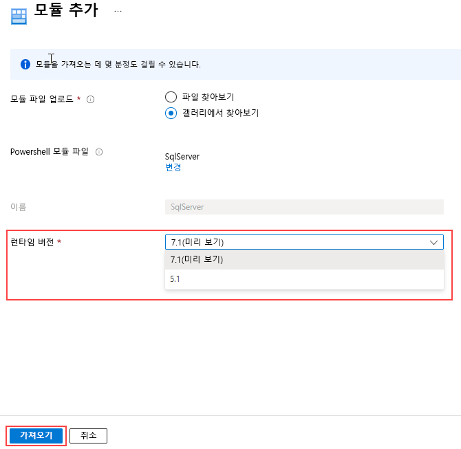

17. 데이터베이스에 안전하게 로그인하려면 자격 증명을 만들어야 합니다. 자동화 계정 블레이드에서 공유 리소스 섹션으로 이동하여 **자격 증명** 을 클릭합니다.

    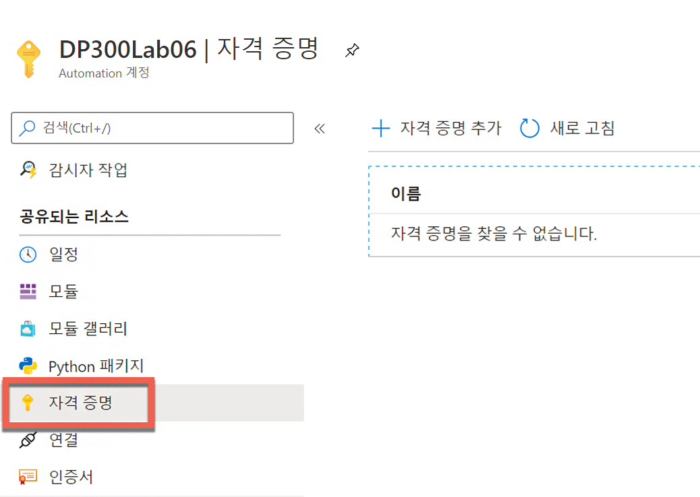

18. **+ 자격 증명 추가** 를 클릭한 다음 아래와 같이 자격 증명을 만듭니다.
    - 이름: **SQLUser**
    - 사용자 이름: **labadmin**
    - 암호: **Azur3Pa$$**

    **만들기** 를 클릭합니다.

    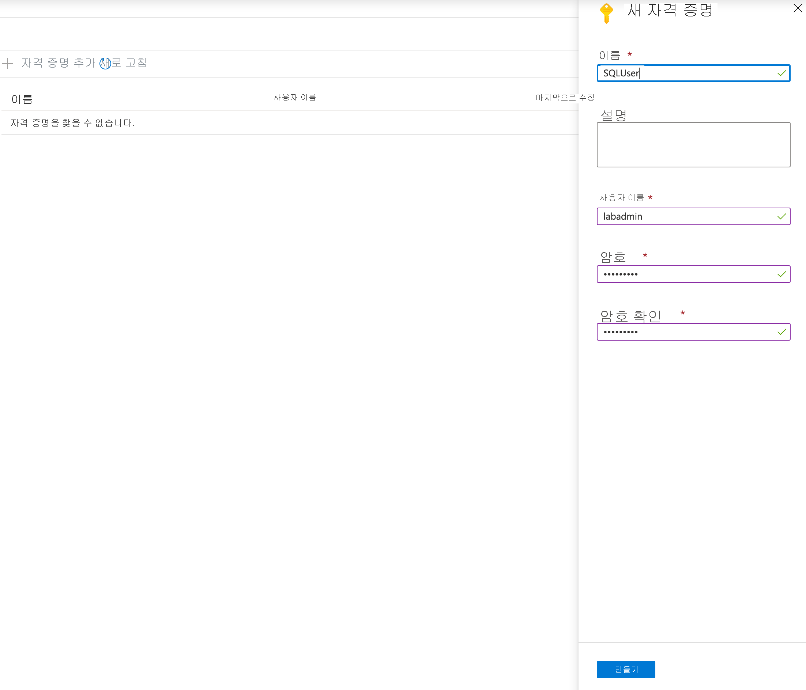

19. 자동화 계정 블레이드의 프로세스 자동화 섹션으로 스크롤하고 **Runbook** 을 클릭한 다음 **+ Runbook 만들기** 를 클릭합니다.

    

20. Runbook 만들기 창에서 다음을 입력합니다.
    - 이름: **IndexMaintenance**
    - Runbook 유형: **Powershell**
    - 런타임 버전: 사용 가능한 최신 런타임 버전 선택
    - 설명: 원하는 대로 간단한 설명을 제공할 수 있습니다.
    **만들기** 를 클릭합니다.

    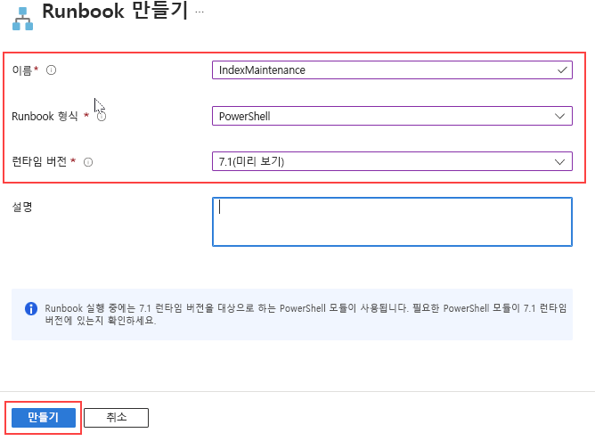

    Runbook을 만들고 나면 프로세스에서 Runbook으로 직접 이동해야 합니다.

21. Windows 탐색기에서 D:\LabFIles\Automate Resources 폴더로 이동합니다. DP300-Lab-Module-6.ps1 파일을 마우스 오른쪽 단추로 클릭하고 편집을 클릭합니다. PowerShell IDE가 열립니다.

    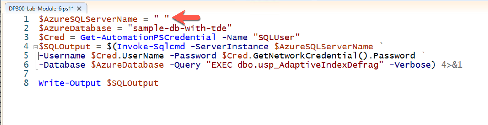

22. Azure SQL 서버의 이름을 반영하도록 $AzureSQLServerName 변수를 편집합니다. 아래와 같이 Azure SQL Database의 개요 화면에서 이 값을 얻을 수 있습니다.

    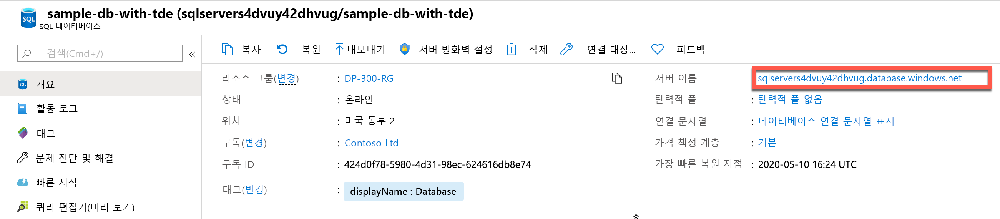

23. .database.windows.net 도메인 접미사가 포함된 서버 이름을 복사합니다.

    

24. 파일 첫째 줄에 서버 이름을 붙여 넣습니다. 모든 텍스트를 선택하고 클립보드에 복사합니다.

25. Automation Runbook으로 돌아가 PowerShell IDE에서 복사한 PowerShell 코드를 붙여넣습니다. 그런 다음 저장을 클릭하고 **게시** 를 클릭합니다.

    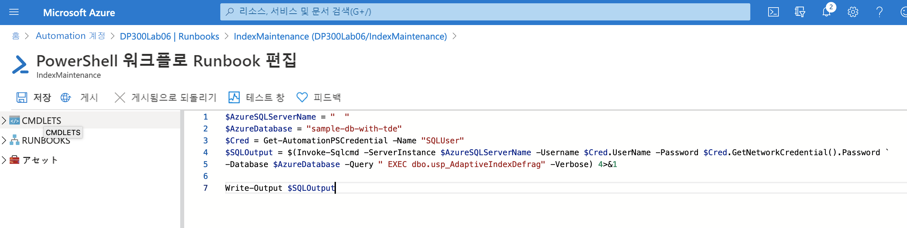

26. 이전에 게시한 버전을 덮어쓸지를 묻는 메시지가 표시되면 예를 클릭합니다.

    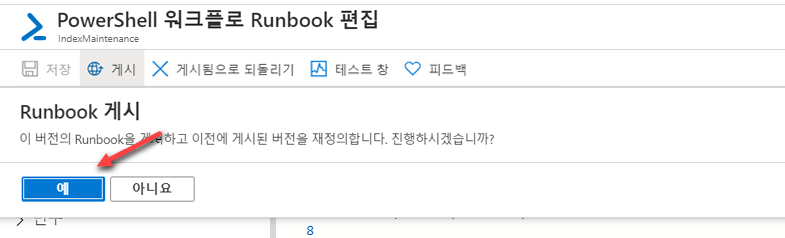

27. 다음으로 runbook이 정기적으로 실행되도록 예약합니다. 왼쪽 탐색 메뉴에서 **일정** 을 클릭합니다. 그런 다음 위쪽에 있는 **+ 일정 추가** 를 클릭합니다.

    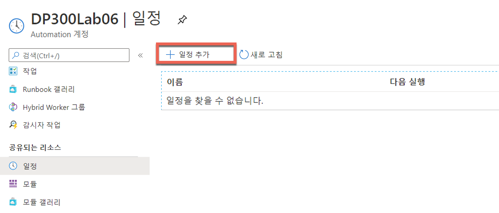

28. **Runbook에 일정 연결** 을 클릭합니다.

    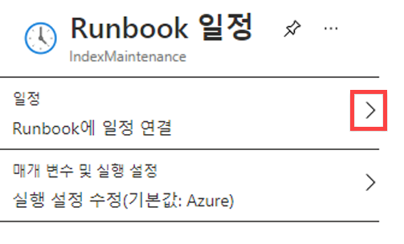

29. **+ 일정 추가** 를 선택합니다.

    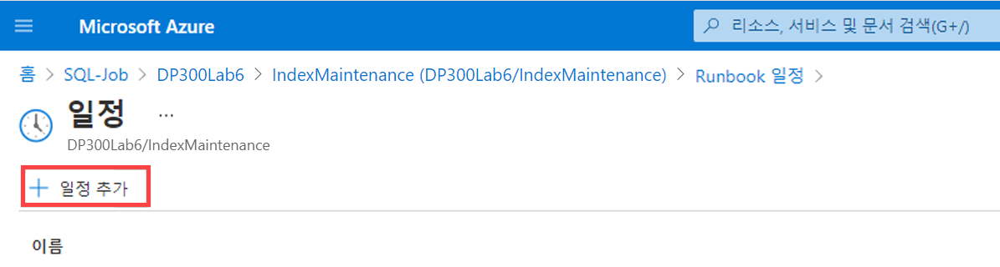

30. 원하는 경우 설명적 일정 이름과 설명을 제공합니다.

31. 다음 날, 동부 표준 시간대의 4:00AM을 시작 시간으로 지정합니다. 일정이 매일 반복 실행되도록 구성합니다. 만료일을 설정하지 마세요.

    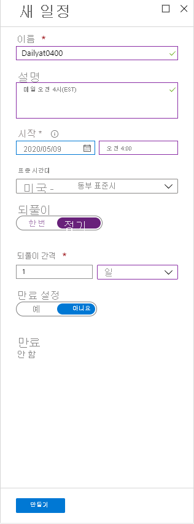

32.  **만들기** 를 클릭합니다. **확인** 을 클릭합니다.

33. 이제 일정이 runbook에 연결됩니다.

    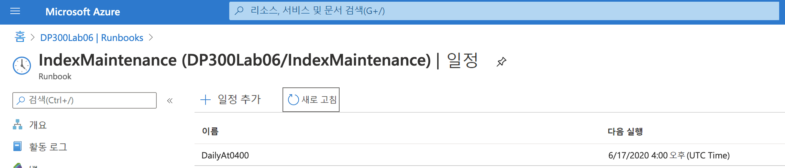
