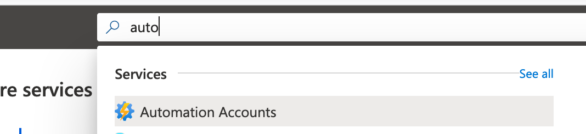
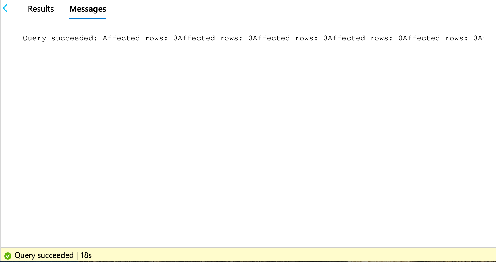
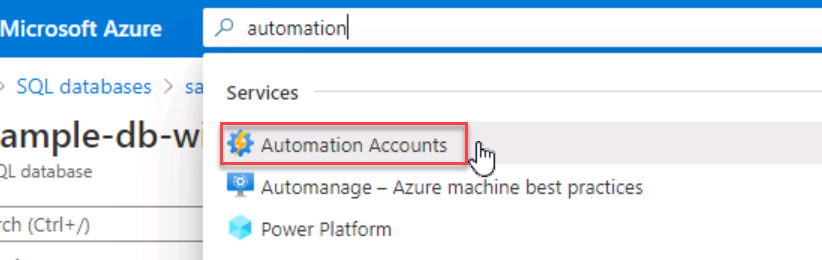
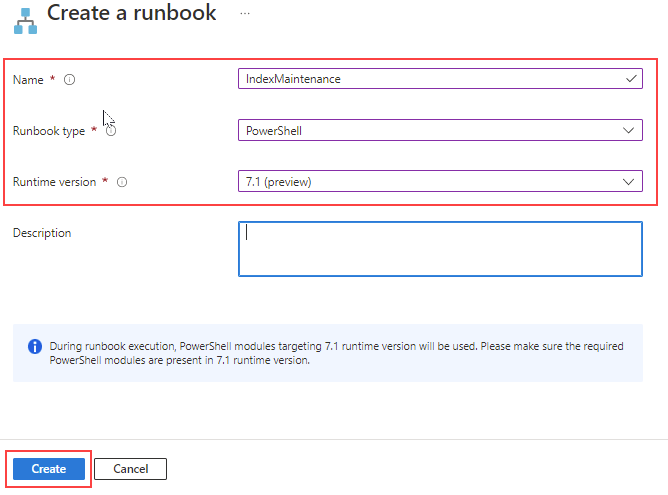
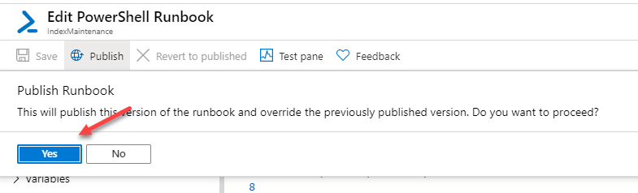
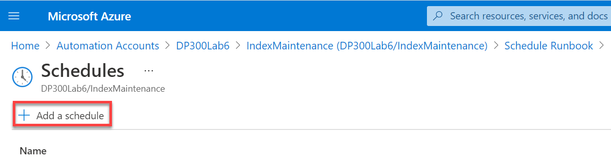

---
lab:
  title: 랩 6 – 리소스 자동화
  module: Automation of Tasks
---

# <a name="lab-6--automate-resources"></a>랩 6 – 리소스 자동화

**예상 소요 시간:** 90분

이 랩은 Azure Portal에 대한 액세스를 통해 웹 브라우저에서 수행할 수 있습니다.

Note: the Microsoft.Insights module needs to be added to your subscription in order to complete this lab. You can register by completing the following steps.

Azure Portal의 오른쪽 위에 있는 Cloud Shell 아이콘을 클릭합니다.


A shell will open at the bottom of the screen. Click on PowerShell as shown below.


You may be prompted to create a storage account. Click Create Storage.


PowerShell 창이 열리면 다음 명령을 붙여넣고 Enter 키를 누릅니다.

```sql
register-AzResourceProvider -ProviderNamespace Microsoft.Insights
```


**랩 파일**: 이 랩용 파일은 D:\LabFiles\Automate Resources 폴더에 있습니다.

# <a name="lab-overview"></a>랩 개요

학생들은 단원에서 파악한 정보를 사용하여 AdventureWorks 내 자동화 프로세스를 구성하고 구현합니다.

# <a name="lab-objectives"></a>랩 목표

이 랩을 완료하면 다음을 수행할 수 있습니다.

- GitHub 빠른 시작 템플릿에서 Azure 리소스 배포

- 성능 메트릭 관련 알림 구성

- Azure SQL Database에서 인덱스 유지 관리를 수행하려면 Azure Automation Runbook 배포하세요.

# <a name="scenario"></a>시나리오

You have been hired as a Senior Data Engineer to help automate day to day operations of database administration. This automation is to help ensure that the databases for AdventureWorks continue to operate at peak performance as well as provide methods for alerting based on certain criteria. AdventureWorks utilizes SQL Server in both Infrastructure as a Service and Platform as a Service offerings.

# <a name="exercise-1-deploy-an-azure-quickstart-template"></a>연습 1: Azure 빠른 시작 템플릿 배포 

예상 소요 시간: 30분

개인 연습

이 연습의 주요 작업은 다음과 같습니다.

- GitHub 빠른 시작 템플릿에서 Azure 리소스 배포

## <a name="task-deploy-an-azure-sql-database-from-a-template"></a>작업: 템플릿에서 Azure SQL Database 배포

1. 웹 브라우저를 사용하여 다음 GitHub로 이동합니다.

    [https://github.com/Azure/azure-quickstart-templates/tree/master/quickstarts/microsoft.sql/sql-database-transparent-encryption-create](https://github.com/Azure/azure-quickstart-templates/tree/master/quickstarts/microsoft.sql/sql-database-transparent-encryption-create)

    

    azuredeploy.json을 클릭하고 파일을 검토합니다.

2. Navigate back to the above link (click the back arrow in the top left of the browser), and click on the Deploy to Azure button. You may be prompted to login to the Azure portal. Login with your supplied credentials.

3. 참고: 이 랩을 완료하려면 Microsoft.Insights 모듈을 구독에 추가해야 합니다.

    다음 단계를 완료하면 등록할 수 있습니다.

    - SQL 관리자 로그인: **labadmin**
    - SQL 관리자 로그인 암호: **Azur3Pa$$**
    - 투명한 데이터 암호화: **사용**
    - 위치: **[resourceGroup().location]**

    

4. Click Review + create, then click Create. Your deployment will begin. You can track the status of your deployment by clicking the bell (highlighted in the screenshot below) and then clicking on the Deployment in progress link in the Notifications pane.

    

    Your deployment will take approximately 5-10 minutes to deploy. If you have clicked on the link above, you will be able to track your deployment.

    

5. 완료되면 화면이 새로 만든 리소스에 대한 링크로 업데이트됩니다.

    

    Click on the Go to resource link. You will be taken to the Azure Resource Group your deployment just created. You should see both a SQL server and a SQL database in the Resource group.  Make note of the name of your SQL server, as you will it in the next exercise.

    

# <a name="exercise-2-configure-performance-metrics-based-alerts"></a>연습 2: 성능 메트릭 기반 경고 구성

예상 소요 시간: 30분

개인 연습

이 연습의 주요 작업은 다음과 같습니다.

- 성능 메트릭 관련 알림 구성

## <a name="task-creating-an-alert-when-cpu-exceeds-an-average-of-80-percent"></a>작업: CPU가 평균 80%를 초과할 때 경고를 생성합니다.

1. 화면 하단에서 셸이 열립니다.

    

2. sample-db-with-tde 데이터베이스의 기본 블레이드에서 모니터링 섹션으로 아래로 이동합니다.

3. 아래와 같이 PowerShell을 클릭합니다. 

    

4. You will notice that the resource is already populated for you with the SQL Server you created. If the <bpt id="p1">**</bpt>Select a signal<ept id="p1">**</ept> window is already open then proceed to the next step. Under the Condition section, click Add condition. 

  

5. 신호 로직 구성 플라이아웃 메뉴에서 CPU 백분율을 선택합니다.

    

6. Supply a threshold value of 80. Click Done.

    

7. **작업** 탭의 작업 그룹 섹션에서 **작업 그룹 만들기**를 선택합니다.

8. 작업 그룹 만들기 화면에서 다음을 입력합니다.
    - 작업 그룹 이름: **emailgroup**
    - 표시 이름: **emailgroup**

    

    **다음: 알림 >** 을 선택합니다.

9. 그런 다음 **알림 유형** 드롭다운을 클릭하고 **전자 메일/SMS 메시지/푸시/음성**을 선택하여 이름 DemoLab을 입력합니다.

    

10. 스토리지 계정을 만들라는 메시지가 표시될 수 있습니다.

    경고 규칙 만들기 화면의 **세부 정보** 메뉴에서 DemoAlert라는 이름의 경고 규칙을 추가한 다음, **검토 + 만들기** 및 **만들기**를 선택합니다.

# <a name="exercise-3-deploy-an-automation-runbook"></a>연습 3: Automation Runbook 배포

예상 소요 시간: 30분

개인 연습

이 연습의 주요 작업은 다음과 같습니다.

- 유지 관리 작업 스크립트를 배포합니다.

- Azure SQL Database에서 인덱스 유지 관리를 수행하려면 Azure Automation Runbook 배포하세요.

## <a name="task-deploy-an-automation-runbook-to-rebuild-indexes-in-an-azure-sql-database"></a>작업: Automation Runbook을 배포하여 Azure SQL Database에서 인덱스 다시 작성

1. 스토리지 만들기를 클릭합니다. 

    

2. 검색 창의 Azure Portal에서 Automation을 입력한 다음, Automation 계정을 클릭합니다.

    

    Portal에서 **+ 만들기** 단추를 클릭합니다.

    

3. Automation 계정 만들기

    Resource Group: Use the resource group you created earlier in this lab. <bpt id="p1">**</bpt>DP300-Lab06<ept id="p1">**</ept>

    이름: **DP300Lab06**

    위치: 랩 2에서 Azure SQL 서버를 만든 지역 사용

    Select <bpt id="p1">**</bpt>Review + create<ept id="p1">**</ept> and <bpt id="p2">**</bpt>Create<ept id="p2">**</ept>. Your automation account should deploy in 1-3 minutes.


4. AdaptativeIndexDefragmentation의 **github** 페이지로 이동합니다. [https://github.com/microsoft/tigertoolbox/blob/master/AdaptiveIndexDefrag/usp_AdaptiveIndexDefrag.sql](https://github.com/microsoft/tigertoolbox/blob/master/AdaptiveIndexDefrag/usp_AdaptiveIndexDefrag.sql)

    

    Click on Raw. This will provide the code in a format where you can copy it. Select all of the text (Ctrl-A) and copy it to your clipboard (Crtl-C).

5. Azure Portal에서 데이터베이스로 다시 이동하여 아래와 같이 쿼리 편집기를 클릭합니다.

    

6. You will be prompted for credentials to login to your database. Use the credentials you created in Exercise 1.
   <bpt id="p1">**</bpt>Login<ept id="p1">**</ept>: labadmin <bpt id="p2">**</bpt>Password<ept id="p2">**</ept>: Azur3Pa$$

    When you try to log in, you may receive an error about a Whitelist IP. Click on the blue <bpt id="p1">**</bpt>Whitelist IP<ept id="p1">**</ept> link at the end of the error message. Doing so will update server firewall rules to allow access.

    

7. After you see a success message, click <bpt id="p1">**</bpt>OK<ept id="p1">**</ept> on the log in screen again. This time you should be granted access to SQL Database Query Editor.

8. In the query editor, paste the text you copied earlier in this task from GitHub into the Query 1 pane. Delete the <bpt id="p1">**</bpt>USE msdb<ept id="p1">**</ept> and <bpt id="p2">**</bpt>GO<ept id="p2">**</ept> statements on lines 5 and 6 of the script.

    

9. Click <bpt id="p1">**</bpt>Run<ept id="p1">**</ept>. The query should result in the following message:

    

10. In the Azure portal, type automation within the search field. Click on <bpt id="p1">**</bpt>Automation Accounts<ept id="p1">**</ept>.

    

    구독에서 만든 자동화 계정을 식별하고 클릭합니다.

    

12. Automation 블레이드의 공유 리소스 섹션에서 **모듈**을 선택합니다.

    

13. **갤러리 찾아보기**를 클릭합니다.

    

14. 갤러리 내에서 sqlserver 검색

    

15. Click on the SqlServer text which will direct to the next screen. Click on <bpt id="p1">**</bpt>Select<ept id="p1">**</ept>.
    <ph id="ph1"></ph>

16. On the <bpt id="p1">**</bpt>Add a module<ept id="p1">**</ept> page, select the latest <bpt id="p2">**</bpt>Runtime version<ept id="p2">**</ept> available, and then click <bpt id="p3">**</bpt>Import<ept id="p3">**</ept>. This will import the PowerShell module into your Automation account.

    

17. You will need to create a credential to securely login to your database. From the Automation Account blade navigate to the Shared Resources Section and click <bpt id="p1">**</bpt>Credentials<ept id="p1">**</ept>.

    

18. **+ 자격 증명 추가**를 클릭한 다음 아래와 같이 자격 증명을 만듭니다.
    - 이름: **SQLUser**
    - 사용자 이름: **labadmin**
    - 암호: **Azur3Pa$$**

    **만들기**를 클릭합니다.

    

19. 자동화 계정 블레이드의 프로세스 자동화 섹션으로 스크롤하고 **Runbook**을 클릭한 다음 **+ Runbook 만들기**를 클릭합니다.

    

20. Runbook 만들기 창에서 다음을 입력합니다.
    - 이름: **IndexMaintenance**
    - Runbook 유형: **Powershell**
    - 런타임 버전: 사용 가능한 최신 런타임 버전 선택
    - Description: You can supply a short description of your choosing.
    Click <bpt id="p1">**</bpt>Create<ept id="p1">**</ept>.

    

    Runbook을 만들고 나면 프로세스에서 Runbook으로 직접 이동해야 합니다.

21. 데이터베이스 관리의 일상적인 업무를 자동화하는 데 도움을 주는 선임 데이터 엔지니어로 고용되었습니다.

    

22. 이 자동화에서는 AdventureWorks용 데이터베이스가 최고 성능으로 계속 작동하고 특정 조건에 따라 경고하는 메서드를 제공하도록 지원합니다.

    

23. .database.windows.net 도메인 접미사가 포함된 서버 이름을 복사합니다.

    

24. AdventureWorks는 IaaS(Infrastructure as a Service) 및 PaaS(Platform as a Service) 제품 모두에서 SQL Server를 사용합니다.

25. Navigate back to your automation runbook, and paste in the PowerShell code you copied from the PowerShell IDE. Then click Save and then click <bpt id="p1">**</bpt>Publish<ept id="p1">**</ept>.

    

26. 이전에 게시한 버전을 덮어쓸지를 묻는 메시지가 표시되면 예를 클릭합니다.

    

27. Next you will schedule the runbook to execute on a regular basis. Click on <bpt id="p1">**</bpt>Schedules<ept id="p1">**</ept> in the left hand navigation menu. Then click on <bpt id="p1">**</bpt>+ Add a schedule<ept id="p1">**</ept> at the top.

    

28. **Runbook에 일정 연결**을 클릭합니다.

    

29. **+ 일정 추가**를 선택합니다.

    

30. 원하는 경우 설명적 일정 이름과 설명을 제공합니다.

31. Specify the start time of 4:00AM of the following day and in the Eastern Time zone. Configure the reoccurrence for every 1 Day. Do not set an expiration.

    

32.  Click <bpt id="p1">**</bpt>Create<ept id="p1">**</ept>. Click <bpt id="p1">**</bpt>OK<ept id="p1">**</ept>.

33. 이제 일정이 runbook에 연결됩니다.

    
