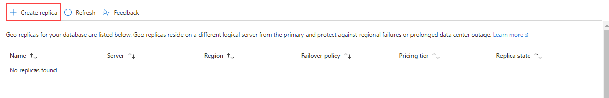

---
lab:
  title: Lab 7 – 고가용성 및 재해 복구 환경 계획 및 구현
  module: Planning and Implementing a High Availability and Disaster Recovery Environment
---

# <a name="lab-7--planning-and-implementing-a-high-availability-and-disaster-recovery-environment"></a>Lab 7 – 고가용성 및 재해 복구 환경 계획 및 구현

**예상 소요 시간:** 90분

**사전 요구 사항**: 연습 1에서 사용하는 Azure SQL Database는 모듈 3의 랩에서 만들었습니다. 

**랩 파일**: 이 랩에 대한 파일은 D:\Labfiles\High Availability 폴더에 있습니다.

# <a name="lab-overview"></a>랩 개요

학생은 Azure SQL Database를 지역 중복되게 하고 Azure를 사용하는 URL로 백업 및 복원하는 두 가지 주요 작업을 실행합니다. 

# <a name="lab-objectives"></a>랩 목표

이 랩을 완료하면 다음을 수행할 수 있습니다.

- Azure SQL 데이터베이스에 대한 지역에서 복제 사용

- URL을 사용하여 SQL Server 데이터베이스를 백업하고 복원합니다.


# <a name="scenario"></a>시나리오

Now that you have automated day-to-day tasks in the previous lab, as the Senior Data Engineer, you are tasked with improving the availability of both IaaS and PaaS configurations for your database environment. You are tasked with the following objectives:

- Azure SQL Database용 지역에서 복제를 사용하여 데이터베이스에 대한 가용성을 높일 수 있습니다.

- 데이터베이스를 Azure의 URL로 백업하고 인적 오류 발생 후 복원합니다.


# <a name="exercise-1-enable-geo-replication-for-azure-sql-database"></a>연습 1: Azure SQL Database에 대한 지역에서 복제 사용

예상 소요 시간: 45분

개요

학생은 모듈 3에 대한 랩에서 만든 Azure SQL Database의 구성을 변경하여 가용성을 개선합니다.

시나리오

WideWorldImporters 내의 DBA는 Azure SQL Database에 대한 지역에서 복제를 활성화하는 방법을 알고 작동 중인지 확인하고 포털을 사용하여 수동으로 다른 지역으로 장애 조치하는 방법을 알아야 합니다.

필수 구성 요소

- 학생을 위해 만든 Azure 계정 - 로그인(전자 메일) 및 암호를 제공해야 합니다

- 사전에 만든 Azure SQL Database 서버 및 데이터베이스

 

1. 브라우저 창을 통해 Azure Portal에 로그인하지 않은 경우 제공된 Azure 자격 증명을 사용하여 로그인하세요.

2. 메뉴에서 아래와 같이 SQL 데이터베이스를 선택합니다.

    

3. Click on the Azure SQL Database that was created in Lab 3. An example is shown below.

    

4. 데이터베이스 블레이드의 데이터 관리에서 **복제본**을 선택합니다.

    

5. 왼쪽 위에 있는 **복제본 만들기** 단추를 클릭합니다.

    

6. Under <bpt id="p1">**</bpt>Server<ept id="p1">**</ept>, select <bpt id="p2">**</bpt>Create New<ept id="p2">**</ept>. On the new server pane, enter a unique server name, a valid admin login, and a secure password, and select the region you chose as the target region and then click <bpt id="p1">**</bpt>OK<ept id="p1">**</ept> to create the server.

7. Back in the Geo-Replica blade, click <bpt id="p1">**</bpt>Review + Create<ept id="p1">**</ept>, and then click <bpt id="p2">**</bpt>Create<ept id="p2">**</ept>. The secondary server and the database will now be created. To check the status, look under the bell icon at the top of the portal. If successful, it will progress from Deployment in progress to Deployment succeeded.

8. Now that the Azure SQL Database is configured with replicas, you will perform a failover. Select the <bpt id="p1">**</bpt>Replicas<ept id="p1">**</ept> page for the secondary server and note that the primary and secondary servers are indicated.

9. 보조 서버에서 **...** 메뉴를 선택하고 **강제 장애 조치(failover)** 를 클릭합니다.

    

10. 메시지가 표시되면 **예**를 클릭합니다. 

    The status of the primary replica will switch to Pending and the secondary, Failover. The process will take a few minutes. When complete, the roles will switch with the secondary becoming the new primary and the old primary becoming the secondary.

# <a name="exercise-2-backup-to-url-and-restore-from-url"></a>연습 2: URL로 백업 및 URL에서 복원

예상 소요 시간: 45분

이 연습의 주요 작업은 다음과 같습니다.

- URL에 백업 구성

- WideWorldImporters 백업

- WideWorldImporters 복원

## <a name="task-1-configure-backup-to-url"></a>작업 1: URL에 백업 구성

SQL Server에서 Azure에 데이터베이스를 백업하기 전에 몇 가지 구성 작업을 수행해야 합니다. 

<bpt id="p1">**</bpt>Note:<ept id="p1">**</ept> There are several long strings, including storage account keys and shared access signatures, that are generated and then reused. You should consider opening up a Notepad file within the lab VM to use for holding these strings. 

1. 컨텍스트가 LON-SQL1 가상 머신인지 확인하세요.

2. Edge를 시작한 후 Azure Portal([https://portal.azure.com](https://portal.azure.com/))로 아직 이동하지 않았으면 이동하여 로그인합니다.

3. 오른쪽 상단 모서리에서 아래 아이콘을 선택하여 Cloud Shell 프롬프트를 엽니다.

    

4. At the bottom half of the portal, you may see a message welcoming you to Azure Cloud Shell, if you have not yet used Cloud Shell. Select Bash.

    

5. If you have not previously used Cloud Shell, you must give it storage. Click Create Storage in the dialog below.

    


6. If you have already used Cloud Shell, just make sure the upper left corner of the Cloud shell screen shows Bash. You can use the drop down arrow to select either PowerShell or Bash. 
 

    완료되면 아래와 유사한 프롬프트가 표시됩니다.

    


7. Cloud Shell에 다음 명령을 복사하여 CLI에서 스토리지 계정을 만듭니다.

    ```
    az storage account create -n dp300storage -g DP-300-Lab02 --kind StorageV2 -l eastus2
    ```

    Edit the command so that your storage account name is unique and all lower case with no special characters. You should change <bpt id="p1">*</bpt>dp300storage<ept id="p1">*</ept> in the above to a unique name like <bpt id="p2">*</bpt>dp300storagemsl123<ept id="p2">*</ept>. The value <bpt id="p1">*</bpt>DP-300-Lab02<ept id="p1">*</ept> is the name of an existing Resource Group. Make sure you use one that has been created in an earlier lab. Change the region if desired. Press Enter to run the command. 


    Next you will get the account keys for your account, which you will use in subsequent steps. Execute the following code in cloud shell, after editing to use the same name (after the -n) and resource group (after the -g) that you used in the previous command.

    ```
    az storage account keys list -g DP-300-Lab02 -n dp300storage
    ```

    Your account key will be in the results of the above command. Make sure you  Copy the returned value for key1 (without the double quotes) as shown here. You might save it in Notepad. 


    
 

8. 이전 랩에서 일상 작업을 자동화했기 때문에 이제 수석 데이터 엔지니어로서 데이터베이스 환경에 대한 IaaS 및 PaaS 구성의 가용성을 개선하는 임무를 맡고 있습니다.

    ```
    az storage container create --name "backups" --account-name "dp300storage" --account-key "storage_key" --fail-on-exist
    ```
 
    출력에 true가 반환되어야 합니다.

    


9. 컨테이너 백업이 만들어졌는지 추가로 확인하려면 다음 명령을 실행합니다. 여기서 *dp300storage*는 만들 때 사용한 스토리지 계정 이름이고 *storage_key*는 위에서 생성된 키입니다. 

    ```
    az storage container list --account-name "dp300storage" --account-key "storage_key"
    ```

    출력의 일부는 아래와 유사하게 반환해야 합니다.

    


10. 다음과 같은 목표를 달성해야 합니다.

    ```
    az storage container generate-sas -n "backups" --account-name "dp300storage" --account-key "storage_key" --permissions "rwdl" --expiry "date_in_the_future" -o tsv
    ```
    **참고: 만료 형식은 “YYYY-MM-DD”입니다. 여기서 YYYY는 4자리 연도이고 MM은 두 자리 월이고 DD는 두 자리 일입니다.**

    The output should return something similar to the value shown below which will be used in the next Task. You can copy and save the value in Notepad along with the key you saved earlier. 

    


## <a name="task-2-back-up-wideworldimporters"></a>작업 2: WideWorldImporters 백업

이제 기능이 구성되었으므로 Azure에서 백업 파일을 Blob으로 생성할 수 있습니다. 

1. SQL Server Management Studio를 열고 LON-SQL1에 연결되어 있는지 확인합니다.

2. 새 쿼리를 클릭합니다.

3. Create the credential that will be used to access storage in the cloud with the following Transact-SQL. (If a credential already exists, drop it first.) Fill in the appropriate values, where <bpt id="p1">*</bpt>dp300storage<ept id="p1">*</ept> is the storage account name created in Task 1, Step 8 and <bpt id="p2">*</bpt>sas_token<ept id="p2">*</ept> is the value generated in Task 1, Step 10 (starting with <bpt id="p3">*</bpt>se=...<ept id="p3">*</ept>). 

    ```sql
    IF EXISTS 

    (SELECT * FROM sys.credentials 

    WHERE name = 'https://dp300storage.blob.core.windows.net/backups') 

    BEGIN
    
        DROP CREDENTIAL [https://dp300storage.blob.core.windows.net/backups]
        
    END
    
    GO


    CREATE CREDENTIAL [https://dp300storage.blob.core.windows.net/backups]

    WITH IDENTITY = 'SHARED ACCESS SIGNATURE',

    SECRET = 'sas_token'

    GO 
    ```
    

4. Click <bpt id="p1">**</bpt>Execute<ept id="p1">**</ept>. This should be successful.

5. Transact-SQL에서 다음 명령을 사용하여 Azure에 WideWorldImporters 데이터베이스를 백업합니다. 여기서 *dp300storage*는 작업 1에서 사용한 스토리지 계정 이름입니다.

    ```sql
    BACKUP DATABASE WideWorldImporters 

    TO URL = 'https://dp300storage.blob.core.windows.net/backups/WideWorldImporters.bak';

    GO 
    ```

    This may take some time. If successful, you should see output similar to this:

    'WideWorldImporters' 데이터베이스(파일 1의 'WWI_Primary' 파일)에 대해 처리된 1240 페이지.

    'WideWorldImporters' 데이터베이스(파일 1의 'WWI_UserData' 파일)에 대해 처리된 53104 페이지.

    'WideWorldImporters' 데이터베이스(파일 1의 'WWI_InMemory_Data_1' 파일)에 대해 처리된 3865 페이지.

    'WideWorldImporters' 데이터베이스(파일 1의 'WWI_Log' 파일)에 대해 처리된 1468 페이지.

    BACKUP DATABASE는 59677페이지를 14.839초(31.419MB/초) 만에 성공적으로 처리했습니다.

    완료 시간: 2020-05-18T08:01:41.6935863+00:00

    

    잘못 구성된 경우 다음과 비슷한 오류 메시지가 표시됩니다.

    Msg 3201, Level 16, State 1, Line 33  
    ‎Cannot open backup device '<ph id="ph1">https://dp300storage.blob.core.windows.net/container_name/WideWorldImporters.bak</ph>'. Operating system error 50(The request is not supported.).  
    Msg 3013, Level 16, State 1, Line 33  
    BACKUP DATABASE가 비정상적으로 종료됩니다.


    잘못 입력한 것이 없는지 그리고 모든 것이 성공적으로 만들어졌는지 확인합니다.

6. To see that the file is actually in Azure, you can use Storage Explorer or Azure Cloud Shell. The syntax in Bash is as follows, where <bpt id="p1">*</bpt>dp300storage<ept id="p1">*</ept> is the storage account name used in Task 1, and <bpt id="p2">*</bpt>account_key<ept id="p2">*</ept> is the key used there as well. 
    ```
    az storage blob list -c "backups" --account-name "dp300storage" --account-key "storage_key"
    ```
    
    샘플 출력이 아래에 표시됩니다.

    

 
## <a name="task-3-restore-wideworldimporters"></a>작업 3: WideWorldImporters 복원

이 작업은 데이터베이스를 복원하는 방법을 보여 줍니다.


1. SQL Server Management Studio의 새 쿼리 창에서 다음 코드를 실행합니다. 
    ```sql
    USE WideWorldImporters;
    GO
    
    ```

2. Now execute the statement below to return the very first row of the Customers table which has a CustomerID of 1. Note the name of the customer.
    ```sql
    SELECT TOP 1 * FROM Sales.Customers;
    GO
    
    ```
    
3. 다음 명령을 실행하여 해당 고객의 이름을 변경합니다.
    ```sql
    UPDATE Sales.Customers
    SET CustomerName = 'This is a human error'
    WHERE CustomerID = 1;
    GO
    
    ```

4. Re-run Step 2 to verify that the name has been changed. Now imagine if someone had changed thousands or millions of rows without a WHERE clause – or the wrong WHERE clause.

5. 데이터베이스를 3단계에서 변경하기 전 상태로 되돌리려면 현재 **WideWorldImporters** 에 연결된 모든 쿼리를 닫고 다음 명령을 실행합니다. 여기서 *dp300storage*는 작업 1에서 사용한 스토리지 계정 이름입니다.

    ```sql
    USE master;
    GO

    RESTORE DATABASE WideWorldImporters 
    FROM URL = 'https://dp300storage.blob.core.windows.net/backups/WideWorldImporters.bak';
    GO
    ```

    This may take some time. The output should be similar to this:

    'WideWorldImporters' 데이터베이스(파일 1의 'WWI_Primary' 파일)에 대해 처리된 1240 페이지.

    'WideWorldImporters' 데이터베이스(파일 1의 'WWI_UserData' 파일)에 대해 처리된 53104 페이지.

    'WideWorldImporters' 데이터베이스(파일 1의 'WWI_Log' 파일)에 대해 처리된 1468 페이지.

    'WideWorldImporters' 데이터베이스(파일 1의 'WWI_InMemory_Data_1' 파일)에 대해 처리된 3865 페이지.

    RESTORE DATABASE는 59677페이지를 16.167초(28.838MB/초) 만에 성공적으로 처리했습니다.

    완료 시간: 5/18/2020 8:35:06 AM

6. When the restore of WideWorldImporters is finished, re-run Steps 1 and 2. The data will be back to what it was.
