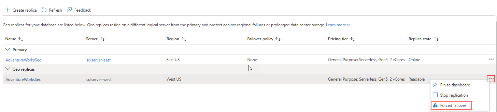
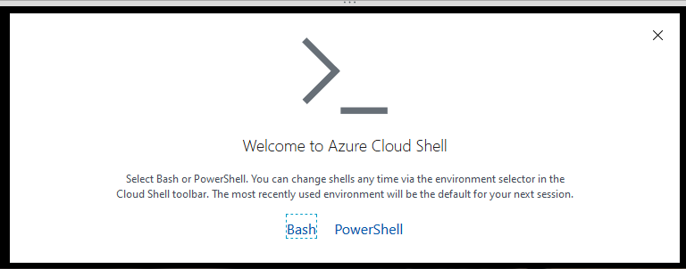
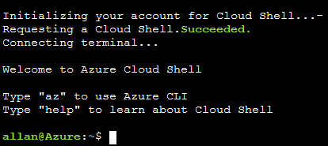

---
lab:
  title: Lab 7 – 고가용성 및 재해 복구 환경 계획 및 구현
  module: Planning and Implementing a High Availability and Disaster Recovery Environment
---

# <a name="lab-7--planning-and-implementing-a-high-availability-and-disaster-recovery-environment"></a>Lab 7 – 고가용성 및 재해 복구 환경 계획 및 구현

**예상 소요 시간:** 90분

**사전 요구 사항**: 연습 1에서 사용하는 Azure SQL Database는 모듈 3의 랩에서 만들었습니다. 

**랩 파일**: 이 랩에 대한 파일은 D:\Labfiles\High Availability 폴더에 있습니다.

# <a name="lab-overview"></a>랩 개요

학생은 Azure SQL Database를 지역 중복되게 하고 Azure를 사용하는 URL로 백업 및 복원하는 두 가지 주요 작업을 실행합니다. 

# <a name="lab-objectives"></a>랩 목표

이 랩을 완료하면 다음을 수행할 수 있습니다.

- Azure SQL 데이터베이스에 대한 지역에서 복제 사용

- URL을 사용하여 SQL Server 데이터베이스를 백업하고 복원합니다.


# <a name="scenario"></a>시나리오

이전 랩에서 일상 작업을 자동화했기 때문에 이제 수석 데이터 엔지니어로서 데이터베이스 환경에 대한 IaaS 및 PaaS 구성의 가용성을 개선하는 임무를 맡고 있습니다. 다음과 같은 목표를 달성해야 합니다.

- Azure SQL Database용 지역에서 복제를 사용하여 데이터베이스에 대한 가용성을 높일 수 있습니다.

- 데이터베이스를 Azure의 URL로 백업하고 인적 오류 발생 후 복원합니다.


# <a name="exercise-1-enable-geo-replication-for-azure-sql-database"></a>연습 1: Azure SQL Database에 대한 지역에서 복제 사용

예상 소요 시간: 45분

개요

학생은 모듈 3에 대한 랩에서 만든 Azure SQL Database의 구성을 변경하여 가용성을 개선합니다.

시나리오

WideWorldImporters 내의 DBA는 Azure SQL Database에 대한 지역에서 복제를 활성화하는 방법을 알고 작동 중인지 확인하고 포털을 사용하여 수동으로 다른 지역으로 장애 조치하는 방법을 알아야 합니다.

필수 구성 요소

- 학생을 위해 만든 Azure 계정 - 로그인(전자 메일) 및 암호를 제공해야 합니다

- 사전에 만든 Azure SQL Database 서버 및 데이터베이스

 

1. 브라우저 창을 통해 Azure Portal에 로그인하지 않은 경우 제공된 Azure 자격 증명을 사용하여 로그인하세요.

2. 메뉴에서 아래와 같이 SQL 데이터베이스를 선택합니다.

    

3. 랩 3에서 만든 Azure SQL Database를 클릭합니다. 아래에 예제가 나와 있습니다.

    

4. 데이터베이스 블레이드의 데이터 관리에서 **복제본**을 선택합니다.

    

5. 왼쪽 위에 있는 **복제본 만들기** 단추를 클릭합니다.

    

6. **서버**에서 새로 **새로 만들기**를 선택합니다. 새 서버 창에서 고유한 서버 이름, 유효한 관리자 로그인 및 안전한 암호를 입력하고 대상 지역으로 선택한 지역을 선택한 다음 **확인**을 클릭하여 서버를 만듭니다.

7. 지역 복제본 블레이드로 돌아가서 **검토 + 만들기**를 클릭한 다음 **만들기**를 클릭합니다. 이제 보조 서버와 데이터베이스가 생성됩니다. 상태를 확인하려면 포털 상단의 벨 아이콘 아래를 봅니다. 성공하면 배포 진행 중에서 배포 성공으로 진행됩니다.

8. 이제 Azure SQL Database가 복제본으로 구성되었으므로 장애 조치(failover)를 수행합니다. 보조 서버의 **복제본** 페이지를 선택하고 주 서버와 보조 서버가 표시됩니다.

9. 보조 서버에서 **...** 메뉴를 선택하고 **강제 장애 조치(failover)** 를 클릭합니다.

    

10. 메시지가 표시되면 **예**를 클릭합니다. 

    주 복제본의 상태는 보류 중으로 전환되고 보조 복제본의 상태는 장애 조치(failover)로 전환됩니다. 이 프로세스는 몇 분 정도 걸립니다. 완료되면 보조 역할이 새 기본 역할이 되고 이전 기본 역할이 보조 역할로 전환됩니다.

# <a name="exercise-2-backup-to-url-and-restore-from-url"></a>연습 2: URL로 백업 및 URL에서 복원

예상 소요 시간: 45분

이 연습의 주요 작업은 다음과 같습니다.

- URL에 백업 구성

- WideWorldImporters 백업

- WideWorldImporters 복원

## <a name="task-1-configure-backup-to-url"></a>작업 1: URL에 백업 구성

SQL Server에서 Azure에 데이터베이스를 백업하기 전에 몇 가지 구성 작업을 수행해야 합니다. 

**참고:** 이러한 구성 작업에서는 스토리지 계정 키, 공유 액세스 서명 등의 긴 문자열이 여러 개 생성되어 재사용됩니다. 그러므로 랩 VM 내에서 메모장 파일을 열어 해당 문자열을 저장하는 것이 좋습니다. 

1. 컨텍스트가 LON-SQL1 가상 머신인지 확인하세요.

2. Edge를 시작한 후 Azure Portal([https://portal.azure.com](https://portal.azure.com/))로 아직 이동하지 않았으면 이동하여 로그인합니다.

3. 오른쪽 상단 모서리에서 아래 아이콘을 선택하여 Cloud Shell 프롬프트를 엽니다.

    

4. Cloud Shell을 아직 사용하지 않은 경우 포털 하단에 Azure Cloud Shell 사용을 환영하는 메시지가 표시될 수 있습니다. Bash를 선택합니다.

    

5. 이전에 Cloud Shell을 사용하지 않은 경우 스토리지를 제공해야 합니다. 아래 대화 상자에서 스토리지 만들기를 클릭합니다.

    


6. Cloud Shell을 사용한 적이 있는 경우 Cloud Shell 화면의 왼쪽 상단 모서리에 Bash가 표시되어 있는지 확인하세요. 드롭다운 화살표를 사용하여 PowerShell 또는 Bash 중 하나를 선택할 수 있습니다. 
 

    완료되면 아래와 유사한 프롬프트가 표시됩니다.

    


7. Cloud Shell에 다음 명령을 복사하여 CLI에서 스토리지 계정을 만듭니다.

    ```
    az storage account create -n dp300storage -g DP-300-Lab02 --kind StorageV2 -l eastus2
    ```

    명령을 편집하여 스토리지 계정 이름을 고유하게 설정합니다. 이름은 모두 소문자여야 하며 특수 문자가 없어야 합니다. 위에 있는 *dp300storage*를 *dp300storagemsl123*과 같은 고유한 이름으로 변경해야 합니다. *DP-300-Lab02* 값은 기존 리소스 그룹의 이름입니다. 이전 랩에서 만든 것 중에서 하나를 사용해야 합니다. 원하는 경우 지역을 변경합니다. Enter 키를 눌러 명령을 실행하고 


    다음으로, 후속 단계에서 사용할 계정의 계정 키를 가져옵니다. Cloud Shell에서 다음 코드를 실행하고 편집 후 이전 명령에서 사용한 동일한 이름(-n 다음) 및 리소스 그룹(-g 다음)를 사용합니다.

    ```
    az storage account keys list -g DP-300-Lab02 -n dp300storage
    ```

    위 명령의 결과에 계정 키가 있습니다. 여기에 표시된 대로 key1에 대해 반환된 값을 복사해야 합니다. 큰따옴표는 복사하지 마세요. 복사한 값은 메모장에 저장할 수 있습니다. 


    
 

8. SQL Server 데이터베이스를 URL에 백업하는 경우 스토리지 계정 및 계정 내의 컨테이너가 사용됩니다. 이 단계에서는 구체적으로 백업 스토리지용 컨테이너를 생성합니다. 이렇게 하려면 다음 명령을 실행합니다. 여기서 *dp300storage*는 스토리지 계정을 만들 때 사용한 스토리지 계정 이름이고 *storage_key*는 위에서 생성된 키입니다.

    ```
    az storage container create --name "backups" --account-name "dp300storage" --account-key "storage_key" --fail-on-exist
    ```
 
    출력에 true가 반환되어야 합니다.

    


9. 컨테이너 백업이 만들어졌는지 추가로 확인하려면 다음 명령을 실행합니다. 여기서 *dp300storage*는 만들 때 사용한 스토리지 계정 이름이고 *storage_key*는 위에서 생성된 키입니다. 

    ```
    az storage container list --account-name "dp300storage" --account-key "storage_key"
    ```

    출력의 일부는 아래와 유사하게 반환해야 합니다.

    


10. 보안을 위해 컨테이너 수준의 SAS(공유 액세스 서명)가 필요합니다. Cloud Shell 또는 PowerShell을 통해 SAS를 생성할 수 있습니다. 다음 명령을 실행합니다. 여기서 *dp300storage*는 위에서 만든 스토리지 계정 이름이고, *storage_key*는 위에서 생성된 키이고, *date_in_the_future*는 지금 이후 시간입니다. date_in_the_future는 UT로 표시되어야 합니다. 2020년 10월 31일 자정에 만료된다는 의미의 2020-10-31T00:00Z를 예로 들 수 있습니다.

    ```
    az storage container generate-sas -n "backups" --account-name "dp300storage" --account-key "storage_key" --permissions "rwdl" --expiry "date_in_the_future" -o tsv
    ```
    **참고: 만료 형식은 “YYYY-MM-DD”입니다. 여기서 YYYY는 4자리 연도이고 MM은 두 자리 월이고 DD는 두 자리 일입니다.**

    출력은 아래에 나와 있는 것과 비슷한 값을 반환합니다. 이 값을 다음 작업에서 사용합니다. 앞에서 저장했던 키와 함께 이 값을 복사하여 메모장에 저장할 수 있습니다. 

    


## <a name="task-2-back-up-wideworldimporters"></a>작업 2: WideWorldImporters 백업

이제 기능이 구성되었으므로 Azure에서 백업 파일을 Blob으로 생성할 수 있습니다. 

1. SQL Server Management Studio를 열고 LON-SQL1에 연결되어 있는지 확인합니다.

2. 새 쿼리를 클릭합니다.

3. 다음 Transact-SQL을 사용하여 클라우드의 스토리지에 액세스하는 데 사용할 자격 증명을 생성합니다. 자격 증명이 이미 있으면 먼저 삭제합니다. 적절한 값을 채웁니다. 여기서 *dp300storage*는 작업 1의 8단계에서 만든 스토리지 계정 이름이고 *sas_token*은 작업 1의 10단계에서 생성된 값입니다(*se=...* 로 시작). 

    ```sql
    IF EXISTS 

    (SELECT * FROM sys.credentials 

    WHERE name = 'https://dp300storage.blob.core.windows.net/backups') 

    BEGIN
    
        DROP CREDENTIAL [https://dp300storage.blob.core.windows.net/backups]
        
    END
    
    GO


    CREATE CREDENTIAL [https://dp300storage.blob.core.windows.net/backups]

    WITH IDENTITY = 'SHARED ACCESS SIGNATURE',

    SECRET = 'sas_token'

    GO 
    ```
    

4. **실행**을 클릭합니다. 작업이 성공해야 합니다.

5. Transact-SQL에서 다음 명령을 사용하여 Azure에 WideWorldImporters 데이터베이스를 백업합니다. 여기서 *dp300storage*는 작업 1에서 사용한 스토리지 계정 이름입니다.

    ```sql
    BACKUP DATABASE WideWorldImporters 

    TO URL = 'https://dp300storage.blob.core.windows.net/backups/WideWorldImporters.bak';

    GO 
    ```

    이 작업에는 약간의 시간이 걸릴 수 있습니다. 성공한다면 다음과 비슷한 출력이 표시될 것입니다.

    'WideWorldImporters' 데이터베이스(파일 1의 'WWI_Primary' 파일)에 대해 처리된 1240 페이지.

    'WideWorldImporters' 데이터베이스(파일 1의 'WWI_UserData' 파일)에 대해 처리된 53104 페이지.

    'WideWorldImporters' 데이터베이스(파일 1의 'WWI_InMemory_Data_1' 파일)에 대해 처리된 3865 페이지.

    'WideWorldImporters' 데이터베이스(파일 1의 'WWI_Log' 파일)에 대해 처리된 1468 페이지.

    BACKUP DATABASE는 59677페이지를 14.839초(31.419MB/초) 만에 성공적으로 처리했습니다.

    완료 시간: 2020-05-18T08:01:41.6935863+00:00

    

    잘못 구성된 경우 다음과 비슷한 오류 메시지가 표시됩니다.

    Msg 3201, Level 16, State 1, Line 33  
    ‎백업 디바이스 ‘ https://dp300storage.blob.core.windows.net/container_name/WideWorldImporters.bak ’을 열 수 없습니다. 운영 체제 오류 50(요청이 지원되지 않습니다).  
    Msg 3013, Level 16, State 1, Line 33  
    BACKUP DATABASE가 비정상적으로 종료됩니다.


    잘못 입력한 것이 없는지 그리고 모든 것이 성공적으로 만들어졌는지 확인합니다.

6. 파일이 실제로 Azure에 있는지 확인하려면 Storage Explorer 또는 Azure Cloud Shell을 사용할 수 있습니다. Bash의 구문은 다음과 같습니다. 여기서 *dp300storage*는 작업 1에서 사용한 스토리지 계정 이름이고 *account_key*도 작업 1에서 사용한 키입니다. 
    ```
    az storage blob list -c "backups" --account-name "dp300storage" --account-key "storage_key"
    ```
    
    샘플 출력이 아래에 표시됩니다.

    

 
## <a name="task-3-restore-wideworldimporters"></a>작업 3: WideWorldImporters 복원

이 작업은 데이터베이스를 복원하는 방법을 보여 줍니다.


1. SQL Server Management Studio의 새 쿼리 창에서 다음 코드를 실행합니다. 
    ```sql
    USE WideWorldImporters;
    GO
    
    ```

2. 이제 아래 문을 실행하여 CustomerID가 1인 Customers 테이블의 첫 번째 행을 반환합니다. 고객의 이름을 적어둡니다.
    ```sql
    SELECT TOP 1 * FROM Sales.Customers;
    GO
    
    ```
    
3. 다음 명령을 실행하여 해당 고객의 이름을 변경합니다.
    ```sql
    UPDATE Sales.Customers
    SET CustomerName = 'This is a human error'
    WHERE CustomerID = 1;
    GO
    
    ```

4. 2단계를 다시 실행하여 이름이 변경되었는지 확인합니다. 이제 누군가가 WHERE 절을 사용하지 않거나 잘못된 WHERE 절을 사용하여 수천 또는 수백만 개의 행을 변경했다고 가정합니다.

5. 데이터베이스를 3단계에서 변경하기 전 상태로 되돌리려면 현재 **WideWorldImporters** 에 연결된 모든 쿼리를 닫고 다음 명령을 실행합니다. 여기서 *dp300storage*는 작업 1에서 사용한 스토리지 계정 이름입니다.

    ```sql
    USE master;
    GO

    RESTORE DATABASE WideWorldImporters 
    FROM URL = 'https://dp300storage.blob.core.windows.net/backups/WideWorldImporters.bak';
    GO
    ```

    이 작업에는 약간의 시간이 걸릴 수 있습니다. 출력은 다음과 유사합니다.

    'WideWorldImporters' 데이터베이스(파일 1의 'WWI_Primary' 파일)에 대해 처리된 1240 페이지.

    'WideWorldImporters' 데이터베이스(파일 1의 'WWI_UserData' 파일)에 대해 처리된 53104 페이지.

    'WideWorldImporters' 데이터베이스(파일 1의 'WWI_Log' 파일)에 대해 처리된 1468 페이지.

    'WideWorldImporters' 데이터베이스(파일 1의 'WWI_InMemory_Data_1' 파일)에 대해 처리된 3865 페이지.

    RESTORE DATABASE는 59677페이지를 16.167초(28.838MB/초) 만에 성공적으로 처리했습니다.

    완료 시간: 5/18/2020 8:35:06 AM

6. WideWorldImporters의 복원이 완료되면 1단계와 2단계를 다시 실행합니다. 데이터가 이전 상태로 돌아갑니다.
